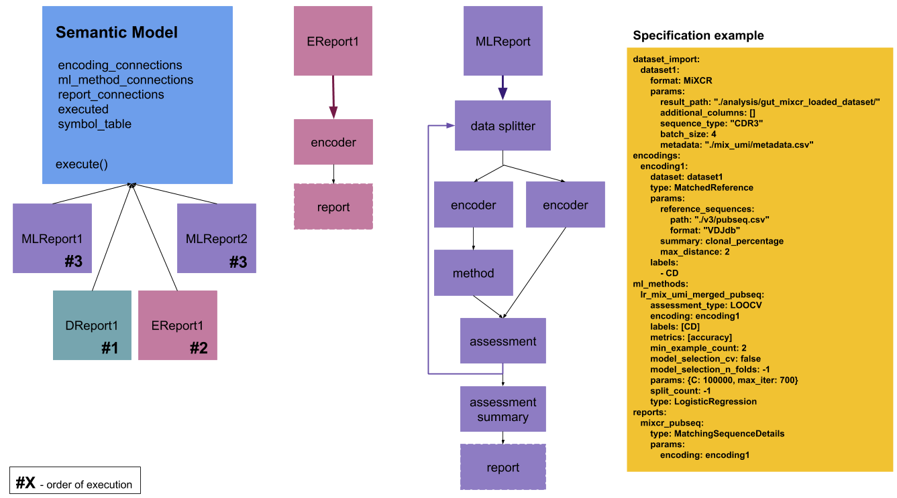
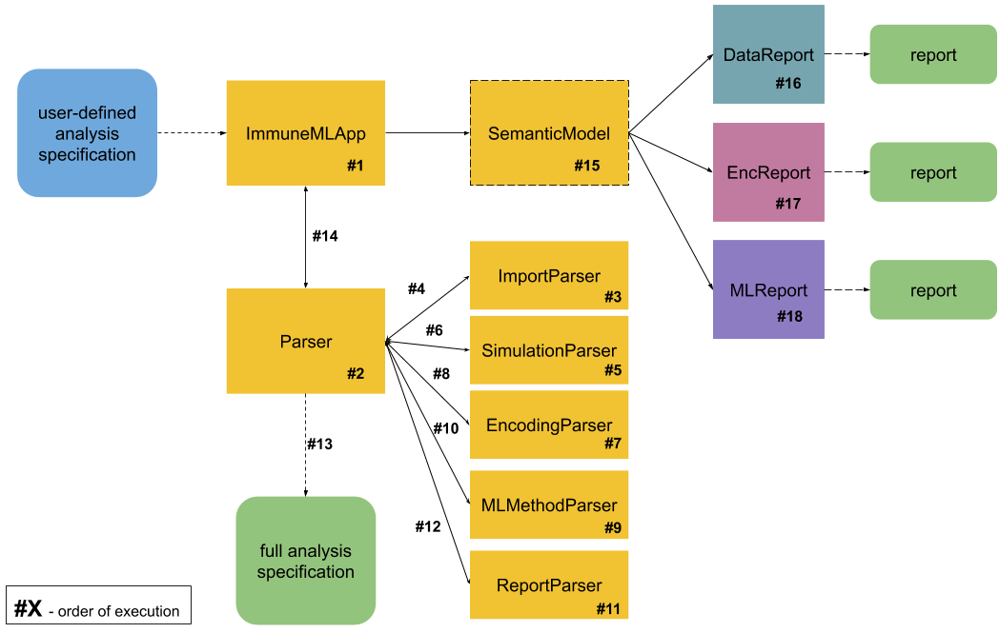

#####################################################
Analysis specification with domain-specific language
#####################################################

.. toctree::
   :maxdepth: 2

In ImmuneML, the analysis can be specified by providing a YAML file.

How to specify an analysis
###############################

The analysis specification consists of a few main sections:

*   dataset_import,
*   encodings,
*   ml_methods,
*   reports.

**dataset_import** section is mandatory. **encodings** need to be defined only if machine learning or an encoding-based
report is using an encoding. Similarly, machine learning methods need to be defined only if a report is based on them.
Machine learning methods, if defined, are run regardless of whether any report is relying on them. Datasets defined in the
**dataset_import** section are always loaded, while **encodings** are run only if they are used subsequently.

In the **dataset_import** section, all datasets that will be used in the subsequent analysis need to be defined along
with the strategy to import them into the platform. Each dataset needs to have its own unique identifier which will be
used to reference the dataset in the rest of the specification. An example of the dataset_import section when loading
the dataset from MiXCR format is given below:

.. code-block:: yaml

    dataset_import:
        dataset1: # unique id of the dataset
            format: MiXCR # format of the dataset
            params: # format-specific parameters
                result_path: "./analysis/gut_mixcr_loaded_dataset/" # where to store the loaded dataset
                additional_columns: [] # what additional columns to load from the file
                sequence_type: "CDR3" # which part of the sequence to load
                batch_size: 4 # how many repertoires can be loaded at once
            metadata: "./analysis/original_data_v3/mix_umi/metadata.csv" # metadata file with list of paths to MiXCR data along with the disease and other information

In the **encodings** section, all encodings to be used need to be defined. In addition to encoding-specific parameters,
it is necessary to define a unique identifier of the encoding, as well as the dataset which will be encoded. To define
more than one encoding, add multiple identifiers in the encoding section with desired parameters.
An example of encodings section is given below:

.. code-block:: yaml

    encodings:
        encoding1: # encoding unique identifier
            dataset: dataset1 # identifier of the dataset to be encoded which was defined in the dataset_import section
            type: MatchedReference # encoder class without "Encoder" in the name
            params: # encoder-specific parameters, depend on the encoder class
                reference_sequences:
                    path: "./analysis/gut_data_overview/reference_sequences/v3/pubseq.csv"
                    format: "VDJdb"
                summary: clonal_percentage
                max_distance: 2
            labels: # list of labels to encode, labels are given by name, complete list is in the metadata file for the dataset
                - CD
        encoding2: # unique identifier of the next encoding
            ....

In the **ml_methods** section, all machine learning methods need to be defined. In addition to machine learning specific
parameters, it is, as in the previous cases, necessary to define a unique identifier and the encoding on which the machine
learning algorithm will be performed. Also, the assessment type needs to be defined (k-fold cross validation, leave-one-out
cross validation, random splits). An example is given below.

.. code-block:: yaml

    ml_methods:
        lr_mix_umi_merged_pubseq: # ML method unique identifier
            assessment_type: LOOCV  # use leave-one-out cross-validation to estimate the performance of the method
            encoding: encoding1 # on which encoding the machine learning will be performed (dataset is defined for the encoding)
            labels: [CD] # which labels to use for encoding, labels are given by name that needs to be unique
            metrics: [accuracy] # what metrics to use to assess the performance of the methods
            min_example_count: 2 # minimum number of examples per class for the machine learning method to be executed
            model_selection_cv: false # whether to use cross-validation and random search to estimate the optimal parameters for one split to train/test
            model_selection_n_folds: -1 # number of folds if cross-validation is used for model selection and optimal parameter estimation
            params: {C: 100000, max_iter: 700} # parameters to be passed to the machine learning method
            split_count: -1 # if assessment type is repeated random splits, how many times to do the random splitting
            type: LogisticRegression # machine learning method to use

In the **reports** section, all reports need to be defined. Each report needs to have a unique identifier and report-specific
parameters. An example is given below.

.. code-block:: yaml

    reports:
        mixcr_pubseq: # report unique identifier
            type: MatchingSequenceDetails # report class
            params: # report-specific parameters for the given class
                encoding: encoding1

The full specification is given below.

.. code-block:: yaml

    dataset_import:
        dataset1: # unique id of the dataset
            format: MiXCR # format of the dataset
            params: # format-specific parameters
                result_path: "./analysis/gut_mixcr_loaded_dataset/" # where to store the loaded dataset
                additional_columns: [] # what additional columns to load from the file
                sequence_type: "CDR3" # which part of the sequence to load
                batch_size: 4 # how many repertoires can be loaded at once
            metadata: "./analysis/original_data_v3/mix_umi/metadata.csv" # metadata file with list of paths to MiXCR data along with the disease and other information
    encodings:
        encoding1: # encoding unique identifier
            dataset: dataset1 # identifier of the dataset to be encoded which was defined in the dataset_import section
            type: MatchedReference # encoder class without "Encoder" in the name
            params: # encoder-specific parameters, depend on the encoder class
                reference_sequences:
                    path: "./analysis/gut_data_overview/reference_sequences/v3/pubseq.csv"
                    format: "VDJdb"
                summary: clonal_percentage
                max_distance: 2
            labels: # list of labels to encode, labels are given by name, complete list is in the metadata file for the dataset
                - CD
    ml_methods:
        lr_mix_umi_merged_pubseq: # ML method unique identifier
            assessment_type: LOOCV  # use leave-one-out cross-validation to estimate the performance of the method
            encoding: encoding1 # on which encoding the machine learning will be performed (dataset is defined for the encoding)
            labels: [CD] # which labels to use for encoding, labels are given by name that needs to be unique
            metrics: [accuracy] # what metrics to use to assess the performance of the methods
            min_example_count: 2 # minimum number of examples per class for the machine learning method to be executed
            model_selection_cv: false # whether to use cross-validation and random search to estimate the optimal parameters for one split to train/test
            model_selection_n_folds: -1 # number of folds if cross-validation is used for model selection and optimal parameter estimation
            params: {C: 100000, max_iter: 700} # parameters to be passed to the machine learning method
            split_count: -1 # if assessment type is repeated random splits, how many times to do the random splitting
            type: LogisticRegression # machine learning method to use
    reports:
        mixcr_pubseq: # report unique identifier
            type: MatchingSequenceDetails # report class
            params: # report-specific parameters for the given class
                encoding: encoding1

Running an analysis from specification
######################################

To run the analysis with given specification in the YAML format, fill in the paths and run from the command line:

.. code-block:: bash

    $ python ./source/app/ImmuneMLApp.py path_to_yaml_file.yaml path_to_result_folder

Parsing the specification
###############################

Sections are parsed in the following order: dataset_import, encodings, ml_methods, reports. The execution model along with
the specification example is shown below.

The full application execution model is shown below.

