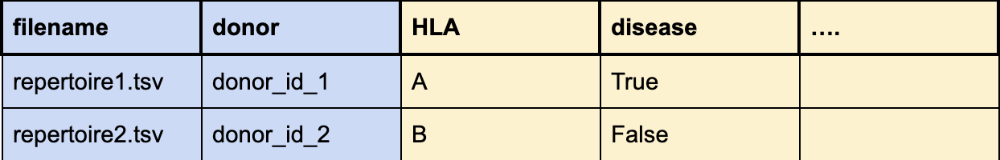

FAQ
===

.. toctree::
   :maxdepth: 2

What should the metadata file look like?
^^^^^^^^^^^^^^^^^^^^^^^^^^^^^^^^^^^^^^^^

The metadata file is defined for repertoire datasets only (the metadata information for receptor and sequence datasets are defined in the same file
as the sequences and receptors).

In case of repertoire datasets, each repertoire is represented by one file in the given format (e.g., AIRR/MiXCR/Adaptive).
For all repertoires in one dataset, a single metadata file should be defined. The metadata file should be a .csv file and have the following columns:

The columns filename and subject_id are mandatory. Other columns may be defined by the user. There are no restrictions on what those should include,
but often other columns will have information on HLA, age, sex, and specific diseases. Any of these columns may be used as a prediction target in
the downstream analysis. The prediction target is specified by the name of the column in the YAML specification as the value of the label parameter.
For more information on YAML specification, see :ref:`YAML specification`.

When installing all requirements from requirements.txt, there is afterward an error with yaml package (No module named yaml)?
^^^^^^^^^^^^^^^^^^^^^^^^^^^^^^^^^^^^^^^^^^^^^^^^^^^^^^^^^^^^^^^^^^^^^^^^^^^^^^^^^^^^^^^^^^^^^^^^^^^^^^^^^^^^^^^^^^^^^^^^^^^^^^

This issue might be helpful: https://github.com/yaml/pyyaml/issues/291. Try installing yaml manually with a specific version.

When should I install immuneML with R dependencies?
^^^^^^^^^^^^^^^^^^^^^^^^^^^^^^^^^^^^^^^^^^^^^^^^^^^
In most cases, it is adviced to install immuneML without R dependencies. The immuneML core functionality does not
depend on R, it is only necessary to generate certain reports. Therefore, R dependencies are only necessary if you
want to use one of the following reports:

- :ref:`SequencingDepthOverview`

- :ref:`SequenceAssociationLikelihood`

- :ref:`FeatureValueBarplot`

- :ref:`FeatureValueDistplot`

- :ref:`FeatureHeatmap`

- :ref:`SimilarityHeatmap`

- :ref:`DensityHeatmap`

There is an issue with the type of entry when specifying a list of inputs, why does this happen?
^^^^^^^^^^^^^^^^^^^^^^^^^^^^^^^^^^^^^^^^^^^^^^^^^^^^^^^^^^^^^^^^^^^^^^^^^^^^^^^^^^^^^^^^^^^^^^^^

Please check that the YAML is in valid format. To list different inputs (e.g. a list of reports under assessment/reports/hyperparameter in
TrainMLModel instruction), the correct YAML syntax includes a space between - and the list item.

When running the TrainMLModel instruction multiple times, sometimes it fails saying that there is only one class in the data. Why does this happen?
^^^^^^^^^^^^^^^^^^^^^^^^^^^^^^^^^^^^^^^^^^^^^^^^^^^^^^^^^^^^^^^^^^^^^^^^^^^^^^^^^^^^^^^^^^^^^^^^^^^^^^^^^^^^^^^^^^^^^^^^^^^^^^^^^^^^^^^^^^^^^^^^^^^^^

Please check the number of examples used for machine learning (e.g. number of repertoires). If there are very few examples, and/or if classes
are not balanced, it is possible that just by chance, the data from only one class will be in the training set. If that happens, the classifiers
will not train and an error will be thrown. To fix this, try working with a larger dataset or check how TrainMLModel is specified.
If TrainMLModel does nested cross-validation, it might require a bit more data. To perform only cross-validation, under `selection` key, specify
that `split_strategy` is `random` and that `training_percentage` is `1` (to use all data from the inner loop for training). In this way, instead of having
multiple training/validation/test splits, there will be only training/test splits as specified under key `assessment` in TrainMLModel instruction.

