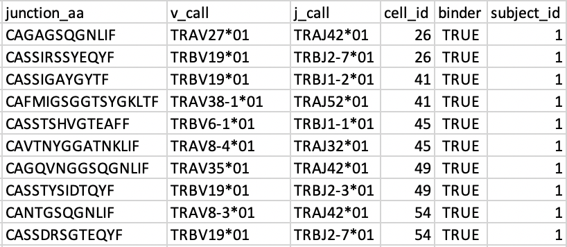

AIRR-C Deep Dive Tutorial
=========================

This page contains resources for the immuneML Deep Dive Tutorial at the AIRR Community Meeting VI.

Example dataset: 100 TCRAB receptors
------------------------------------

A dataset with 100 TCRAB receptors in AIRR format can be found here: :download:`100_receptors.tsv <../_static/files/airrc_tutorial/100_receptors.tsv>`. The file content looks as follows:

The **cell_id** column tells which alpha and beta chains should be paired together.
The **binder** column tells whether the given immune receptor binds to the antigen of interest or not.

`Back to the main AIRR-C tutorial page <./index.html>`_