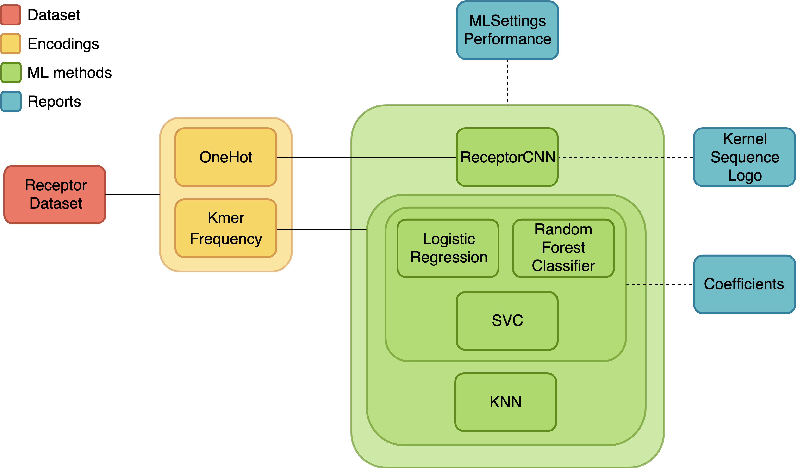

AIRR-C Deep Dive Tutorial
=========================

This page contains resources for the immuneML Deep Dive Tutorial at the AIRR Community Meeting VI.

YAML specification examples for training ML models
--------------------------------------------------

Four example YAML specifications are given below. The only difference between the YAML specification for the command line and for the Galaxy interface is the definition of the dataset import.

YAML examples for the command-line interface (import AIRR format data):
#######################################################################

- The YAML specification presented in the slides: :download:`slides_example.yaml <../_static/files/airrc_tutorial/slides_example.yaml>`
- A bare backbone of a YAML specification, which can be customized and used on the command line: :download:`command_line_backbone.yaml <../_static/files/airrc_tutorial/command_line_backbone.yaml>`

YAML examples for Galaxy (import immuneML binary format data):
##############################################################

- An example of a YAML specification as produced by the Galaxy tool `Train immune receptor classifiers (simplified interface) <https://galaxy.immuneml.uiocloud.no/root?tool_id=immuneml_train_classifiers>`_: :download:`receptor_classification.yaml <../_static/files/airrc_tutorial/receptor_classification.yaml>`
- A bare backbone of a YAML specification, which can be customized and used in the Galaxy tool `Train machine learning models <https://galaxy.immuneml.uiocloud.no/root?tool_id=immuneml_train_ml_model>`_:  :download:`galaxy_backbone.yaml <../_static/files/airrc_tutorial/galaxy_backbone.yaml>`

Recommended analysis components
-------------------------------

The following analysis components are recommended for constructing your own YAML specification:

`Back to the main AIRR-C tutorial page <./index.html>`_