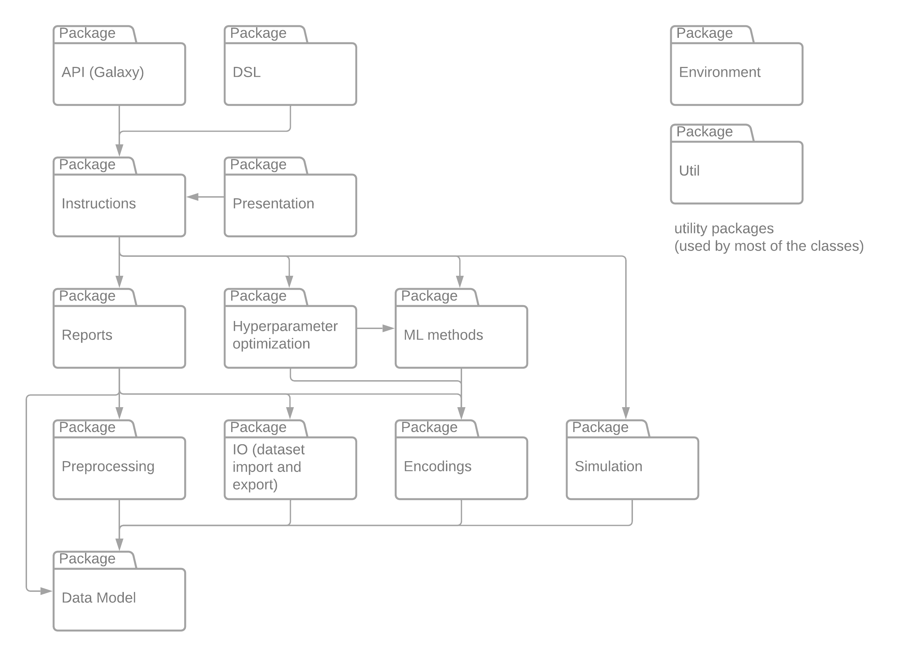

Developer documentation
=======================

To get started with adding features to immuneML, follow the steps described here. These steps assume you have some experience with object-oriented programming in Python
and some basic knowledge of how git works.

  #. Follow the guite to :ref:`Set up immuneML for development` by cloning the `immuneML GitHub repository <https://github.com/uio-bmi/immuneML>`_ and setting up development environment.
  #. Create a branch from the master branch where you will develop new features or propose an update to the existing ones. The branch should have a descriptive name showing what it is meant for.
  #. Make your changes on the branch you created. The list of tutorials on how to add new features is available below.
  #. When you have finished the changes, make a pull request to the master branch. It will be reviewed by core immuneML developers who will provide feedback and merge the branch to the master branch when it is ready.

immuneML platform overview
---------------------------

An overview of the most used packages with their dependencies in immuneML is shown in the figure below. However, to extend the platform, it is only
necessary to follow the tutorials without the need to go into all platform details.

  UML diagram showing the immuneML packages and the dependencies between them

For more details on the data model, see :ref:`immuneML data model`.

Tutorials
----------

The tutorials provided here describe how new components can be added to the codebase. Specifically, the tutorials are focused on adding new machine
learning methods, encodings and analysis reports. The relevant UML diagram showing the relations between the existing components and packages is shown
below.

.. figure:: ./_static/images/dev_docs/extending_immuneML.png
  :width: 70%
  :alt: UML diagram showing existing components and how the platform could be extended

  UML diagram showing existing components and how the platform could be extended by implementing functionalities defined by corresponding abstract
  classes

The tutorials for extending immuneML with new components are the following:

- :ref:`How to add a new machine learning method` - new ML methods can subsequently be trained and used for classification of immune receptors or repertoires,
- :ref:`How to add a new encoding` - encodings are used to represent (encode) the immune receptor data, to use as input for a machine learning method or a report to provide additional insights,
- :ref:`How to add a new report` - reports can be used to examine the inner mechanisms of machine learning methods, encoded receptor data or to perform an exploratory analysis.

.. toctree::
  :maxdepth: 1
  :caption: Developer tutorials:

  developer_docs/how_to_add_new_ML_method.rst
  developer_docs/how_to_add_new_encoding.rst
  developer_docs/how_to_add_new_report.rst

.. toctree::
  :maxdepth: 1
  :caption: Platform overview

  developer_docs/data_model.rst

.. toctree::
  :maxdepth: 4
  :caption: List of all classes:

  modules