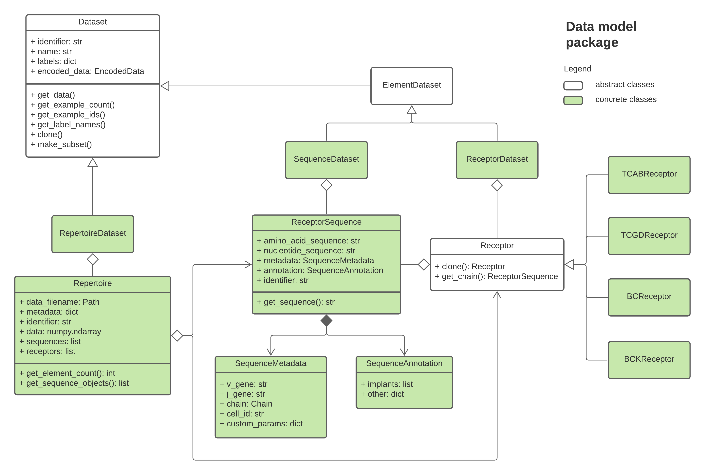

immuneML data model
=====================

.. meta::

   :twitter:card: summary
   :twitter:site: @immuneml
   :twitter:title: immuneML dev docs: data model
   :twitter:image: https://docs.immuneml.uio.no/_images/data_model_architecture.png

immuneML works with adaptive immune receptor sequencing data.
Internally, the classes and data structures used to represent this data adheres to the `AIRR Rearrangement Schema <https://docs.airr-community.org/en/stable/datarep/rearrangements.html>`_,
although it is possible to import data from a wider variety of common formats.

Most immuneML analyses are based on the amino acid CDR3 junction.
Some analyses also use the V and J gene name ('call') information.
While importing of full-length (V + CDR3 + J) sequences is supported,
there are no functionalities in immuneML designed for analysing sequences
at that level.

An immuneML dataset consists of a set of 'examples'. These examples are the

immuneML data model supports three types of datasets that can be used for analyses:

#. Repertoire dataset (:py:obj:`~immuneML.data_model.dataset.RepertoireDataset.RepertoireDataset`) - each example in the dataset is a large set of AIR sequences which are typically derived from one subject (individual).
#. Receptor dataset (:py:obj:`~immuneML.data_model.dataset.ReceptorDataset.ReceptorDataset`) - each example is one paired-chain receptor consisting of two AIR sequences (e.g., TCR alpha-beta, or IGH heavy-light).
#. Sequence dataset (:py:obj:`~immuneML.data_model.dataset.SequenceDataset.SequenceDataset`) - each example is one single AIR sequence chain.

Useful function in the dataset classes include getting the metadata information from the :py:obj:`~immuneML.data_model.dataset.RepertoireDataset.RepertoireDataset`,
using :py:obj:`~immuneML.data_model.dataset.RepertoireDataset.RepertoireDataset.get_metadata` function, obtaining the number of examples in the
dataset, checking possible labels or making subsets.

The UML diagram showing these classes and the underlying dependencies is shown below.

  UML diagram showing the immuneML data model, where white classes are abstract and define the interface only, while green are concrete and used throughout the codebase.

Implementation details for :code:`ReceptorDataset` and :code:`SequenceDataset` are available in :py:obj:`~immuneML.data_model.dataset.ElementDataset.ElementDataset`.