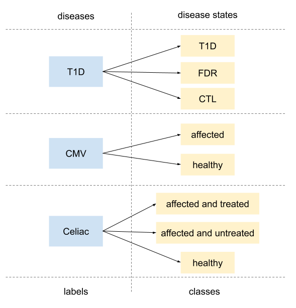

How to add a new machine learning method
==========================================

This tutorial assumes you have installed immuneML for development as described at :ref:`Set up immuneML for development`, and familiarized yourself
with the documentation at :ref:`Tutorials`.

To add a new ML method to ImmuneML, it is necessary to add a class that will implement the new method. The constructor arguments in the new class
will be the required parameters in the specification file.

ImmuneML supports multi-label multi-class classification. Most often, multi-label refers to having one label per disease (e.g., separate labels for
celiac disease and CMV), while per each label it is possible to have multiple classes which correspond to disease states (e.g., the patient has or
does not have a disease, but also the stages of a disease, see Figure below).

  Label and disease in immuneML: labels can reflect the specific disease and a separate model is fitted to each label, while a label can include
  multiple classes in which case the ML model performs multi-class classification

The ML models in the immuneML support one label. If multiple labels are specified, for instance during training the models and optimizing
hyperparameters, a separate model will be fitted to each label.

The necessary functionalities are represented as abstract functions in MLMethod class (:py:obj:`~source.ml_methods.MLMethod.MLMethod`).
To create a new ML method class, inherit MLMethod and implement all abstract functions.

Testing the ML method outside immuneML with a sample design matrix
-------------------------------------------------------------------

When implementing a new ML method, it can be useful to test the method with a small sample design matrix before integrating it into the immuneML
codebase. Example design matrices for any encoding can be exported to .csv format with the DesignMatrixExporter report and the ExploratoryAnalysis
instruction. To quickly generate some random sample data, RandomRepertoireDataset or RandomReceptorDataset may be specified as import formats.
Alternatively, you can import your own data. A full yaml specification for exporting a sample design matrix for a 3-mer encoding may look like this:

.. indent with spaces
.. code-block:: yaml

  definitions:
    datasets:
      my_simulated_data:
        format: RandomRepertoireDataset
        params:
          repertoire_count: 5 # a dataset with 5 repertoires
          sequence_count_probabilities: # each repertoire has 10 sequences
            10: 1
          sequence_length_probabilities: # each sequence has length 15
            15: 1
          labels:
            my_label: # half of the repertoires has my_label = true, the rest has false
              false: 0.5
              true: 0.5
    encodings:
      my_3mer_encoding:
        KmerFrequency:
          k: 3
    reports:
      my_design_matrix:
        DesignMatrixExporter:
          name: my_design_matrix
  instructions:
    my_instruction:
      type: ExploratoryAnalysis
      analyses:
        my_analysis:
          dataset: my_simulated_data
          encoding: my_3mer_encoding
          labels:
          - my_label
          report: my_design_matrix

.. note::

  Note that for design matrices beyond 2 dimensions (such as OneHotEncoder with flatten = False), the matrix is exported as a .npy file instead of a
  .csv file.

The resulting design matrix can be found in my_instruction/analysis_my_analysis/report/design_matrix.csv, and the true classes for each repertoire
can be found in labels.csv. In immuneML, the design matrix is passed to the ML method as an EncodedData object, and the labels as a numpy ndarray.
The EncodedData object has attribute examples which contains the design matrix, and feature_names and example_ids which contain the row and column
names respectively.

Testing the ML method using immuneML for encoding the data
^^^^^^^^^^^^^^^^^^^^^^^^^^^^^^^^^^^^^^^^^^^^^^^^^^^^^^^^^^^

In immuneML, different encodings can be used to create encoded data. For the full list of possible encodings, see :ref:`Encodings`. Encoding works in the following
way: given a dataset and encoding parameters, the specific encoder object creates an instance of EncodedData class and fills the attributes examples
(design / feature matrix, where one row is one example), labels (a dictionary of numpy array where the keys are label names and values are arrays
with class assignment for each example), feature_names (if available for the encoding, a list of feature names for each column in the examples).
This object will be provided as input to the corresponding functions of the new ML method class.

To load the data encoded as described above into an EncodedData object, the function :py:obj:`source.dev_util.util.load_encoded_data` can be used.

Adding the new method to immuneML
-----------------------------------

Once the core functionality of the new ML method has been tested, it can be integrated into immuneML. For methods based on scikit-learn, read how to
do this under :ref:`Adding a method based on scikit-learn`. For other methods, see :ref:`Adding native methods`.

.. include:: ./dev_docs_util.rst

Adding a method based on scikit-learn
^^^^^^^^^^^^^^^^^^^^^^^^^^^^^^^^^^^^^^

To add a method from the scikit-learn’s package, go through this step-by-step guide where, exemplary, a SVM class based on scikit-learn’s LinearSVC
will be added:

  #. Add a new class to the package ml_methods
  #. Make SklearnMethod a base class of the new class,
  #. Implement a constructor (handle parameters and parameter_grid as inputs),
  #. Implement get_ml_model(cores_for_training: int) function, which should return a new instance of the desired scikit-learn’s class with the parameters that were passed to the constructor of the new class,
  #. Implement _can_predict_proba() to return True or False to indicate whether the method can output the class probabilities,
  #. Implement get_params(label) to return the coefficients and/or other trained parameters of the model for the given label.

Example scikit-learn-based SVM implementation:

.. code-block:: python

  class SVM(SklearnMethod):

    def __init__(self, parameter_grid: dict = None, parameters: dict = None):
       super(SVM, self).__init__()

       self._parameters = parameters if parameters is not None else {"max_iter": 10000}

       if parameter_grid is not None:
           self._parameter_grid = parameter_grid
       else:
           self._parameter_grid = {}

    def _get_ml_model(self, cores_for_training: int = 2):
       params = {**self._parameters, **{}}
       return LinearSVC(**params)

    def _can_predict_proba(self) -> bool:
       return False

    def get_params(self, label):
       params = self.models[label].estimator.get_params() if isinstance(self.models[label], RandomizedSearchCV) \
           else self.models[label].get_params()
       params["coefficients"] = self.models[label].coef_.tolist()
       params["intercept"] = self.models[label].intercept_.tolist()
       return params

Adding native methods
^^^^^^^^^^^^^^^^^^^^^^^

To add a new ML method:

  #. Add a new class in a new file, where the class name and the file name must match.
  #. Make the new class inherit MLMethod class,
  #. Define an init function,
  #. Implement all abstract methods as defined in :py:obj:`~source.ml_methods.MLMethod.MLMethod` class.

The name of the new class has to be different from the ML methods’ classes already defined in the same package.

Using ML methods from specification
------------------------------------

To use ML method from specification, it is necessary to define:

  #. The method class,
  #. Parameters for the method,
  #. And if applicable, whether cross-validation should be performed to determine the optimal parameters.

The cross-validation performs the grid search over the parameters if any of the parameters is specified as a list of potential values.

An example specification for logistic regression without cross-validation (log_reg), logistic regression with cross-validation (log_reg_cv) would be:

.. indent with spaces
.. code-block:: yaml

  ml_methods:
    log_reg: # the name of the method which will be used in the specification to refer to the method
      SimpleLogisticRegression: # class name of the method
        penalty: l1 # parameters of the model
      model_selection_cv: False # should there be a grid search and cross-validation - not here
      model_selection_n_folds: -1 # no number of folds for cross-validation as it is not used here
    log_reg_cv: # the name of the next method
      SimpleLogisticRegression: # class name of the method
        penalty:	# parameter of the model
          - l1 # value of the parameter to test
          - l2 # another value of the parameter to test
      model_selection_cv: True # perform cross-validation and grid search
      model_selection_n_folds: 5 # do 5-fold cross-validation

The parameters model_selection_cv and model_selection_n_folds have values False and -1, respectively and can be omitted if there should be no model
selection on this level. Also, if no parameters of the model are specified (such as penalty in the example), default values would be used.

During parsing, the parameters of the model will be assigned to “parameters” attribute of the ML method object if none of the parameters is a list of
possible values. Otherwise, the parameters will be assigned to the parameter_grid parameter which will be later used for grid search and
cross-validation.
