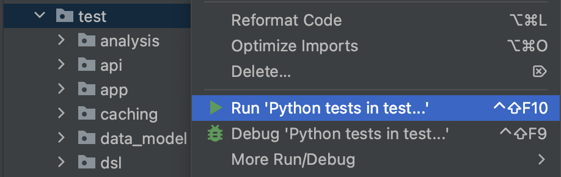

Set up immuneML for development
=========================================

.. meta::

   :twitter:card: summary
   :twitter:site: @immuneml
   :twitter:title: immuneML dev docs: set up for development
   :twitter:description: See how to set up immuneML for development.
   :twitter:image: https://docs.immuneml.uio.no/_images/extending_immuneML.png

Prerequisites
---------------

- System requirements: at least 4GB of RAM memory and 15GB of disk space.

- A Python virtual environment using **at least Python version 3.9** (newest version of Python is usually recommended).
  This can be created through `Python venv <https://docs.python.org/3/library/venv.html>`_ or
  `conda venv <https://docs.conda.io/projects/conda/en/latest/user-guide/getting-started.html>`_.

- Under Windows, the Microsoft Visual C++ 14.0 or greater is required to install from requirements.txt.

Development setup
-------------------------------

For development purposes, it is most convenient to clone the codebase using PyCharm.
Alternatively, immuneML can be installed manually to be used with a different editor.
When running into problems during installation, please check the :ref:`Installation issues` troubleshooting page.

Development setup with PyCharm
***********************************

To set up the project in PyCharm, see
`the official JetBrains tutorial for creating a PyCharm project from an existing GitHub repository <https://www.jetbrains.com/help/pycharm/manage-projects-hosted-on-github.html>`_.

Manual development setup without PyCharm
**********************************************

Alternatively to using PyCharm, the following steps describe how to perform the process manually:

1. Create a directory where the code should be located and navigate to that directory.

2. Create and activate a virtual environment with Python 3.9 or later (if not already created). For example, using venv:

.. code-block:: console

  python3 -m venv ./immuneml_venv/
  source ./immuneml_venv/bin/activate

2. Execute the command to clone the repository from the development branch:

.. code-block:: console

  git clone https://github.com/uio-bmi/immuneML.git@development

3. From the project folder (immuneML folder created when the repository was cloned
from GitHub), install the requirements from the requirements.txt file (this file can be found in the immuneML root folder):

.. code-block:: console

  pip install -e .

If you want to install optional requirements install the relevant requirements file(s):

.. code-block:: console

  pip install -r requirements_DeepRC.txt
  pip install -r requirements_TCRdist.txt
  pip install -r requirements_KerasSequenceCNN.txt
  pip install -r requirements_generative_models.txt

4. If not setting up the project in PyCharm, it might be necessary to manually add the root project folder to PYTHONPATH.
The syntax for Unix-based systems is the following:

.. code-block:: console

  export PYTHONPATH=$PYTHONPATH:$(pwd)

Testing the development installation
---------------------------------------

Running Quickstart
**********************************************

.. include:: ../installation/run_quickstart.rst

Running unit tests
**********************************************

For a thorough testing of the immuneML codebase, you can run the unit tests. For that purpose, you can
use :code:`unittest` or :code:`pytest` packages. Before running the tests, make sure the package is installed in your
environment, as they are not listed as a dependency in the immuneML package.

In PyCharm, unit tests can be run by right-clicking the folder named :code:`test` at the project root, and clicking "Run 'Python tests in test...'".

Alternatively, unit tests can be run on the command line using the following command (see also: `the official unittest documentation <https://docs.python.org/3/library/unittest.html>`_):

.. code-block:: console

  python -m unittest

Documentation of the development version of immuneML
********************************************************

The documentation of the development version of immuneML is automatically built on every push to the
development branch and hosted at https://uio-bmi.github.io/immuneML/.

