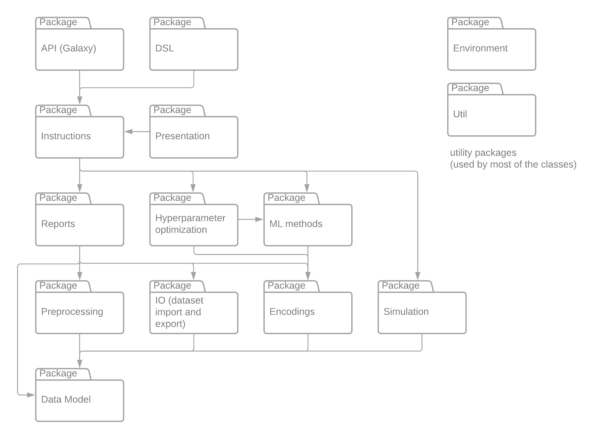
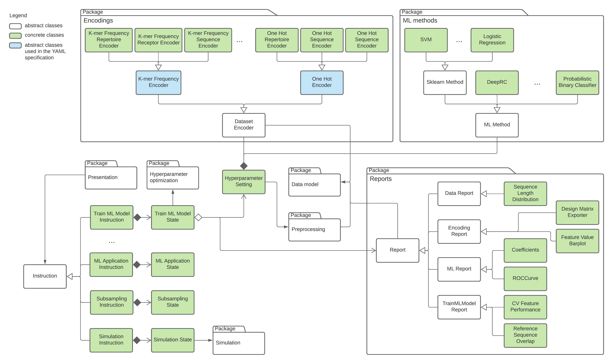

immuneML platform overview
============================

.. meta::

   :twitter:card: summary
   :twitter:site: @immuneml
   :twitter:title: immuneML dev docs: platform overview
   :twitter:image: https://docs.immuneml.uio.no/_images/extending_immuneML.png

How immuneML works
------------------------

immuneML is run by providing the analysis specification in YAML format (see :ref:`YAML specification` for details) and the output path. This section
describes what happens internally when immuneML is run like this. We assume familiarity with using immuneML in the section.

.. figure:: ../_static/images/dev_docs/running_immuneML.png
  :width: 70%
  :alt: Overview of the classes involved in running immuneML

  *Overview of classes involved in running immuneML*

When immuneML is run from the command line, the `immune-ml` command is mapped to the `main()` method in ImmuneMLApp.py. The ImmuneMLApp class is then
instantiated with the specification path and output path. Running immuneML then corresponds to two main steps: parsing the specification file and
running the specified analyses.

To parse the specification file, ImmuneMLApp object calls ImmunMLParser from the dsl (domain-specific language) package. All parsing functionality is
located in that package. Parsing consists of two major steps again: parsing the definitions component (motifs, signals, encodings, datasets,
ML methods, reports, etc) and parsing the instructions (concrete analyses to be performed using the parsed components). This maps to two classes:
DefinitionParser and InstructionParser. DefinitionParser parses each of the components and invokes a separate parser class for each component. The
parsed components are used to create objects and put them in the symbol table to be later used in the analysis. When all components are parsed, the
filled symbol table is passed as input to the InstructionParser class. It uses the objects from the symbol table to populate instruction objects
that will run the analysis. Again, each instruction type has its own parser (e.g., TrainMLModelParser, ExploratoryAnalysisParser). The specific
parsers were created to ensure user-friendly error messages in case of misspecified YAML files.

Once the YAML specification is parsed, all instruction objects are extracted and forwarded to the semantic model. The object of the SemanticModel
class will then run all instructions one by one, collect their states as the output of each instruction and use them to generate the presentation for
the user. Each instruction class is a subclass of Instruction class and implements `run()` method and returns the instruction's state object as output.
The instruction state objects consist of input data and parameters for the instruction and during the execution of the instruction the results are
also added to the state. This is then used as input for the presentation part where the results are shown to the user. The cod for the presentation
part is located in the `presentation` package and are grouped by presentation format. The only format supported at the moment is HTML.

To generate the HTML output from the analyses, the semantic model finds the presentation class that corresponds to the instruction and calls its
`build()` method with the instructions state as input. This method creates a mapping between the state object and the information that will be
shown in the HTML files. For each instruction, a set of presentation templates is available. The templates are filled from the generated mapping
using the pystache package. This process is repeated for each instruction if there are multiple ones and a common index.html file is generated linking
to all HTML files. If there is only one instruction, the index.html file is the mapped HTML template of that instruction.

Package overview
------------------------

An overview of the most used packages with their dependencies in immuneML is shown in the figure below. However, to extend the platform, it is only
necessary to follow the tutorials without the need to go into all platform details.

  *UML diagram showing the immuneML packages and the dependencies between them*

For more details on the data model, see :ref:`immuneML data model`.

Extending the platform
---------------------------

The tutorials provided in the documentation focus on adding new machine learning methods, encodings and analysis reports. The relevant architecture is
shown in the diagram below.

  *UML diagram showing existing components and how the platform could be extended by implementing functionalities defined by corresponding abstract
  classes*