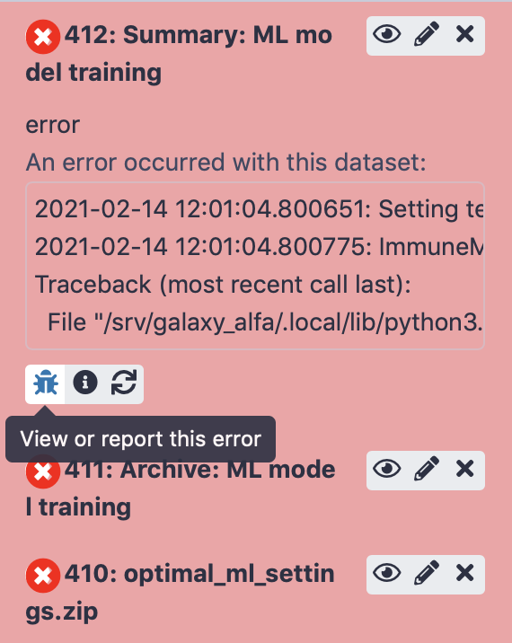

Introduction to Galaxy
=========================================

.. meta::

   :twitter:card: summary
   :twitter:site: @immuneml
   :twitter:title: immuneML & Galaxy: introduction to Galaxy
   :twitter:description: See tutorials on how to use Galaxy.
   :twitter:image: https://docs.immuneml.uio.no/_images/receptor_classification_overview.png

Galaxy is an open, web-based platform allowing accessible, reproducible and transparent research.
The immuneML Galaxy instance can be found at https://galaxy.immuneml.uio.no.
This introduction covers all essential information needed for users of the immuneML Galaxy instance.
If you want to learn even more about Galaxy, see the official `Galaxy introduction page <https://galaxyproject.org/learn/>`_.

The interface is divided into three sections. In the tool panel on the left, you will find various Galaxy tools.
Once clicked, these tools will be opened in the tool panel in the middle of the screen. The tool panel is a graphical
interface where you provide the input that is needed to run the tool. Finally, the results of the tool will show
up as one or more items in the history panel on the right. History items can in some cases also serve as input for
other tools.

Uploading data to Galaxy
------------------------
To upload files to your Galaxy history, you can either use the upload button (arrow up) or select the Galaxy tool **Upload file**
located under **Get local data**. Here, you can select files from your local machine, or directly paste in content.
Note that when uploading a .zip or other type of compressed file, it may be necessary to manually select the 'file type'.

.. image:: ../_static/images/galaxy/galaxy_upload_data.png
   :alt: import button Galaxy
   :width: 250

The Galaxy History
------------------------
All intermediate steps of an analysis, including produced files, can in be found in the Galaxy history.
Anonymous users can only work on one history simultaneously, but registered users may have multiple Galaxy histories,
representing different analyses.
To create a new Galaxy history, click the '+' icon, or alternatively click History options (cogwheel icon) followed by **Create new**.
The default history name is **Unnamed history**, which can be edited by clicking the name.

To switch between histories, click 'View all histories' (window icon). Here, histories can be switched to, copied or deleted
to free up memory.

Running tools
------------------------
The tool panel will look different for every tool, but it will typically consist of a set of buttons, text boxes or selection
boxes that need to be filled in to run the tool. In some cases, you will find a selection box that requires you to select a
previously created history item, such as an uploaded file or created dataset.

.. image:: ../_static/images/galaxy/galaxy_train_ml_model.png
   :alt: train ML model tool
   :width: 500

The tool will produce one or multiple history items. Initially, the history items will
be gray while Galaxy is waiting for the run to start. While the tool is running, the history
items are yellow. Depending on the complexity of the task, this may take a while.

.. image:: ../_static/images/galaxy/galaxy_train_ml_model_results_yellow.png
   :alt: running Galaxy
   :width: 250

If a tool run is successful, the produced history items will show
up green, and when errors occurred the item will be red.
See also: :ref:`Viewing errors and reporting bugs in Galaxy`.

.. image:: ../_static/images/galaxy/galaxy_train_ml_model_results.png
   :alt: successful Galaxy run
   :width: 250

History items
------------------------
The items in the history show three buttons:

- 'View data' (eye icon) opens the history item in the main panel (in case of a file), in order to show the results,
  or downloads the item (in case of an archive). When running an immuneML tool, the 'Summary' history items will show
  a detailed summary of the run including plots that were created during the run and links to data that may be downloaded.
- 'Edit attributes' (pencil icon) allows you to change the name of the history item, as well as editing other attributes.
- 'Delete' (cross icon) deletes the item from the history

When clicking on the history item outside of these three buttons, the item expands and shows more options.

Some options that you might be likely to use are:

- 'Download' (floppydisk icon) to download the file.
- 'View details' (i icon), which will open a page showing a summary of the tool run, including all parameters that were used to run the tool.
  Furthermore, it links to the Tool Standard Output file, which shows all print statements that were made by the tool during runtime.
  For immuneML tools, this means an overview is printed of timestamped analysis steps. The Tool Standard Error file is also linked, which
  may give insights when the tool run did not succeed. For example: when provided with an incorrect input file, immuneMLs error messages will be
  printed here.
- 'Run this job again' (arrows icon) brings you back to the tool panel with all parameters that were used already set. This allows you to
  rerun the same analysis, or make slight modifications to the settings used to run the tool.

Importing or sharing histories
-------------------------------
Galaxy histories can be made public, or shared with individual other users.
Publicly shared immuneML Galaxy histories can be found on this page: https://galaxy.immuneml.uio.no/histories/list_published.
These histories can be opened by clicking their name, and individual history elements can be viewed.
To import a history, open it, then click 'Import history' (+ icon) in the right upper corner, give it a suitable name and click 'Import'.
The history will now open as your own.

.. image:: ../_static/images/galaxy/import_galaxy_history.png
   :alt: import button Galaxy
   :width: 250

To share your current Galaxy history, click 'History options' (cogwheel icon), then Share or publish. Here you may choose between
making the history accessible via a link, publishing it in the immuneML Galaxy Published Histories section, or share it with individual users
through their Galaxy user e-mail.

Editing files in Galaxy
------------------------
Since immuneML analyses are specified in a yaml file, you might at some point want to edit this yaml file either to
make changes to the analysis or correct errors. Note: this functionality is only available to users who are logged in,
not anonymous users.
To edit a file in Galaxy, click on the history item to expand it, then click 'Visualize this data' (barchart icon).
Look for the tool named **Editor**. You can now edit the file as you want, and by clicking 'export' a new history
item will be generated containing the edited file.

Creating a Galaxy collection of files
-------------------------------------
When working with many files in Galaxy, it can be inconvenient to have to click on all the files that you want to use
as input to a tool (for example, when using the `Create dataset <https://galaxy.immuneml.uio.no/root?tool_id=immune_ml_dataset>`_ tool).
A solution to this is `Galaxy collections <https://training.galaxyproject.org/archive/2019-12-01/topics/galaxy-data-manipulation/tutorials/collections/tutorial.html>`_,
which are containers for multiple data files.

To create a Galaxy collection, follow these steps:

#. Upload or import all the files that you want in your collection to the Galaxy history.

#. Click 'operations on multiple datasets' (checkbox icon above the Galaxy history). Checkboxes should now appear in front of the history items.

#. Click 'All' to select all history items, or select just those files you want to include.

#. Click 'For all selected...' > 'Build Dataset List' and enter a name for your collection. Your collection should now appear as a new item in the history.

#. Click the 'operations on multiple datasets' button again in order to go back to the normal menu.

Viewing errors and reporting bugs in Galaxy
--------------------------------------------
If a tool run fails and you suspect this might be due to a bug, it is possible to send an automatic bug report.
Open the failed history item by clicking on it, and then click 'View or report this error' (bug icon). This will show you the error that
made the run fail. Typically, the last few lines show a message printed directly by immuneML explaining the error
(for example when an incorrect input file is provided).
If you still think you have encountered a bug, please write in the textbox what you attempted to do and what behavior
you expected of the tool, and click 'Report'.

