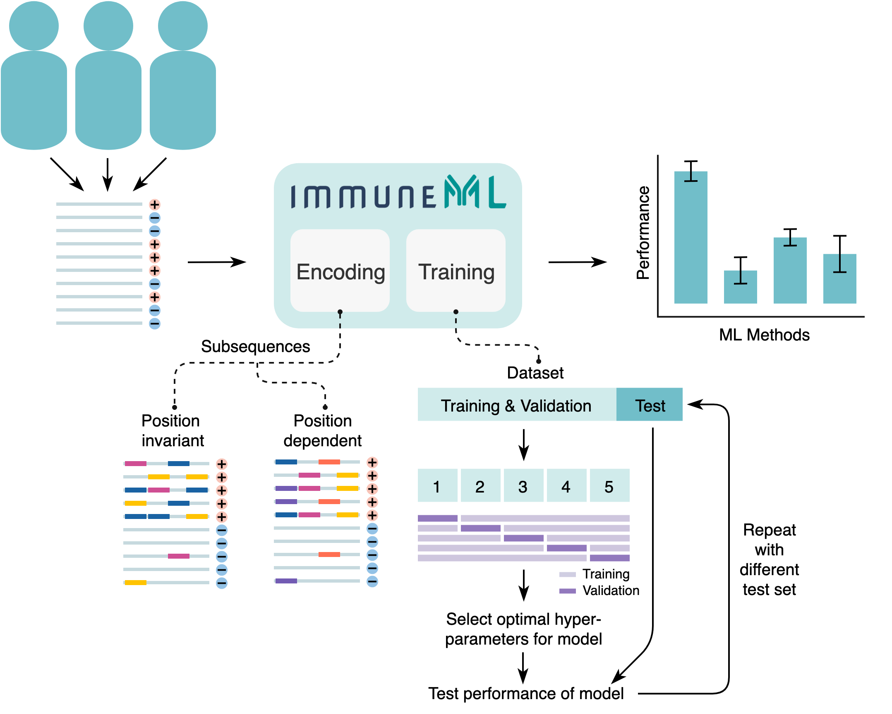

How to train immune receptor classifiers using the easy Galaxy interface
===========================================================================

This is the documentation for the 'Train immune receptor classifiers (easy interface)' Galaxy tool.
The purpose of this tool is to train machine learning (ML) models to predict a characteristic per immune receptor, such as
antigen specificity. One or more ML models are trained to classify receptors based on the information within the CDR3 sequences. Finally, the performance
of the different methods is compared.
Alternatively, if you want to predict a property per immune repertoire, such as disease status, check out the ‘Train immune repertoire classifiers’ tool instead.

Basic terminology
-----------------

In the context of ML, the characteristics to predict per receptor are called **labels** and the values that these labels can
take on are **classes**. One could thus have a label named ‘epitope’ with possible classes ‘binding_gluten’ and ‘not_binding_gluten’.
The labels and classes must be present in the receptor metadata.

When training an ML model, the goal is for the model to learn **signals** within the data which discriminate between the different
classes. An ML model that predicts classes is also referred to as a **classifier**. A signal can have a variety of definitions,
including the presence of a specific subsequence or conserved positions. Our assumptions about what makes up a ‘signal’
determines how we should represent our data to the ML model. This representation is called **encoding**. In this tool, the
appropriate encoding is chosen based on the answers to the last two questions.

  Figure 2 - An overview of the components of the immuneML receptor classification tool.
  ImmuneML reads in receptor data with labels (+ and -), encodes the data, trains user-specified ML models and summarizes
  the performance statistics per ML method.
  Encoding: position dependent and invariant encoding are shown. The specificity-associated subsequences are highlighted
  with color. The different colors represent independent elements of the antigen specificity signal. Each color represents
  one subsequence, and position dependent subsequences can only have the same color when they occur in the same position,
  although different colors (i.e., nucleotide or amino acid sequences) may occur in the same position.
  Training: the training and validation data is used to train ML models and find the optimal hyperparameters through
  5-fold cross-validation. The test set is left out and is used to obtain a fair estimate of the model performance.

Encoding
---------

Encodings for immune receptor data represent the immune receptor based on the subsequences (e.g., 3 – 5 amino acids long)
in the CDR3 regions. The CDR3 regions are divided into overlapping subsequences and the (antigen specificity)
signal may be characterized by the presence or absence of certain sequence motifs in the CDR3 region.

The subsequences may be position dependent or invariant. Position invariant means that if a subsequence, e.g.,
‘EDNA’ occurs in different positions in the CDR3 it will still be considered the same signal. This is not the case for
position dependent subsequences, if ‘EDNA’ often occurs in the beginning of the CDR3 in antigen binding receptors,
then finding ‘EDNA’ in the end of a CDR3 in a new receptor will be considered unrelated. Positions are determined based
on the IMGT numbering scheme.

Finally, it is possible to introduce gaps in the encoding of subsequences (not shown in the Figure). In this case, a
motif is defined by two subsequences separated by a region of varying nucleotide or amino acid length. Thus, the
subsequences ‘EDNA’, ‘EDGNA’ and ‘EDGAGAGNA’ may all be considered to be part of the same motif: ‘ED’ followed by ‘NA’
with a gap of 0 – 5 amino acids in between.

Note that in any case, the subsequences that are associated with the ‘positive’ class may still be present in the ‘negative’
class, albeit at a lower rate.

Training a machine learning model
----------------------------------

Training an ML model means optimizing the **parameters** for the model with the goal of predicting the correct class of an (unseen) immune receptor.
Different ML methods require different procedures for training. In addition to the model parameters there are the **hyperparameters**, these
hyperparameters do not directly change the predictions of a model, but they control the learning process (for example: the learning speed).

The immune receptors are divided into sets with different purposes: the training and validation sets are used for finding the optimal parameters
and hyperparameters respectively. The test set is held out, and is only used to estimate the performance of a trained model.

In this tool, a range of plausible hyperparameters have been predefined for each ML method. The optimal hyperparameters are found by splitting the
training/validation data into 5 equal portions, where 4 portions are used to train the ML model (with different hyperparameters) and the remaining
portion is used to validate the performance of these hyperparameters settings. This is repeated 5 times such that each portion has been used for
validation once. With the best hyperparameters found in the 5 repetitions, a final model is trained using all 5 portions of the data. This procedure
is also referred to as 5-fold cross-validation.

The whole process may be repeated multiple times with different randomly selected repertoires in the test set, to see how robust the performance is.

More analysis options
----------------------

A limited selection of immuneML options is available through this tool. If you want full control of the analysis, consider using the tool described under
:ref:`How to train ML models in Galaxy`. This tool provides other encodings and machine learning methods to choose from, as well as
data preprocessing and settings for hyperparameters optimization. The interface of the YAML-based tool expects more independence and knowledge about
machine learning from the user. See also :ref:`How to specify an analysis with YAML`.

Tool output
---------------------------------------------
This Galaxy tool will produce the following history elements:

- Receptor Classification Archive: a .zip file containing the complete output folder as it was produced by immuneML. This folder
  contains the output of the TrainMLModel instruction including all trained models and their predictions, and report results.
  Furthermore, the folder contains the complete YAML specification file for the immuneML run, the HTML output and a log file.

- Results of receptor classification: a HTML page that allows you to browse through all results, including prediction accuracies on
  the various data splits and plots showing the performance of classifiers and learned parameters.

- Generated YAML file: the YAML specification file that was used by immuneML internally to run the analysis. This file can be
  downloaded, altered, and run again by immuneML using the :ref:`YAML-based Galaxy tool <How to train ML models in Galaxy>`.

- Optimal ML model: a .zip file containing the raw files for the optimal trained ML model file for the given label.
  This .zip file can subsequently be used as an input when :ref:`applying previously trained ML models to a new AIRR dataset in Galaxy <How to apply previously trained ML models to a new AIRR dataset in Galaxy>`

