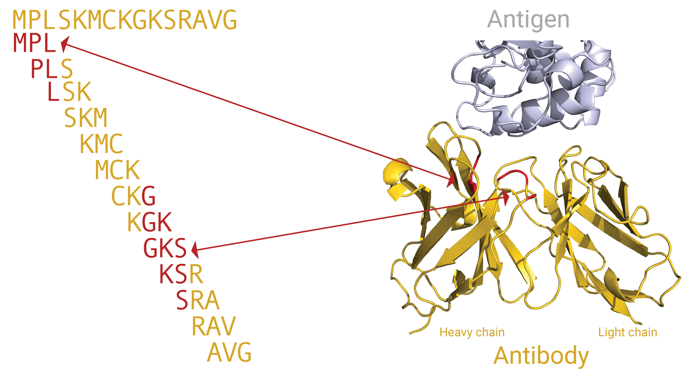

How to train immune repertoire classifiers using the simplified Galaxy interface
=============================================================================

This page provides the documentation for the Galaxy tool `Train immune repertoire classifiers (simplified interface) <https://galaxy.immuneml.uio.no/root?tool_id=novice_immuneml_interface>`_.
The purpose of this tool is to train machine learning (ML) models to predict a characteristic per immune repertoire, such as
a disease status. One or more ML models are trained to classify repertoires based on the information within the sets of CDR3 sequences. Finally, the performance
of the different methods is compared.
Alternatively, if you want to predict a property per immune receptor, such as antigen specificity, check out the
`Train immune receptor classifiers (simplified interface) <https://galaxy.immuneml.uio.no/root?tool_id=immuneml_train_classifiers>`_ tool instead.

An example Galaxy history showing how to use this tool `can be found here <https://galaxy.immuneml.uio.no/u/immuneml/h/repertoire-classification-simplified-interface>`_.

Basic terminology
-----------------

In the context of ML, the characteristics to predict per repertoire are called **labels** and the values that these labels can take on are **classes**.
One could thus have a label named ‘CMV_status’ with possible classes ‘positive’ and ‘negative’. The labels and classes must be present in the metadata
file, in columns where the header and values correspond to the label and classes respectively.

.. figure:: ../_static/images/metadata_repertoire_classification.png
  :width: 70%

  Metadata for repertoire classification

When training an ML model, the goal is for the model to learn **signals** within the data which discriminate between the different classes. An ML model
that predicts classes is also referred to as a **classifier**. A signal can have a variety of definitions, including the presence of specific receptors,
groups of similar receptors or short CDR3 subsequences in an immune repertoire. Our assumptions about what makes up a ‘signal’ determines how we
should represent our data to the ML model. This representation is called **encoding**. In this tool, the encoding is automatically chosen based on
the user's assumptions about the dataset.

.. figure:: ../_static/images/repertoire_classification_overview.png
  :width: 70%

  An overview of the components of the immuneML repertoire classification tool. immuneML reads in repertoire data with labels (+ and -), encodes the
  data, trains user-specified ML models and summarizes the performance statistics per ML method.
  Encoding: different forms of encoding are shown; full sequence encoding and position dependent and invariant subsequence encoding.
  The disease-associated sequences or sub-sequences are highlighted with color. The different colors represent independent elements of the disease signal.
  Each color represents one (sub)sequence, and position dependent subsequences can only have the same color when they occur in the same position,
  although different colors (i.e., nucleotide or amino acid sequences) may occur in the same position.
  Training: the training and validation data is used to train ML models and find the optimal hyperparameters through 5-fold cross-validation.
  The test set is left out and is used to obtain a fair estimate of the model performance.

Encoding
---------

The simplest encoding represents an immune repertoire based on the full CDR3 sequences that it contains. This means the ML models will learn to look
at which CDR3 sequences are more often present in the ‘positive’ or ‘negative’ classes. It also means that two similar (non-identical) CDR3 sequences
are treated as independent pieces of information; if a particular sequence often occurs in diseased repertoires, then finding a similar sequence in a
new repertoire is no evidence for this repertoire also being diseased.

Other encoding variants are based on shorter subsequences (e.g., 3 – 5 amino acids long, also referred to as k-mers) in the CDR3 regions of an immune repertoire. With this
encoding, the CDR3 regions are divided into overlapping subsequences and the (disease) signal may be characterized by the presence or absence of
certain sequence motifs in the CDR3 regions. Here, two similar CDR3 sequences are no longer independent, because they contain many identical subsequences.
A graphical representation of how a CDR3 sequence can be divided into k-mers, and how these k-mers can relate to specific positions in a 3D immune receptor
(here: antibody) is shown in this figure:

The subsequences may be position-dependent or invariant. Position invariant means that if a subsequence, e.g., ‘EDNA’ occurs in different positions
in the CDR3 it will still be considered the same signal. This is not the case for position dependent subsequences, if ‘EDNA’ often occurs in the
beginning of the CDR3 in diseased repertoires, then finding ‘EDNA’ in the end of a CDR3 in a new repertoire will be considered unrelated. Positions
are determined based on the IMGT numbering scheme.

Finally, it is possible to introduce gaps in the encoding of subsequences (not shown in the Figure). In this case, a motif is defined by two
subsequences separated by a region of varying nucleotide or amino acid length. Thus, the subsequences ‘EDNA’, ‘EDGNA’ and ‘EDGAGAGNA’ may all be
considered to be part of the same motif: ‘ED’ followed by ‘NA’ with a gap of 0 – 5 amino acids in between.

Note that in any case, the (sub)sequences that are associated with the ‘positive’ class may still be present in the ‘negative’ class, albeit at a lower rate.

Training a machine learning model
----------------------------------

Training an ML model means optimizing the **parameters** for the model with the goal of predicting the correct class of an (unseen) immune repertoire.
Different ML methods require different procedures for training. In addition to the model parameters there are the **hyperparameters**, which
do not directly change the predictions of a model, but they control the learning process (for example: the learning speed).

The immune repertoires are divided into sets with different purposes: the training and validation sets are used for finding the optimal parameters
and hyperparameters respectively. The test set is held out, and is only used to estimate the performance of a trained model.

In this tool, a range of plausible hyperparameters have been predefined for each ML method. The optimal hyperparameters are found by splitting the
training/validation data into 5 equal portions, where 4 portions are used to train the ML model (with different hyperparameters) and the remaining
portion is used to validate the performance of these hyperparameter settings. This is repeated 5 times such that each portion has been used for
validation once. With the best hyperparameters found in the 5 repetitions, a final model is trained using all 5 portions of the data. This procedure
is also referred to as 5-fold cross-validation. Note that this 5-fold cross-validation is separate from the number of times the splitting into
training + validation and testing sets is done (see the overview figure).

Finally, the whole process is repeated one or more times with different randomly selected repertoires in the test set, to see how robust the performance
of the ML methods is. The number of times to repeat this splitting into training + validation and test sets is determined in the last question.

Tool output
---------------------------------------------
This Galaxy tool will produce the following history elements:

- Summary: repertoire classification: a HTML page that allows you to browse through all results, including prediction accuracies on
  the various data splits and plots showing the performance of classifiers and learned parameters.

- Archive: repertoire classification : a .zip file containing the complete output folder as it was produced by immuneML. This folder
  contains the output of the TrainMLModel instruction including all trained models and their predictions, and report results.
  Furthermore, the folder contains the complete YAML specification file for the immuneML run, the HTML output and a log file.

- optimal_ml_settings.zip: a .zip file containing the raw files for the optimal trained ML settings (ML model, encoding).
  This .zip file can subsequently be used as an input when :ref:`applying previously trained ML models to a new AIRR dataset in Galaxy <How to apply previously trained ML models to a new AIRR dataset in Galaxy>`

- repertoire_classification.yaml: the YAML specification file that was used by immuneML internally to run the analysis. This file can be
  downloaded, altered, and run again by immuneML using the :ref:`YAML-based Galaxy tool <How to train ML models in Galaxy>`.

More analysis options
----------------------

A limited selection of immuneML options is available through this tool. If you wish to have full control of the analysis, consider using the tool described under
:ref:`How to train ML models in Galaxy`. This tool provides other encodings and machine learning methods to choose from, as well as
data preprocessing and settings for hyperparameter optimization. The interface of the YAML-based tool expects more independence and knowledge about
machine learning from the user. See also :ref:`How to specify an analysis with YAML`.

