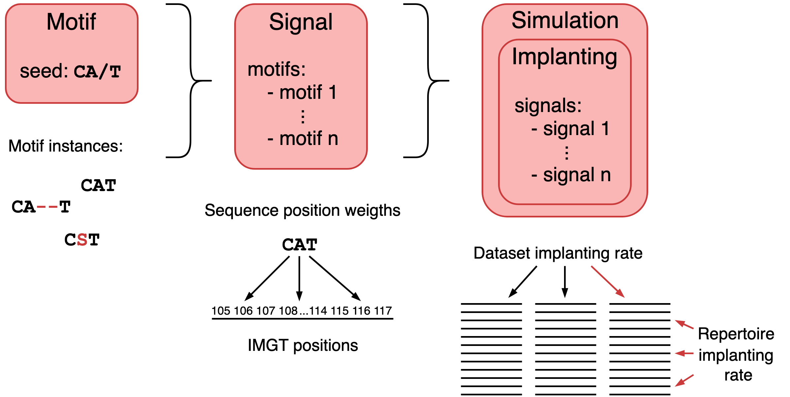

How to simulate immune events into an existing AIRR dataset in Galaxy
========================================================================================

.. meta::

   :twitter:card: summary
   :twitter:site: @immuneml
   :twitter:title: immuneML & Galaxy: simulate immune events into an existing AIRR dataset
   :twitter:description: See tutorials on how to simulate immune events into an existing AIRR dataset in Galaxy.
   :twitter:image: https://docs.immuneml.uio.no/_images/receptor_classification_overview.png

The Galaxy tool `Simulate immune events into an existing repertoire dataset <https://galaxy.immuneml.uiocloud.no/root?tool_id=immuneml_simulation>`_
can be used to implant short disease-associated motifs into an existing
Repertoire dataset. Such a dataset with simulated immune signals can be used to benchmark different ML methods.
Any type of repertoire dataset (experimental or simulated) can be used as a starting point for an immune event simulation, as long as it contains amino acid sequences.

If you instead want to simulate a synthetic dataset from scratch, start by :ref:`simulating an AIRR dataset in Galaxy <How to simulate an AIRR dataset in Galaxy>`.

An example Galaxy history showing how to use this tool `can be found here <https://galaxy.immuneml.uiocloud.no/u/immuneml/h/simulate-signals>`_.

Creating the YAML specification
---------------------------------------------

The Galaxy tool takes in an immuneML dataset from the history and a YAML specification.

In the YAML specification, the :ref:`Simulation` instruction must be used. Additionally, the elements
:code:`motifs`, :code:`signals` and :code:`simulations` must be defined in the :code:`definitions` section of the YAML specification.
A :ref:`motif <Motif>` describes a short amino acid sequence (motif seed) which may be implanted into an immune receptor sequence with small modifications.
A :ref:`signal <Signal>` is a group of motifs, and may for example represent a disease. A simulation consists of :ref:`implantings <Implanting>`, which each represent
one or more signals. This can be used to simulate confounding factors (signals occurring together), or ensure signals do not overlap between repertoires.

These elements are described in more detail in :ref:`YAML specification of the Simulation instruction for introducing immune signals`.

This figure shows how the different concepts in a Simulation relate to each other:

When writing an analysis specification for Galaxy, it can be assumed that all selected files are present in the current working directory. A path
to an additional file thus consists only of the filename.
A complete YAML specification for immune event simulation in Galaxy is show here:

.. highlight:: yaml
.. code-block:: yaml

  definitions:
    datasets:
      dataset: # user-defined dataset name
        format: ImmuneML # the default format used by the 'Create dataset' galaxy tool is ImmuneML
        params:
          path: dataset.iml_dataset # specify the dataset name, the default name used by
                                    # the 'Create dataset' galaxy tool is dataset.iml_dataset

    motifs:
      my_simple_motif: # a simple motif without gaps or hamming distance
        seed: AAA
        instantiation: GappedKmer

      my_complex_motif: # complex motif containing a gap + hamming distance
        seed: AA/A  # ‘/’ denotes gap position if present, if not, there’s no gap
        instantiation:
          GappedKmer:
            min_gap: 1
            max_gap: 2
            hamming_distance_probabilities: # probabilities for each number of
              0: 0.7                        # modification to the seed
              1: 0.3
            position_weights: # probabilities for modification per position
              0: 1
              1: 0 # note that index 2, the position of the gap,
              3: 0 # is excluded from position_weights
            alphabet_weights: # probabilities for using each amino acid in
              A: 0.2          # a hamming distance modification
              C: 0.2
              D: 0.4
              E: 0.2

    signals:
      my_signal:
        motifs: # specify one or more motifs defined above
          - my_simple_motif
          - my_complex_motif
        implanting: HealthySequence
        sequence_position_weights: # the relative likelihood of implanting
          109: 1                   # the motif at each IMGT starting position
          110: 2
          111: 5
          112: 1

    simulations:
      my_simulation:
        my_implanting:
          signals:
            - my_signal  # specify one or more signals defined above
          dataset_implanting_rate: 0.5      # 50% of the repertoires will contain my_signal
          repertoire_implanting_rate: 0.25  # 25% of the sequences in a repertoire will contain one motif

  instructions:
    my_simulation_instruction:
      type: Simulation
      dataset: dataset # specify the dataset defined above
      simulation: my_simulation
      export_formats:
      # only one format can be specified here and the dataset in this format will be
      # available as a Galaxy collection afterwards
        - ImmuneML # Can be AIRR (human-readable) or ImmuneML (recommended for further Galaxy-analysis)

Tool output
---------------------------------------------
This Galaxy tool will produce the following history elements:

- Summary: immune signal simulation: a HTML page describing general characteristics of the dataset, including the name of the dataset
  (this name should be specified when importing the dataset later in immuneML), the dataset type and size, and the details of the
  simulated immune signals.

- Archive: immune signal simulation: a .zip file containing the complete output folder as it was produced by immuneML. This folder
  contains the output of the Simulation instruction including all raw data files.
  Furthermore, the folder contains the complete YAML specification file for the immuneML run, the HTML output and a log file.

- immuneML dataset with simulated immune events: Galaxy collection containing all relevant files for the new dataset.
