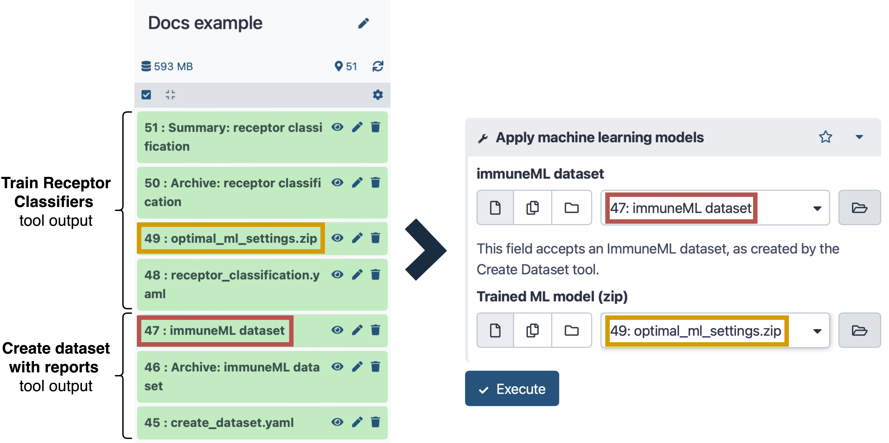

immuneML Galaxy tools
=========================================
.. meta::

   :twitter:card: summary
   :twitter:site: @immuneml
   :twitter:title: immuneML & Galaxy: create a dataset
   :twitter:description: See tutorials on how to create an immuneML dataset in Galaxy.
   :twitter:image: https://docs.immuneml.uio.no/_images/receptor_classification_overview.png

If you are unfamiliar with Galaxy, we recommend to first read :ref:`Introduction to Galaxy`.

Overview of Galaxy tool functionalities
-----------------------------------------------------------

Each immuneML Galaxy tool provides an interface to run a specific immuneML instruction or workflow.
To quickly test different immuneML functionalities, the tools provide button-based interfaces with limited options.
Alternatively, a YAML file may be used as input, which is identical to the YAML file used on the command line interface.

.. list-table::
   :widths: 30 65 20
   :header-rows: 1

   * - Galaxy tool
     - immuneML instruction
     - Interface type
   * - `Create Dataset with Reports <https://galaxy.immuneml.uiocloud.no/root?tool_id=immuneml_dataset>`_
     - Creates dataset and runs optional reports with :ref:`ExploratoryAnalysis` instruction
     - Button or YAML-based
   * - `Simulate a Random Dummy Dataset <https://galaxy.immuneml.uiocloud.no/root?tool_id=immuneml_simulate_random_dummy_dataset>`_
     - Creates dataset with :ref:`random dataset import <How to generate a dataset with random sequences>`
     - Button or YAML-based
   * - `Simulate Immune Events with LIgO <https://galaxy.immuneml.uiocloud.no/root?tool_id=immuneml_simulate_ligo_events>`_
     - Modifies dataset with :ref:`LigoSim` instruction
     - Button or YAML-based
   * - `Train ML Classifiers <https://galaxy.immuneml.uiocloud.no/root?tool_id=immuneml_train_ml_model>`_
     - YAML-based interface for training a classifier with :ref:`TrainMLModel` instruction
     - YAML-based
   * - `Train Receptor Classifier (Simplified Interface) <https://galaxy.immuneml.uiocloud.no/root?tool_id=immuneml_train_receptor_classifier>`_
     - Simplified interface for training a classifier with :ref:`TrainMLModel` instruction with sequence/receptor dataset
     - Button-based
   * - `Train Repertoire Classifier (Simplified Interface)  <https://galaxy.immuneml.uiocloud.no/root?tool_id=immuneml_train_repertoire_classifier>`_
     - Simplified interface for training a classifier with :ref:`TrainMLModel` instruction with repertoire dataset
     - Button-based
   * - `Apply ML Classifier <https://galaxy.immuneml.uiocloud.no/root?tool_id=immuneml_apply_ml_model>`_
     - Applies an ML classifier with :ref:`MLApplication` instruction
     - Button-based
   * - `Train Generative Model <https://galaxy.immuneml.uiocloud.no/root?tool_id=immuneml_train_gen_model>`_
     - Trains a generative model with :ref:`TrainGenModel` instruction
     - Button or YAML-based
   * - `Apply Generative Model <https://galaxy.immuneml.uiocloud.no/root?tool_id=immuneml_apply_gen_model>`_
     - Creates dataset with :ref:`ApplyGenModel` by applying a trained generative model
     - Button-based
   * - `Clustering <https://galaxy.immuneml.uiocloud.no/root?tool_id=immuneml_clustering>`_
     - Clusters a dataset with :ref:`Clustering` instruction
     - Button or YAML-based
   * - `Run immuneML with any YAML specification <https://galaxy.immuneml.uiocloud.no/root?tool_id=immuneml_yaml>`_
     - Runs any instruction (recommended for e.g., advanced :ref:`ExploratoryAnalysis`, or instructions not covered by other tools)
     - YAML-based

immuneML datasets in Galaxy
---------------------------------------------

In Galaxy, an immuneML dataset is a special type of history element, which internally contains an immuneML dataset stored in AIRR format.
Datasets can be imported from files using the `Create Dataset with Reports <https://galaxy.immuneml.uiocloud.no/root?tool_id=immuneml_dataset>`_ tool.
Some other tools also produce (synthetic) immuneML datasets.

Tips for importing data:

- If your dataset contains many files, you may want to consider using a Galaxy collection as input :ref:`using a Galaxy collection as input <Using a Galaxy collection as input>`.
- For quick testing of Galaxy, a dataset of random sequences can quickly be generated using the `Simulate a Random Dummy Dataset <https://galaxy.immuneml.uiocloud.no/root?tool_id=immuneml_simulate_random_dummy_dataset>`_ tool.
- See :ref:`How to import data into immuneML` for general information about datasets in immuneML.

When running a YAML-based tool, the tool will ask you to select a dataset from the Galaxy history, and the YAML should
contain the following snippet to ensure the selected dataset is imported:

.. indent with spaces
.. code-block:: yaml

    definitions:
      datasets:
        dataset:
          format: AIRR
          params:
            path: dataset.yaml

Galaxy tool input and output
---------------------------------------------

Galaxy tools produce their output as history elements which can be viewed, downloaded, or used as input for subsequent tools.
immuneML tools will output the following history elements:

- A summary HTML file showing the results (:ref:`or error in the case of a failed run <Viewing errors and reporting bugs in Galaxy>`).
  For tools generating datasets, the dataset element also serves as the HTML summary.
- An archive containing the zipped folder with all internally generated results (identical to the results you get when running immuneML on the command line).
- Each button-based tool will also return the YAML file that was generated based on the user options to run immuneML.
- Classifiers or generative models generated by the respective tools (these may be used as input for subsequent tools).

