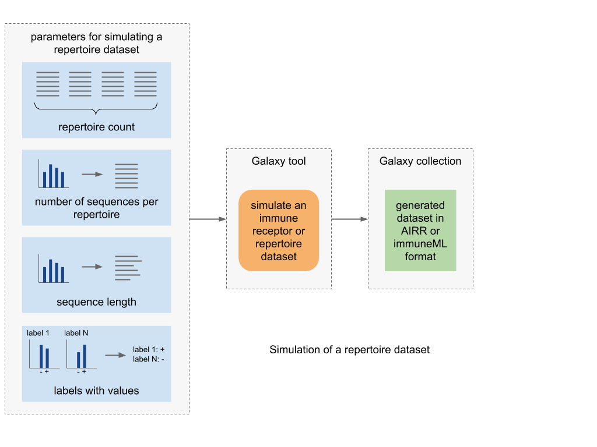
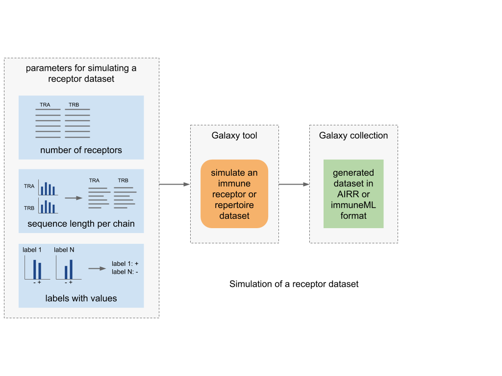

Simulate an immune receptor or repertoire dataset
===================================================

This tool allows you to quickly make a dataset which could be used for benchmarking machine learning methods or encodings,
or testing out other functionalities. The tool generates a SequenceDataset, ReceptorDataset or RepertoireDataset consisting of random CDR3 sequences. The sequences are
made of randomly chosen amino acids and there is no underlying structure in the sequences. You can control how many sequences, receptors or repertoires to
generate and the length of the receptor sequences. Additionally, you can define labels with possible values which will be randomly assigned to the
sequences, receptors or repertoires.

Simulations of a repertoire and a receptor dataset are shown in the figures below.

The tool takes a YAML specification as input and outputs a dataset collection either in Pickle or AIRR format, which can then be downloaded or used as input
for other immuneML Galaxy tools.

The YAML specification should use :ref:`RandomSequenceDataset`, :ref:`RandomReceptorDataset` or :ref:`RandomRepertoireDataset` import in combination with the :ref:`DatasetExport` instruction.
A complete example of a full YAML is shown in this tutorial: :ref:`Exporting a random sequence/receptor/repertoire dataset`.
