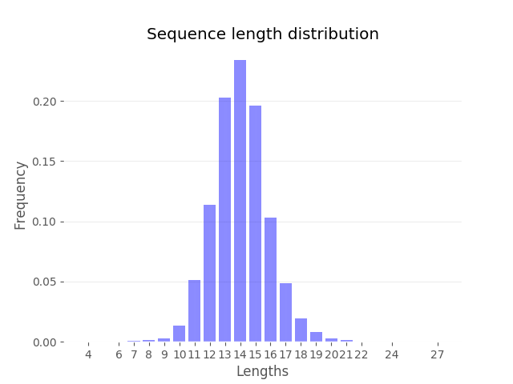

####################
How to add a report
####################

.. toctree::
   :maxdepth: 2

In ImmuneML, it is possible to automatically generate a report describing some aspect of the problem being examined.
There are a few types of reports:

1.  Data report - reports examining some aspect of the dataset (such as sequence length distribution, gene usage etc.),
2.  Encoding report - shows some aspect of the encoded dataset,
3.  Analysis report - reports results of a custom analysis (such as the number of disease-specific sequences found in
    the repertoire of each patient and healthy control),
4.  Machine learning report - shows the characteristics of inferred machine learning models (such as coefficient values
    for logistic regression, learning curves etc.).

These types of reports are modeled by the following classes:

-   **DataReport**,
-   **EncodingReport**,
-   **AnalysisReport**,
-   **MLReport**.

The existing reports listed below can be used by specifying their name in the analysis configuration. However, if a
custom report is needed which has not been covered by the list of existing ones, it is possible to build a new one.
This guide describes how to do that.

The list of available reports is empty at the moment.

Creating a custom report
=========================

Let's assume that for the analysis at hand, it is necessary to look into sequence length distribution in the given dataset.
If such report does not exist, it is necessary to build a new one.

Determine the type of the report
--------------------------------

First, it is important to determine what the type of the report is. If the report should summarize some features of the
dataset, without using the encoded data or machine learning, and does not include any additional analysis, it should be
a data report.

The distribution of sequence lengths is exactly a data report - it summarizes one feature of the dataset and does not use
any external information.

Inherit a class of the chosen report type
-----------------------------------------

Once the report type is chosen, the next step is to inherit a class representing the chosen report type. In this case,
the next step is to build a class **SequenceLengthDistribution** which will inherit **DataReport** class.
**SequenceLengthDistribution** class should be placed in the same package as **DataReport** class: `reports/data_reports/`.

.. code-block:: python

    class SequenceLengthDistribution(DataReport):

        def generate(self, dataset: RepertoireDataset, result_path: str, params: dict):
            pass

**DataReport** class has an abstract method ``generate(...)`` which takes in the following arguments:

-   dataset: dataset object which will be analyzed,
-   result_path: path to the location where the report will be stored,
-   params: dictionary with parameters characteristic for the specific report.

The last argument ``params`` should be used for all additional parameters needed by the new report.

Implement report generation
---------------------------

Now that there is a class which will help to generate a report, it is necessary to implement the ``generate(...)`` function
so that it performs the expected analysis.

In order to perform the expected analysis, it is needed to:

1.  calculate the frequency for each sequence length in the dataset and
2.  plot the calculated frequencies.

Counting the number of occurrences of each sequence length in one repertoire can be done in the following way:

.. code-block:: python

        def count_in_repertoire(self, repertoire: Repertoire) -> Counter:
            # map each sequence to its length and count how many times that length appears for the repertoire
            c = Counter([len(sequence.get_sequence()) for sequence in repertoire.sequences])
            return c

If the number of occurrences is calculated for one repertoire in this way, the next step is to aggregate this across all
repertoires in the given dataset. Once that information is available, it can be normalized by the total number of sequences
in the repertoire.

.. code-block:: python

        def get_normalized_sequence_lengths(self, dataset: RepertoireDataset) -> Counter:
            sequence_lenghts = Counter()

            # sum occurrences of each length across all repertoires in the dataset
            for repertoire in dataset.get_data():
                seq_lengths = self.count_in_repertoire(repertoire)
                sequence_lenghts += seq_lengths

            # calculate the total number of sequences in the repertoire
            total = sum(sequence_lenghts.values())

            # normalize the counts of sequence lengths to obtain the relative frequency
            for key in sequence_lenghts:
                sequence_lenghts[key] /= total

            return sequence_lenghts

Once the sequence lengths distribution is calculated, the following step is to plot the distribution. The x-axis will
contain possible lengths of sequences which occur in the dataset and the y-axis will show how frequent those lengths are.

.. code-block:: python

        def plot(self, normalized_sequence_length, result_path):

            plt.style.use('ggplot')

            x = OrderedDict(sorted(normalized_sequence_length.items(), key=lambda item: item[0]))

            plt.bar(x.keys(), x.values(), alpha=0.45, color="b")
            plt.xticks(list(x.keys()), list(x.keys()))
            plt.grid(True, color='k', alpha=0.07, axis='y')
            plt.xlabel("Lengths")
            plt.ylabel("Frequency")
            plt.title("Sequence length distribution")

            PathBuilder.build(result_path)

            plt.savefig(result_path + "sequence_length_distribution.png", transparent=True)

Finally, with these functions defined, the only thing left is to put them together in the ``generate(..)`` function.

.. code-block:: python

        def generate(self, dataset: RepertoireDataset, result_path: str, params: dict):
            normalized_sequence_lengths = self.get_normalized_sequence_lengths(dataset)
            self.plot(normalized_sequence_lengths, result_path)

Results
=======

When running this report on a dataset, the output plot could look like this:

