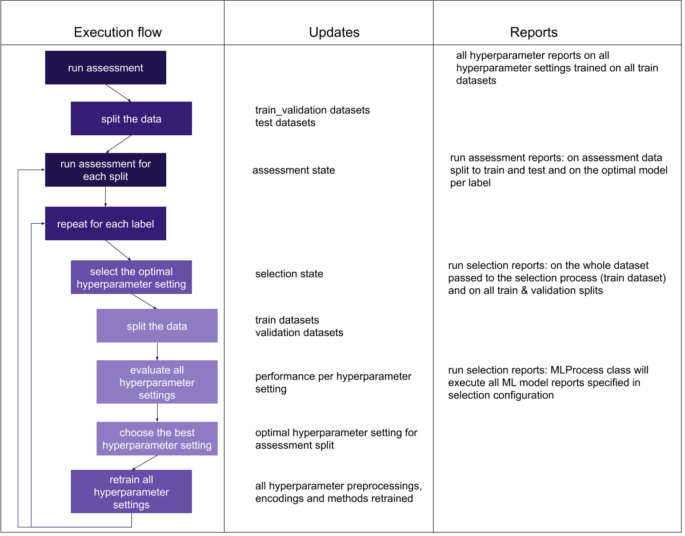
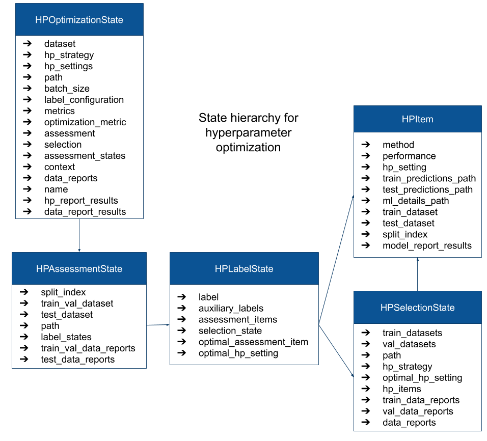

Hyperparameter optimization details
===================================

The flow of the hyperparameter optimization is shown in the Figure 1, along with the output that is generated and reports executed during the particular step:

  Figure 1 - execution flow of the HPOptimizationInstruction along with the information on data and reports generated at each step

The code is split into `HPOptimizationInstruction`, `HPAssessment`, `HPSelection`, `HPUtil` and `HPReports` classes. All code related to hyperparameter
optimization is located in the hyperparameter_optimization package, except HPOptimizationInstruction which is located in the instructions package.

The parameters used to define the hyperparameter optimization, such as dataset, how to split the data, which batch size to use,
along with intermediary results, such as split data and trained ML models are all kept in the `HPOptimizationState` class instance.
This data class is also passed to specified hyperparameter reports. More details on the HPOptimizationState are shown in Figure 2.

  Figure 2 - Hyperparameter optimization state hierarchy of classes along with information each of these classes includes
