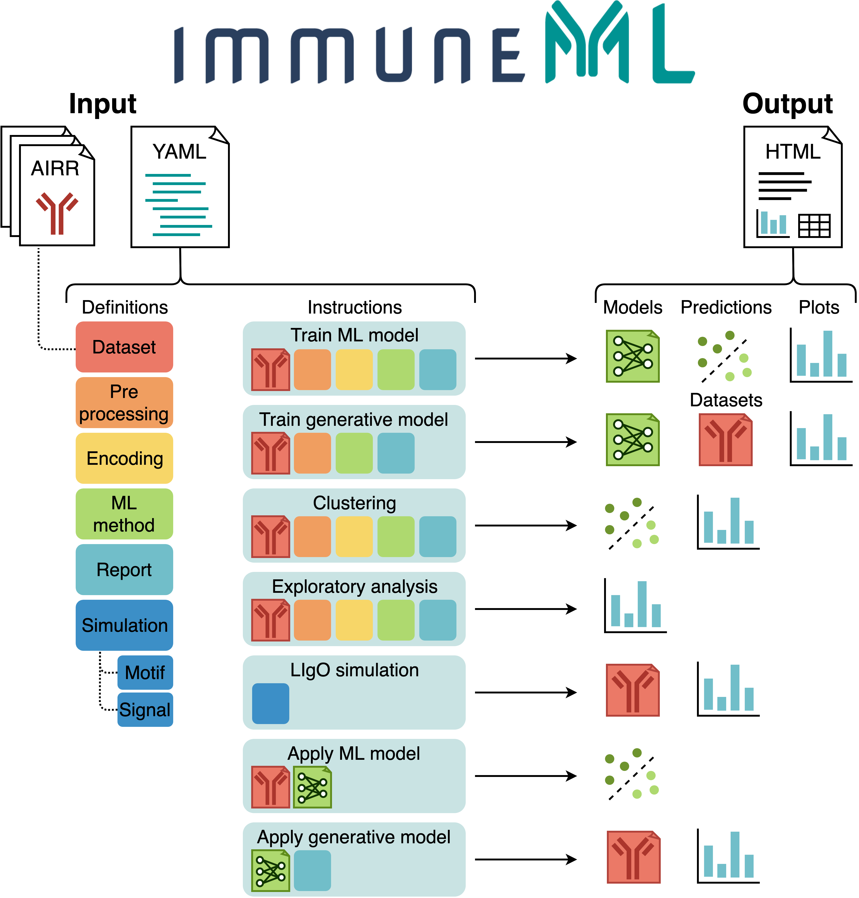

.. immuneML documentation master file, created by
   sphinx-quickstart on Mon Jul 29 19:02:08 2019.
   You can adapt this file completely to your liking, but it should at least
   contain the root `toctree` directive.

Welcome to the immuneML documentation!
======================================

.. meta::

   :twitter:card: summary
   :twitter:site: @immuneml
   :twitter:title: immuneML documentation and tutorials
   :twitter:description: immuneML is an open-source software platform for machine learning analysis of adaptive immune receptor repertoires, available as a Python library, through Galaxy and as a Docker image. On this website, you can browse the platform's documentation and tutorials.
   :twitter:image: https://docs.immuneml.uio.no/_images/receptor_classification_overview.png

immuneML is a platform for machine learning-based analysis and classification of adaptive immune receptors and
repertoires (AIRR). To **get started using immuneML right away**, check out our :ref:`Quickstart` tutorial.

immuneML can be used for:

- **Training ML models** for repertoire classification (e.g., disease prediction) or receptor sequence
  classification (e.g., antigen binding prediction). In immuneML, the performance of different machine learning (ML)
  settings can be compared by nested cross-validation. These ML settings consist of data preprocessing steps, encodings
  and ML models and their hyperparameters.

- **Exploratory analysis of datasets** by applying preprocessing and encoding, and plotting descriptive statistics without training ML models.

- **Simulating** immune events, such as disease states, into experimental or synthetic repertoire datasets.
  By implanting known immune signals into a given dataset, a ground truth benchmarking dataset is created. Such a dataset
  can be used to test the performance of ML settings under known conditions.

- **Applying trained ML models** to new datasets with unknown class labels.

The starting point for any immuneML analysis is the YAML specification file. In this file, the settings of the analysis
components are defined (also known as *definitions*), which are shown in six different colors in the figure below. Additionally, the YAML file
describes one or more *instructions*, which corresponds to one of the applications listed above (and some additional instructions).

   An overview of immuneML usage: analysis components and instructions are specified in a YAML file. Each use case corresponds to a different instruction. The results of the instructions are summarized and presented in an HTML file.

If you want to **use immuneML locally**, see :ref:`Installing immuneML`.

Alternatively, to **run immuneML in a web browser**, go to our `Galaxy Portal <https://galaxy.immuneml.uiocloud.no/>`_.
Here, we offer the same functionalities as in the command-line interface, and in addition simplified button-based interfaces for training classifiers.

To become familiar with the **YAML-based specification**, you can find a concrete example in our :ref:`Quickstart` guide, or read about the overall YAML structure and options in :ref:`How to specify an analysis with YAML`.

- YAML specifications are equivalent between the Galaxy and command-line interfaces. However, in Galaxy datasets must first be converted to a dataset collection (see :ref:`How to make an immuneML dataset in Galaxy`).

We offer :ref:`Tutorials` for specific use cases (e.g., how to train and assess classifiers, or how to generate synthetic immune repertoire data for benchmarking purposes), and under :ref:`immuneML & Galaxy` you will find tutorials using Galaxy as a starting point.

If you are wondering about all the possible **analysis components** and their options, you can find the complete list and
documentation under :ref:`YAML specification`.

Our open-source code can be found on `GitHub <https://github.com/uio-bmi/ImmuneML>`_ :)

Previous versions
-------------------

Documentation for previous immuneML versions can be found here:

- `v2.1.2 <https://docs.immuneml.uio.no/v2.1.2/>`_
- `v2.1.0 <https://docs.immuneml.uio.no/v2.1.0/>`_
- `v2.0.4 <https://docs.immuneml.uio.no/v2.0.4/>`_
- `v1.2.5 <https://docs.immuneml.uio.no/v1.2.5/>`_

.. toctree::
   :maxdepth: 1
   :caption: Contents:

   quickstart
   installation
   tutorials
   galaxy
   specification
   usecases
   troubleshooting
   developer_docs

Indices and tables
==================

* :ref:`genindex`
* :ref:`modindex`
* :ref:`search`
