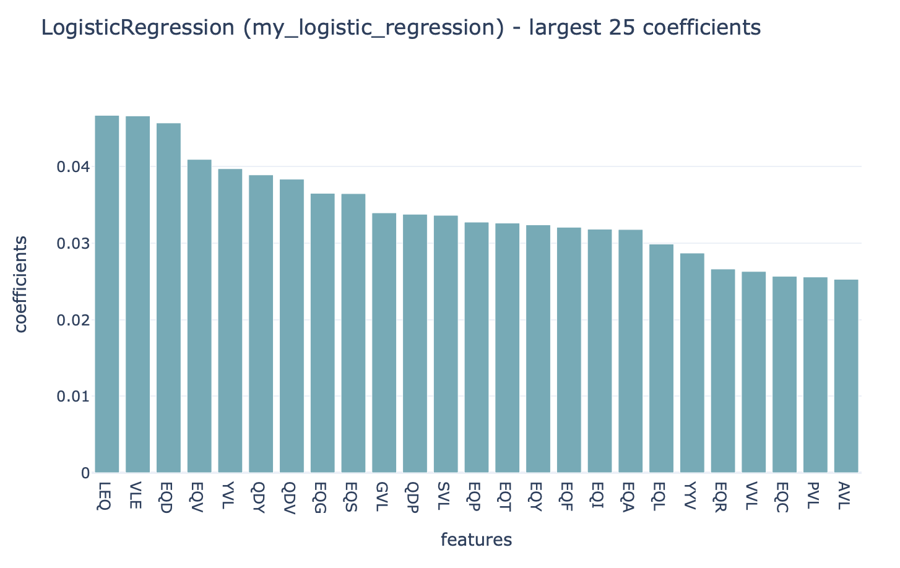

Quickstart
==========

The purpose of this tutorial is to help new users get started with running immuneML as quick as possible.
This tutorial will show you how to use immuneML for a simple machine learning analysis on an adaptive immune receptor repertoire dataset.
This example dataset consists of 100 synthetic immune repertoires (sequences generated by OLGA), each containing 1000 CDR3 sequences.
In half the repertoires, the subsequence 'VLEQ' has been implanted in 5% of the CDR3 sequences to simulate a disease signal.
Using immuneML, we will encode the data as 3-mer frequencies and try to predict the disease status of each repertoire using logistic regression.

The quickest way for a first-time user to try out immuneML is through our Galaxy interface.
Alternatively, immuneML can be installed locally and ran as a command line tool.

Getting started through Galaxy
-------------------------------------------------

The Galaxy web interface is available at https://galaxy.immuneml.uio.no/.
You may choose to register a user account or perform the analysis as an anonymous user.

Different functionalities are available as Galaxy tools (left menu), and the analysis results appear in the Galaxy history (right list).
These history elements can be used as input for the next tool, creating a multi-step analysis workflow.

For reference, a Galaxy history showing the complete results of the Quickstart analysis `can be found here <https://galaxy.immuneml.uio.no/u/immuneml/h/quickstart-complete>`_.

Step 1: importing the dataset to a Galaxy history
^^^^^^^^^^^^^^^^^^^^^^^^^^^^^^^^^^^^^^^^^^^^^^^^^

The Quickstart test dataset is available through `this Galaxy history <https://galaxy.immuneml.uio.no/u/immuneml/h/quickstart-dataset>`_.

This history contains the following items:

- A metadata.csv file, which describes which of the 100 repertoires contain the disease signal named 'signal_disease'.

- 100 repertoire .tsv files in AIRR format.

- immuneML dataset: a galaxy collection made using the above-mentioned files.

Individual files can be inspected by clicking the eyeball icons.
To import the complete history, click the + icon in the right upper corner.

.. image:: _static/images/galaxy/import_galaxy_history.png
   :alt: import button Galaxy
   :width: 250

Step 2: writing the YAML specification
^^^^^^^^^^^^^^^^^^^^^^^^^^^^^^^^^^^^^^^^^^^^^^^^^
Any immuneML analysis is described by a YAML specification file.
This file contains nested key-value pairs. Mandatory keywords with a specific meaning are marked like :code:`this`
in the text. Note that correct whitespace (not tab) indentation of the yaml file is important.

In this tutorial, we will only cover the essential elements of the YAML specification.
For a more complete introduction, see :ref:`How to specify an analysis with YAML`.

The YAML specification consists of:

- :code:`definitions` describing the analysis components.

  - :code:`datasets`: our data is in :ref:`AIRR` format, we need to provide the name of the metadata file.

  - :code:`encodings`: the data will be represented through a :ref:`k-mer frequency encoding <KmerFrequency>`.
    This means each repertoire is represented based on the frequency of subsequences of length k.
    For example, the sequence CSVQYF contains the 3-mers CSV, SVQ, VQY and QYF.

  - :code:`ml_methods`: we will use :ref:`logistic regression <LogisticRegression>` to classify
    the encoded immune repertoires.

  - Optionally, :code:`reports`: we will plot the :ref:`coefficients <Coefficients>` of the trained
    logistic regression model, to get more insight into what the model has learned.

- :code:`instructions` describing the type of analysis.

  - The :ref:`TrainMLModel` instruction is used to train one or more 'ML settings' (combinations of encodings and ML methods),
    and optimize the hyperparameters using nested cross-validation. We can set the parameters for the outer 'assessment' and
    inner 'selection' cross-validation loops.

The complete YAML specification for this analysis looks like this:

.. highlight:: yaml
.. code-block:: yaml

    definitions:
      datasets:
        my_dataset: # user-defined dataset name
          format: AIRR
          params:
            is_repertoire: true # we are importing a repertoire dataset
            metadata_file: metadata.csv

      encodings:
        my_kmer_frequency: # user-defined encoding name
          KmerFrequency:   # encoding type
            k: 3           # encoding parameters

      ml_methods:
        my_logistic_regression: LogisticRegression # user-defined ML model name: ML model type (no user-specified parameters)

      reports:
        my_coefficients: Coefficients # user-defined report name: report type (no user-specified parameters)

    instructions:
      my_training_instruction: # user-defined instruction name
        type: TrainMLModel

        dataset: my_dataset # use the same dataset name as in definitions
        labels:
        - signal_disease    # use a label available in the metadata.csv file

        settings: # which combinations of ML settings to run
        - encoding: my_kmer_frequency
          ml_method: my_logistic_regression

        assessment: # parameters in the assessment (outer) cross-validation loop
          reports:  # plot the coefficients for the trained model
            models:
            - my_coefficients
          split_strategy: random   # how to split the data - here: split randomly
          split_count: 1           # how many times (here once - just to train and test)
          training_percentage: 0.7 # use 70% of the data for training

        selection: # parameters in the selection (inner) cross-validation loop
          split_strategy: random
          split_count: 1
          training_percentage: 1 # use all data for training

        optimization_metric: balanced_accuracy # the metric to optimize during nested cross-validation when comparing multiple models
        metrics: # other metrics to compute for reference
        - auc
        - precision
        - recall

        strategy: GridSearch # strategy for hyperparameter optimization, GridSearch is currently the only available option

        reports: []                # optional train ML model reports to run
        number_of_processes: 4     # processes for parallelization
        refit_optimal_model: false # whether to retrain the model on the whole dataset after optimizing hyperparameters
        store_encoded_data: false  # whether to store intermediate encoded data files (increases disk usage)

After the YAML specification has been saved to a file (for example: quickstart.yaml), it can be uploaded to Galaxy, and
the file will appear as a new history element.

.. image:: _static/images/galaxy/galaxy_upload_data.png
   :alt: upload data Galaxy
   :width: 250

Step 3: running the analysis
^^^^^^^^^^^^^^^^^^^^^^^^^^^^^^^^^^^^^^^^^^^^^^^^^

Next, the `Train machine learning models <https://galaxy.immuneml.uio.no/root?tool_id=immuneml_train_ml_model>`_ Galaxy tool should be used.
Select the YAML specification and previously created dataset from the history, and no additional files.

.. image:: _static/images/galaxy/galaxy_train_ml_model.png
   :alt: train ML model tool
   :width: 500

Step 4: understanding the results
^^^^^^^^^^^^^^^^^^^^^^^^^^^^^^^^^^^^^^^^^^^^^^^^^

After running the Galaxy tool for training ML models, three new items will appear in the Galaxy history.

.. image:: _static/images/galaxy/galaxy_train_ml_model_results.png
   :alt: history elements
   :width: 250

One of the history items contains a summary of the results; a HTML page displaying a summary of the analysis, the performance of the optimized ML model (click 'see details' to navigate further),
and the report that plots the 25 top coefficients of the trained logistic regression model. Notice how the coefficients with the highest
values are associated with the k-mers 'VLE' and 'LEQ', which overlap with the implanted disease signal 'VLEQ'.

Another history item is a .zip file containing the configuration of the optimal ML settings, including settings for the encoding
and machine learning method. Using immuneML, these optimal ML settings can subsequently be applied to a new repertoire dataset with unknown disease labels.

Finally, one of the history items contains a downloadable archive of the complete immuneML ouput. This archive contains the above-mentioned
HTML pages and trained ML models, as well as all ML model predictions, raw report results, the complete YAML specification file for the analysis and a
log file.

Getting started using the command-line interface
-------------------------------------------------

This tutorial assumes that immuneML is already installed locally (see :ref:`Installing immuneML`).
We recommend :ref:`installing immuneML using a package manager <Install immuneML with a package manager>`.

Step 1: downloading the dataset
^^^^^^^^^^^^^^^^^^^^^^^^^^^^^^^^^^^^^^^^^^^^^^^^^

The dataset used in this tutorial can be downloaded from the NIRD Research Data Archive `(DOI ....) <https://doi.org/...>`_,
and download the following files:

- The metadata.csv file, which describes which of the 100 repertoires contain the disease signal named 'signal_disease'.

- The 100 repertoire_<somenumber>.tsv, which are synthethic immune repertoire files in AIRR format.

Step 2: writing the YAML specification
^^^^^^^^^^^^^^^^^^^^^^^^^^^^^^^^^^^^^^^^^^^^^^^^^
Any immuneML analysis is described by a YAML specification file.
This file contains nested key-value pairs. Mandatory keywords with a specific meaning are marked like :code:`this`
in the text. Note that correct whitespace (not tab) indentation of the yaml file is important.

In this tutorial, we will only cover the essential elements of the YAML specification.
For a more complete introduction, see :ref:`How to specify an analysis with YAML`.

The YAML specification consists of:

- :code:`definitions` describing the analysis components.

  - :code:`datasets`: our data is in :ref:`AIRR` format, we need to provide the location of the repertoires and the metadata file.

  - :code:`encodings`: the data will be represented through a :ref:`k-mer frequency encoding <KmerFrequency>`.
    This means each repertoire is represented based on the frequency of subsequences of length k.
    For example, the sequence CSVQYF contains the 3-mers CSV, SVQ, VQY and QYF.

  - :code:`ml_methods`: we will use :ref:`logistic regression <LogisticRegression>` to classify
    the encoded immune repertoires.

  - Optionally, :code:`reports`: we will plot the :ref:`coefficients <Coefficients>` of the trained
    logistic regression model, to get more insight into what the model has learned.

- :code:`instructions` describing the type of analysis.

  - The :ref:`TrainMLModel` instruction is used to train one or more 'ML settings' (combinations of encodings and ML methods),
    and optimize the hyperparameters using nested cross-validation. We can set the parameters for the outer 'assessment' and
    inner 'selection' cross-validation loops.

The complete YAML specification for this analysis looks like this:

.. highlight:: yaml
.. code-block:: yaml

    definitions:
      datasets:
        my_dataset: # user-defined dataset name
          format: AIRR
          params:
            is_repertoire: true # we are importing a repertoire dataset
            path: path/to/repertoires/
            metadata_file: path/to/metadata.csv

      encodings:
        my_kmer_frequency: # user-defined encoding name
          KmerFrequency:   # encoding type
            k: 3           # encoding parameters

      ml_methods:
        my_logistic_regression: LogisticRegression # user-defined ML model name: ML model type (no user-specified parameters)

      reports:
        my_coefficients: Coefficients # user-defined report name: report type (no user-specified parameters)

    instructions:
      my_training_instruction: # user-defined instruction name
        type: TrainMLModel

        dataset: my_dataset # use the same dataset name as in definitions
        labels:
        - signal_disease    # use a label available in the metadata.csv file

        settings: # which combinations of ML settings to run
        - encoding: my_kmer_frequency
          ml_method: my_logistic_regression

        assessment: # parameters in the assessment (outer) cross-validation loop
          reports:  # plot the coefficients for the trained model
            models:
            - my_coefficients
          split_strategy: random   # how to split the data - here: split randomly
          split_count: 1           # how many times (here once - just to train and test)
          training_percentage: 0.7 # use 70% of the data for training

        selection: # parameters in the selection (inner) cross-validation loop
          split_strategy: random
          split_count: 1
          training_percentage: 1 # use all data for training

        optimization_metric: balanced_accuracy # the metric to optimize during nested cross-validation when comparing multiple models
        metrics: # other metrics to compute for reference
        - auc
        - precision
        - recall

        strategy: GridSearch # strategy for hyperparameter optimization, GridSearch is currently the only available option

        reports: []                # optional train ML model reports to run
        number_of_processes: 4     # processes for parallelization
        refit_optimal_model: false # whether to retrain the model on the whole dataset after optimizing hyperparameters
        store_encoded_data: false  # whether to store intermediate encoded data files (increases disk usage)

Step 3: running the analysis
^^^^^^^^^^^^^^^^^^^^^^^^^^^^^^^^^^^^^^^^^^^^^^^^^

Once the YAML specification has been saved to a file (for example: quickstart.yaml), the analysis can be run using the following steps:

#. Activate the virtual environment where immuneML is available (as described in the installation manual).

#. Navigate to the directory where quickstart_specs.yaml was saved.

#. Run the following command:

.. code-block:: console
    immune-ml quickstart_specs.yaml ./quickstart_results/

Step 4: understanding the results
^^^^^^^^^^^^^^^^^^^^^^^^^^^^^^^^^^^^^^^^^^^^^^^^^

The results folder contains a multitude of files and folders, which can most easily be navigated by opening ./quickstart_results/index.html in a browser.
This HTML page displays a summary of the analysis, the performance of the optimized ML model (click 'see details' to navigate further), and the report that plots the 25 top coefficients of
the trained logistic regression model. Notice how the coefficients with the highest values are associated with the k-mers 'VLE' and 'LEQ', which overlap with the implanted disease signal 'VLEQ'.

In the folder ./quickstart_results/exported_models/ a .zip file can be found containing the configuration of the optimal ML settings, including settings for the encoding
and machine learning method. Using immuneML, these optimal ML settings can subsequently be applied to a new repertoire dataset with unknown disease labels.

The folder ./quickstart_results/my_training_instruction/ contains all raw exported results of the TrainMLModel instruction including all ML model predictions and raw report results.

Finally, ./quickstart_results/ contains the complete YAML specification file for the analysis and a log file.

