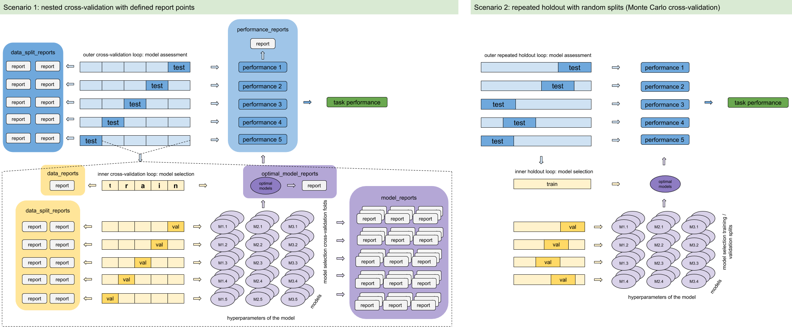

#################
Quickstart guide
#################

This guide will show how to use the ImmuneML and run a simple analysis on simulated data.

Analysis example
=================

The goal of the analysis is to predict whether an individual has a disease or not (i.e. to predict the immune state
of an individual). In this case, the goal is to predict whether an individual has celiac disease or not.
This prediction will be made based on the machine learning analysis of the immune repertoire of a
person. The person's immune repertoire consists of all immune receptor sequences in the individual, some of which are
specific for the disease in question.

In order to be able to predict if an individual has a disease with a machine learning algorithm, it is necessary to
train the algorithm with known examples. The known examples are the repertoires of people who have the disease and the
repertoires of the people who do not have the disease. With these examples at hand, the algorithm can learn to
distinguish between repertoires with the disease and those without, thus yielding a useful approach to prediction.

To be able to learn something from the immune repertoires, machine learning algorithms require the repertoires to have a
suitable representation. In this analysis, a suitable representation will be made by inferring repertoires' vector representation
with Word2Vec.

The workflow of the quickstart analysis
=======================================

The analysis will consist of the following steps:

1.  Definition of the instruction to execute
2.  Hyperparameter optimization in order to choose the best model
3.  Assessment of the trained model on independent test set

Hyperparameter optimization (implemented as nested cross-validation) is illustrated in the following figure.

Performing the analysis
========================

Run specification
-----------------

In the quickstart.py, a Quickstart class is defined that will perform the analysis. The configuration for the analysis
is given as a Python dictionary in the following manner:

.. code-block:: python

            specs = {
              "datasets": {
                  "d1": {
                      "format": "Pickle",
                      "path": dataset_path,
                      "result_path": dataset_path
                  }
              },
              "encodings": {
                  "e1": {
                      "type": "Word2Vec",
                      "params": {
                          "k": 3,
                          "model_creator": "sequence",
                          "size": 8,
                      }
                  }
              },
              "ml_methods": {
                  "simpleLR": {
                      "type": "SimpleLogisticRegression",
                      "params": {
                          "penalty": "l1"
                      },
                      "model_selection_cv": False,
                      "model_selection_n_folds": -1,
                  }
              },
              "preprocessing_sequences": {
                  "seq1": [
                      {"filter_chain_B": {
                          "type": "DatasetChainFilter",
                          "params": {
                              "keep_chain": "A"
                          }
                      }}
                  ],
                  "seq2": [
                      {"filter_chain_A": {
                          "type": "DatasetChainFilter",
                          "params": {
                              "keep_chain": "B"
                          }
                      }}
                  ]
              },
              "reports": {
                  "rep1": {
                      "type": "SequenceLengthDistribution",
                      "params": {
                          "batch_size": 3
                      }
                  }
              },
              "instructions": {
                  "HPOptimization": {
                      "settings": [
                          {
                              "preprocessing": "seq1",
                              "encoding": "e1",
                              "ml_method": "simpleLR"
                          },
                          {
                              "preprocessing": "seq2",
                              "encoding": "e1",
                              "ml_method": "simpleLR"
                          }
                      ],
                      "assessment": {
                          "split_strategy": "random",
                          "split_count": 1,
                          "training_percentage": 0.7,
                          "label_to_balance": None,
                          "reports": {
                              "data_splits": [],
                              "performance": []
                          }
                      },
                      "selection": {
                          "split_strategy": "random",
                          "split_count": 1,
                          "training_percentage": 0.7,
                          "label_to_balance": None,
                          "reports": {
                              "data_splits": ["rep1"],
                              "models": [],
                              "optimal_models": []
                          }
                      },
                      "labels": ["CD"],
                      "dataset": "d1",
                      "strategy": "GridSearch",
                      "metrics": ["accuracy"],
                      "reports": ["rep1"]
                  }
              }
        }

Prerequisites
-------------

To be able to run the code, first install the Python packages listed below. Installation instructions are given using pip.
More details and installation instructions can be found on the corresponding package's websites.

1.  Numpy_

.. code-block:: RST

    $ pip install numpy

2.  Sklearn_

.. code-block:: RST

    $ pip install sklearn

3.  Gensim_

.. code-block:: RST

    $ pip install gensim

Run the analysis
----------------

To perform the analysis described in the previous sections, do the following:

1.  Clone the GitHub repository
2.  Navigate to the ImmuneML folder from the cloned repository
3.  Execute the following line in the terminal:

.. code-block:: RST

    $ python3 source/workflows/processes/quickstart.py

.. _Numpy: http://www.numpy.org/
.. _Sklearn: https://scikit-learn.org/stable/index.html
.. _Gensim: https://radimrehurek.com/gensim/

