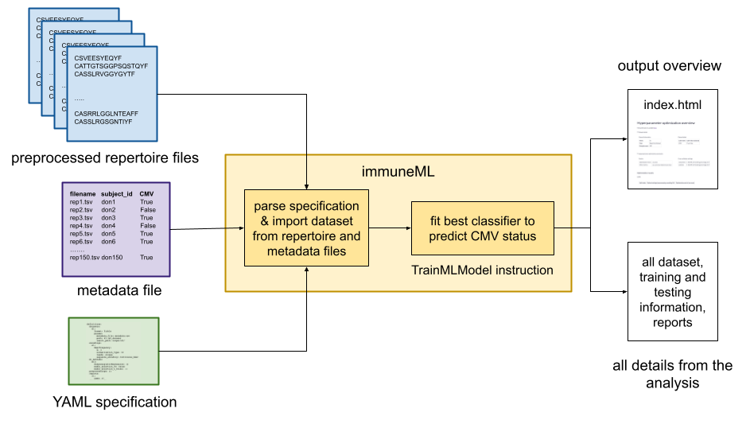

Quickstart
==========

.. toctree::
   :maxdepth: 2

In this tutorial, we will perform a simple machine learning (ML) analysis to show how immuneML can be used on immune receptor repertoire data.
We will use a dataset consisting of 100 immune receptor repertoires with CDR3 amino acid receptor sequences where some of the repertoires come from
CMV positive and some come from CMV negative subjects (a subset of the dataset published byEmerson et al 2017). Based on this dataset,
we will encode the repertoire data as k-mer frequencies and try to predict the CMV status (label) of each repertoire using logistic regression.

This tutorial assumes that immuneML is already installed locally. To see how to do that, see :ref:`Installing immuneML`.
The easiest way to get started is to install immuneML using a package manager, as described in the second subsection of the readme file.

To specify immuneML analysis, we will use a YAML specification file. In this tutorial, we will only cover the basics needed for this particular
example. For more details and more complex analyses, see How to specify an analysis with YAML.

The YAML specification file for our example should include:

1. The definition of the dataset which will be imported from ImmuneML/datasets/cmv_emerson_2017/ (this dataset is automatically available in ImmuneML directory
when you check out the immuneML repository from GitHub,

2. Definition of the machine learning approach:
  a. Encoding: k-mer frequency data representation, where each repertoire is encoded by the frequency of subsequences of amino acids (e.g. from sequence CSVEEQYF, the 3-mers are CSV, SVE, VEE, EEQ, EQY, QYF),
  b. Machine learning approach: logistic regression (a classification algorithm).

3. The instruction describing of what exactly we want to do with the dataset and machine learning approach we defined: in our case, to train the classifier on the dataset of 100 immune repertoires.

Defining components to use for the analysis
^^^^^^^^^^^^^^^^^^^^^^^^^^^^^^^^^^^^^^^^^^^^^^^^^^^^

The specification file consists of two major parts: definitions of components (e.g. datasets, ML approaches) and instructions (what we want to do
with the defined components, e.g. train a machine learning classifier).

In our case, we need the following components:

- Dataset

- Encoding (to represent the dataset in a way that machine learning methods can handle)

- Machine learning method (which specifies the algorithm we want to use as a classifier - in our case it is logistic regression).

These components can be defined in the following way:

.. highlight:: yaml
.. code-block:: yaml

  definitions:
    datasets:
      my_dataset:
        format: AdaptiveBiotech # the dataset is in Adaptive format
        params:
          result_path: ./generated_dataset/ # where to store imported files
          metadata_file: ImmuneML/datasets/cmv_emerson_2017/cmv_emerson_2017_metadata.csv # metadata with CMV status for each repertoire
          path: ImmuneML/datasets/cmv_emerson_2017/repertoires/ # directory where the repertoire files can be found
    encodings:
      kmer_frequency: KmerFrequency
    ml_methods:
      logistic_regression: SimpleLogisticRegression

Specifying the instruction - training an ML classifier
^^^^^^^^^^^^^^^^^^^^^^^^^^^^^^^^^^^^^^^^^^^^^^^^^^^^^^^^

The instruction that we will use to train a logistic regression classifier is called HPOptimization (hyperparameter optimization).
For that instruction, we need to define which dataset we want to use (my_dataset from the specification above), what we want to predict
(which label we want to use – CMV here), which metric we want to optimize (here: accuracy), how we want to split the data for training,
validation and testing (here: split to training and test data, where training will include 70 repertoires and test will have 30 repertoires),
and also which combination of data representation (encoding: here kmer_frequency only) and ML method (here: logistic_regression) we want to use.
In principle, we could try out multiple options for both encoding and ML method (e.g., we could also try using SVM as a classifier), but in this
tutorial we will use only one (logistic regression). There are other options which can be defined for this instruction, but these can have fixed
values for the purpose of this tutorial. For more details, see specification documentation.

The specification for the instruction part looks like this (since we want to train a classifier, we call the instruction
my_train_classifier_instruction):

.. highlight:: yaml
.. code-block:: yaml

  instructions:
  my_train_classifier_instruction:
    type: HPOptimization
    dataset: my_dataset # the dataset defined in definitions / datasets
    labels: ["CMV"] # which label to use for prediction - classify CMV here
    optimization_metric: accuracy # for multiple classifiers, which metric to optimize
    metrics: [auc] # compute additional metrics (balanced_accuracy, precision, recall)
    settings: # which ML settings (encoding/ML combination) to try out
      - {encoding: kmer_frequency, ml_method: logistic_regression}
    strategy: GridSearch # how to optimize multiple settings (only one valid option)
    assessment: # split the data to training and test data
      split_strategy: random # how to split the data - here: split randomly
      split_count: 1 # how many times (here once - just to train and test)
      training_percentage: 0.7 # how much data to use for training (70%)
    selection: # split the train data to train/validation data
      split_strategy: random
      split_count: 1
      training_percentage: 1 # use all data for training
    reports: [] # reports to be run on the whole dataset e.g. sequence length distribution (no reports in now)
    batch_size: 4 # number of repertoires to process at the time (4 here)

Running the analysis
^^^^^^^^^^^^^^^^^^^^^^^^^^^^^^^^^^^^^^^^^^^^^^^^^^^^^^^^

Once we have defined the analysis with the YAML specification, to run this analysis do the following:

#. Activate immuneML environment (as described previously),

#. Download the YAML file we created locally,

#. Run the following command:

.. code-block:: console

  immune-ml quickstart_specs.yaml ./quickstart_results/

If the analysis was completed successfully, the command output should look similar to the log below, where we can see the label used for
prediction and the average performance on the test set. The average performance is computed as the average over performances for each split
to train / test data (in this case, there was only one such split).

Analysis results
^^^^^^^^^^^^^^^^^^^^^^^^^^^^^^^^^^^^^^^^^^^^^^^^^^^^^^^^

The generated dataset should be located under ./generated_dataset/ and the analysis results are located under ./quickstart_results/ folder.
The results include generated dataset, splits for cross validation, all encoded datasets and trained models, as well as all reports listed (if any).
The results folder will also contain index.html file which gives the high level overview of results and reports.

To create your own analysis, see the tutorials for different use-cases or see the documentation for YAML specification (:ref:`Specification`).
