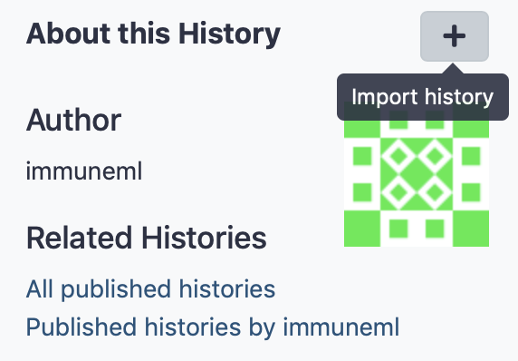

Quickstart: Galaxy with button-based tools
==============================================

This tutorial will show you how to use immuneML for a simple machine learning analysis on an adaptive immune receptor repertoire (AIRR) dataset.
This example dataset consists of 100 synthetic immune repertoires (sequences generated by OLGA), each containing 1000 CDR3 sequences.
In half the repertoires, the subsequence 'VLEQ' has been implanted in 5% of the CDR3 sequences to simulate a disease signal.
Using immuneML, we will encode the data as 3-mer frequencies and try to predict the disease status of each repertoire using logistic regression.

Getting started through Galaxy
-------------------------------------------------

The Galaxy web interface is available at https://galaxy.immuneml.uio.no/.
You may choose to register a user account or perform the analysis as an anonymous user.

Different functionalities are available as Galaxy tools (left menu), and the analysis results appear in the Galaxy history (right list).
These history elements can be used as input for the next tool, creating a multi-step analysis workflow.

The purpose of the Quickstart tutorial is to quickly guide you through an analysis step by step, without assuming prior knowledge of Galaxy.
Additionally, you can check out our :ref:`Introduction to Galaxy` for a more detailed explanation of the Galaxy interface.

Step 1: importing the dataset to a Galaxy history
^^^^^^^^^^^^^^^^^^^^^^^^^^^^^^^^^^^^^^^^^^^^^^^^^

Every immuneML analysis takes a dataset as input. For the Quickstart tutorial, an example dataset has been prepared and is
available through `this Galaxy history <https://galaxy.immuneml.uio.no/u/immuneml/h/quickstart-dataset>`_.
Alternatively, the tutorial :ref:`How to make an immuneML dataset in Galaxy` describes in detail
how to make an immuneML dataset using your own data.

This Quickstart dataset Galaxy history contains the following items:

- A metadata.csv file. The metadata file describes which of the 100 repertoires are diseased and healthy, under the
  column named 'signal_disease' which contains the values True and False.
  For details about the metadata file, see :ref:`What should the metadata file look like?`.

- 100 repertoire .tsv files in AIRR format.

- immuneML dataset: a galaxy collection made using the above-mentioned files.

Individual files can be inspected by clicking the eyeball icons.
To import the complete history, click the + icon in the right upper corner.

Step 2: running the analysis
^^^^^^^^^^^^^^^^^^^^^^^^^^^^^^^^^^^^^^^^^^^^^^^^^

The immuneML Galaxy instance has two tools that provide a simplified interface for training immune receptor and immune
repertoire classifiers. Here, we will use the tool `Train immune repertoire classifiers (simplified interface) <https://galaxy.immuneml.uio.no/root?tool_id=novice_immuneml_interface>`_.

Select the immuneML dataset from the history, and write the name of the label that you want to predict.
In this case, the label is 'signal_disease', because it is defined in the metadata.csv file.

All other options are configurable however you want.
For background information explaining the relevant machine learning concepts, please refer to the text written
below the tool (the text can also be found in :ref:`the documentation <How to train immune repertoire classifiers using the simplified Galaxy interface>`).

Step 3: understanding the results
^^^^^^^^^^^^^^^^^^^^^^^^^^^^^^^^^^^^^^^^^^^^^^^^^

After running the Galaxy tool for training ML models, four new items will appear in the Galaxy history.

The history item 'Summary: repertoire classification' contains HTML pages displaying a summary of the analysis.
On the first page, you will find a table which shows for each of the splits (i.e., each repetition of the experiment)
which of the machine learning models performed best during cross-validation. Furthermore, there is a barplot comparing the performance of the different
machine learning models on the test set across all the splits.

Furthermore, you can click 'see details' in the table to find a more detailed explanation about how well each model
performed in the inner loop of cross validation (on the validation sets).
By clicking 'see reports' you can find reports showing the 25 largest coefficients of logistic regression
or support vector machine, or the top 25 most important features for random forest. Below is an example of logistic
regression coefficients. Notice how the coefficients with the highest values are associated with the k-mers
'VLE' and 'LEQ', which overlap with the implanted disease signal 'VLEQ', meaning the ML model learned the correct signal.

.. image:: ../_static/images/reports/coefficients_logistic_regression.png
   :alt: coefficients report
   :width: 600

The next item, 'Archive: repertoire classification' contains a downloadable archive of the complete immuneML ouput (including
the files available through the other history elements).

The history element 'optimal_ml_settings.zip' is a .zip file containing the configuration of the optimal ML settings,
including settings for the encoding and machine learning method. Using the YAML-based Galaxy tool `Apply machine learning models to new data <https://galaxy.immuneml.uio.no/root?tool_id=immuneml_apply_ml_model>`_
the trained ML model can be used to make predictions on a new dataset where the true disease labels are not known.

Finally, 'repertoire_classification.yaml' contains the YAML specification that was used to run the immuneML analysis.
This YAML specification was automatically generated based on the options you selected in the interface.
You may also use this YAML specification file as a starting point for defining your own analyses later on.

What's next?
-------------------------------------------------

If you haven't done it already, it is highly recommended to follow the :ref:`Introduction to Galaxy`.
If you want to try running immuneML on your own dataset, be sure to check out :ref:`How to make an immuneML dataset in Galaxy`.

While in this tutorial we trained an ML model for making a prediction per repertoire, immuneML also provides
a button-based interface for training ML models to make predictions per sequence, such as antigen binding: `Train immune receptor classifiers (simplified interface) <https://galaxy.immuneml.uio.no/root?tool_id=immuneml_train_classifiers>`_.

immuneML provides many more options for customizing your machine learning analysis when using the YAML-based specification.
To get started with this, you can try out :ref:`Quickstart: Galaxy with YAML-based tools`, for example using
the YAML specification that was produced in the Galaxy history ('repertoire_classification.yaml') with some minor modifications.
See also the tutorial :ref:`How to specify an analysis with YAML` to understand how the YAML specification can be altered.

Other tutorials for how to use each of the (YAML-based) immuneML Galaxy tools can be found under :ref:`immuneML & Galaxy`.
