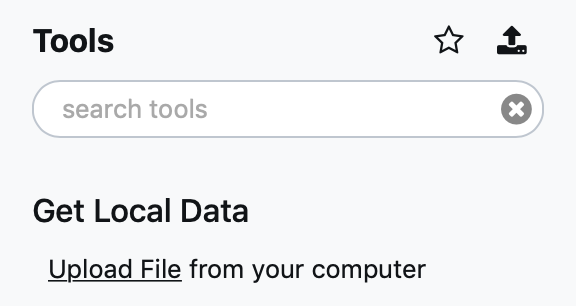

Quickstart: Galaxy with YAML-based tools
==============================================

This tutorial will show you how to use immuneML for a simple machine learning analysis on an adaptive immune receptor repertoire (AIRR) dataset.
This example dataset consists of 100 synthetic immune repertoires (sequences generated by OLGA), each containing 1000 CDR3 sequences.
In half the repertoires, the subsequence 'VLEQ' has been implanted in 5% of the CDR3 sequences to simulate a disease signal.
Using immuneML, we will encode the data as 3-mer frequencies and try to predict the disease status of each repertoire using logistic regression.

Getting started through Galaxy
-------------------------------------------------

The Galaxy web interface is available at https://galaxy.immuneml.uio.no/.
You may choose to register a user account or perform the analysis as an anonymous user.

Different functionalities are available as Galaxy tools (left menu), and the analysis results appear in the Galaxy history (right list).
These history elements can be used as input for the next tool, creating a multi-step analysis workflow.

The purpose of the Quickstart tutorial is to quickly guide you through an analysis step by step, without assuming prior knowledge of Galaxy.
Additionally, you can check out our :ref:`Introduction to Galaxy` for a more detailed explanation of the Galaxy interface.

Step 1: importing the dataset to a Galaxy history
^^^^^^^^^^^^^^^^^^^^^^^^^^^^^^^^^^^^^^^^^^^^^^^^^

Every immuneML analysis takes a dataset as input. For the Quickstart tutorial, an example dataset has been prepared and is
available through `this Galaxy history <https://galaxy.immuneml.uio.no/u/immuneml/h/quickstart-data>`_.
Alternatively, the tutorial :ref:`How to make an immuneML dataset in Galaxy` describes in detail
how to make an immuneML dataset using your own data.

This Quickstart dataset Galaxy history contains the following items:

- 100 repertoire .tsv files in AIRR format.

- A Collection of repertoires. This history element collects the 100 above-mentioned repertoire files in a Galaxy collection.
  To read how to make your own Galaxy collection, see :ref:`Creating a Galaxy collection of files`.

- A metadata.csv file. The metadata file describes which of the 100 repertoires are diseased and healthy, under the
  column named 'signal_disease' which contains the values True and False.
  For details about the metadata file, see :ref:`What should the metadata file look like?`.

Individual files can be inspected by clicking the eyeball icons.
To import the complete history, click the + icon in the right upper corner.

.. image:: ../_static/images/galaxy/import_galaxy_history.png
   :alt: import button Galaxy
   :width: 250

Step 2: creating an immuneML Galaxy dataset
^^^^^^^^^^^^^^^^^^^^^^^^^^^^^^^^^^^^^^^^^^^^^^^^^
Use the `Create dataset <https://galaxy.immuneml.uio.no/root?tool_id=immune_ml_dataset>`_ Galaxy tool to make an
immuneML dataset out of the files in the Galaxy history.
Using the simplified interface, select 'repertoire dataset' and 'AIRR' data format, and select the metadata.csv file as metadata file.
All repertoire files should be selected under 'Data files'. By default, the menu will allow you to select all txt-like files
that are present in the Galaxy history. With smaller datasets, you can simply select all individual repertoire
or receptor files here. Since this is a larger dataset, we will instead select the collection of repertoire files.
Click the 'Dataset collections' button (folder icon), the menu will now only show the collections in the Galaxy history.
Select the collection of repertoires so it becomes highlighted.

Three new items will appear in the Galaxy history. In 'Summary: dataset generation' you can find details about the newly
generated dataset, including the name of the dataset, the dataset type and size, and a download link.

The next item, 'Archive: dataset generation' contains an archive of the output folder produced by immuneML.

Finally, 'immuneML dataset' is a new Galaxy collection containing all relevant files for the dataset.
This history item should be selected as an input in subsequent tools.

Step 3: writing the YAML specification
^^^^^^^^^^^^^^^^^^^^^^^^^^^^^^^^^^^^^^^^^^^^^^^^^
Any immuneML analysis is described by a YAML specification file.
This file contains nested key-value pairs. Mandatory keywords with a specific meaning are marked like :code:`this`
in the text. Note that correct whitespace (not tab) indentation of the yaml file is important.

In this tutorial, we will only cover the essential elements of the YAML specification.
For a more complete introduction, see :ref:`How to specify an analysis with YAML`.

The YAML specification consists of:

- :code:`definitions` describing the analysis components.

  - :code:`datasets`: our data is in :ref:`AIRR` format, we need to provide the name of the metadata file.

  - :code:`encodings`: the data will be represented through a :ref:`k-mer frequency encoding <KmerFrequency>`.
    This means each repertoire is represented based on the frequency of subsequences of length k.
    For example, the sequence CSVQYF contains the 3-mers CSV, SVQ, VQY and QYF.

  - :code:`ml_methods`: we will use :ref:`logistic regression <LogisticRegression>` to classify
    the encoded immune repertoires.

  - Optionally, :code:`reports`: we will plot the :ref:`coefficients <Coefficients>` of the trained
    logistic regression model, to get more insight into what the model has learned.

- :code:`instructions` describing the type of analysis.

  - The :ref:`TrainMLModel` instruction is used to train one or more 'ML settings' (combinations of encodings and ML methods),
    and optimize the hyperparameters using nested cross-validation. We can set the parameters for the outer 'assessment' and
    inner 'selection' cross-validation loops.

The complete YAML specification for this analysis looks like this and can be downloaded here: :download:`quickstart.yaml <../_static/files/quickstart/galaxy/quickstart.yaml>`.

.. highlight:: yaml
.. code-block:: yaml

    definitions:
      datasets:
        my_dataset: # user-defined dataset name
          format: Pickle
          params:
            path: dataset.iml_dataset # 'dataset' is the default name given by the Create dataset tool

      encodings:
        my_kmer_frequency: # user-defined encoding name
          KmerFrequency:   # encoding type
            k: 3           # encoding parameters

      ml_methods:
        my_logistic_regression: LogisticRegression # user-defined ML model name: ML model type (no user-specified parameters)

      reports:
        my_coefficients: Coefficients # user-defined report name: report type (no user-specified parameters)

    instructions:
      my_training_instruction: # user-defined instruction name
        type: TrainMLModel

        dataset: my_dataset # use the same dataset name as in definitions
        labels:
        - signal_disease    # use a label available in the metadata.csv file

        settings: # which combinations of ML settings to run
        - encoding: my_kmer_frequency
          ml_method: my_logistic_regression

        assessment: # parameters in the assessment (outer) cross-validation loop
          reports:  # plot the coefficients for the trained model
            models:
            - my_coefficients
          split_strategy: random   # how to split the data - here: split randomly
          split_count: 1           # how many times (here once - just to train and test)
          training_percentage: 0.7 # use 70% of the data for training

        selection: # parameters in the selection (inner) cross-validation loop
          split_strategy: random
          split_count: 1
          training_percentage: 1 # use all data for training

        optimization_metric: balanced_accuracy # the metric to optimize during nested cross-validation when comparing multiple models
        metrics: # other metrics to compute for reference
        - auc
        - precision
        - recall

        number_of_processes: 4 # processes for parallelization

Save the YAML specification to a local file (for example: quickstart.yaml), and upload it to Galaxy.
The file will appear as a new history element.

Step 4: running the analysis
^^^^^^^^^^^^^^^^^^^^^^^^^^^^^^^^^^^^^^^^^^^^^^^^^

Next, the `Train machine learning models <https://galaxy.immuneml.uio.no/root?tool_id=immuneml_train_ml_model>`_ Galaxy tool should be used.
Select the YAML specification and previously created dataset from the history, and no additional files.

.. image:: ../_static/images/galaxy/galaxy_train_ml_model.png
   :alt: train ML model tool
   :width: 500

Step 5: understanding the results
^^^^^^^^^^^^^^^^^^^^^^^^^^^^^^^^^^^^^^^^^^^^^^^^^

After running the Galaxy tool for training ML models, three new items will appear in the Galaxy history.

.. image:: ../_static/images/galaxy/galaxy_train_ml_model_results.png
   :alt: history elements
   :width: 250

The history item 'Summary: repertoire classification' contains HTML pages displaying a summary of the analysis.
On the first page, you will find a table which shows for each of the splits which of the ML settings (combination of ML model and encoding)
performed best in the inner cross-validation loop, and the performance score of that ML model on the test set.
Furthermore, you can click 'see details' in the table to find a more detailed explanation about how well each model
performed in the inner loop of cross validation (on the validation sets).
By clicking 'see reports' you can find a report that plots the 25 top coefficients of the trained logistic regression model.
Notice how the coefficients with the highest values are associated with the k-mers 'VLE' and 'LEQ', which overlap with
the implanted disease signal 'VLEQ', meaning the ML model learned the correct signal.

.. image:: ../_static/images/reports/coefficients_logistic_regression.png
   :alt: coefficients report
   :width: 600

The next item, 'Archive: repertoire classification' contains a downloadable archive of the complete immuneML ouput (including
the files available through the other history elements).

Finally, history element 'optimal_ml_settings.zip' is a .zip file containing the configuration of the optimal ML settings,
including settings for the encoding and machine learning method. Using the YAML-based Galaxy tool `Apply machine learning models to new data <https://galaxy.immuneml.uio.no/root?tool_id=immuneml_apply_ml_model>`_
the trained ML model can be used to make predictions on a new dataset where the true disease labels are not known.

What's next?
-------------------------------------------------

If you haven't done it already, it is highly recommended to follow the :ref:`Introduction to Galaxy` and :ref:`How to specify an analysis with YAML`.
If you want to try running immuneML on your own dataset, be sure to check out :ref:`How to make an immuneML dataset in Galaxy`.
Other tutorials for how to use each of the immuneML Galaxy tools can be found under :ref:`immuneML & Galaxy`.

The Galaxy interface is intended to make it easy for users to try out immuneML quickly, but for large-scale analyses,
it is best to :ref:`install immuneML <Installing immuneML>` locally. YAML specifications are defined equivalently in
Galaxy and the command-line interface.

