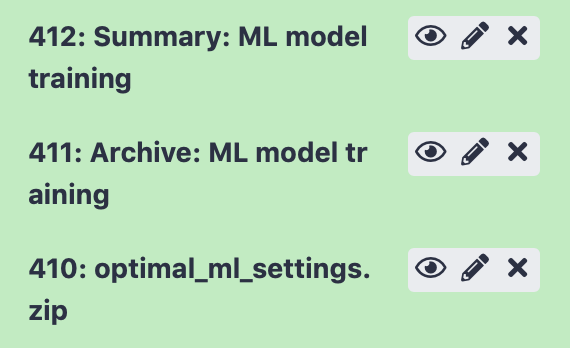

Quickstart: Galaxy with YAML-based tools
==============================================

.. meta::

   :twitter:card: summary
   :twitter:site: @immuneml
   :twitter:title: immuneML quickstart: get started in Galaxy with YAML specification
   :twitter:description: See tutorials on how to run an immuneML quickstart in Galaxy with a YAML specification.
   :twitter:image: https://docs.immuneml.uio.no/_images/receptor_classification_overview.png

This tutorial will show you how to use immuneML for a simple machine learning analysis on an adaptive immune receptor repertoire (AIRR) dataset.
This example dataset consists of 100 synthetic immune repertoires (amino acid sequences generated by `OLGA <https://github.com/statbiophys/OLGA>`_), each containing 1000 CDR3 sequences.
In half the repertoires, the subsequence 'VLEQ' has been implanted in 5% of the CDR3 sequences to simulate a disease signal.
Using immuneML, we will encode the data as 3-mer frequencies and train a logistic regression model to predict the disease status of each repertoire
(i.e., whether the repertoire contains the disease signal 'VLEQ'), which is a binary classification problem.

Getting started through Galaxy
-------------------------------------------------

The Galaxy web interface is available at https://avant.immuneml.uiocloud.no/.
You may choose to register a user account or perform the analysis as an anonymous user.
If you are an anonymous user, the data will disappear once your browser session expires.

Different functionalities are available as Galaxy tools (left menu), and the analysis results appear in the Galaxy history (right list).
These history elements can be used as input for the next tool, creating a multi-step analysis workflow.

The purpose of the Quickstart tutorial is to quickly guide you through an analysis step by step, without assuming prior knowledge of Galaxy.
Additionally, you can check out our :ref:`Introduction to Galaxy` for a more detailed explanation of the Galaxy interface.

Step 1: importing the dataset to a Galaxy history
^^^^^^^^^^^^^^^^^^^^^^^^^^^^^^^^^^^^^^^^^^^^^^^^^

Every immuneML analysis takes a dataset as input. For the Quickstart tutorial, an example dataset has been prepared and is
available through `this Galaxy history <https://avant.immuneml.uiocloud.no/u/immuneml/h/quickstart-data>`_ (under 'Shared data' > 'Histories' > 'Quickstart data').
Alternatively, the tutorial :ref:`How to make an immuneML dataset in Galaxy` describes in detail
how to make an immuneML dataset using your own data.

Individual files can be inspected by clicking the eyeball icons.
To import the complete history, click the + icon in the right upper corner.

.. image:: ../_static/images/galaxy/import_galaxy_history.png
   :alt: import button Galaxy
   :width: 250

This Quickstart dataset Galaxy history contains the following items:

- 100 repertoire .tsv files in AIRR format. For details about the AIRR format, see the `AIRR documentation <https://docs.airr-community.org/en/stable/datarep/format.html>`_

- A Collection of repertoires. This history element collects the 100 above-mentioned repertoire files in a Galaxy collection.
  This Galaxy collection makes it easier to select the repertoires as an input to Galaxy tools (instead of selecting all 100 files manually, you can select the collection).
  To read how to make your own Galaxy collection, see :ref:`Creating a Galaxy collection of files`.

- A metadata.csv file. The metadata file describes which of the 100 repertoires are diseased and healthy, under the
  column named 'signal_disease' which contains the values True and False.
  For details about the metadata file, see :ref:`What should the metadata file look like?`

Step 2: creating an immuneML Galaxy dataset
^^^^^^^^^^^^^^^^^^^^^^^^^^^^^^^^^^^^^^^^^^^^^^^^^
Use the `Create Dataset with Reports <https://avant.immuneml.uiocloud.no/root?tool_id=immuneml_dataset>`_ Galaxy tool (under 'immuneML tools') to import the dataset
and create an *immuneML dataset* history item, which can subsequently be used as input for other Galaxy tools.

Select 'Simplified interface', then 'repertoire dataset' as dataset type and 'AIRR' data format, and select the metadata.csv file as metadata file.
Under the 'Data files' field, all repertoire files must be selected.
This can either be done by manually selecting all 100 repertoire files, or by selecting the Collection of repertoires.
For convenience, we will use the latter option.

By default, the 'Data files' menu will show all txt-like files (such as repertoire files) that are present in the history.
By clicking the 'Dataset collections' button (folder icon), the menu will instead only show the collections in the history.
Select the collection of repertoires so it becomes highlighted.

.. image:: ../_static/images/galaxy/create_dataset_from_collection.png
   :alt: create dataset from collection
   :width: 500

Finally, click 'execute'.

Three new items will appear in the Galaxy history. If everything went correctly, the items would appear green. If the items
are red, an error occurred (check if you correctly selected the collection of repertoires).

In 'Summary: dataset generation' you can find details about the newly
generated dataset, including the name of the dataset, the dataset type and size, and a download link.

The next item, 'create_dataset.yaml' the YAML specification file that was used by immuneML to create the dataset.
This YAML specification could be used when running the Create dataset tool with the 'Advanced' interface.

Finally, 'immuneML dataset' is a new Galaxy collection containing the immuneML dataset in the ImmuneML format.
The ImmuneML format is not human-readable, but it ensures that you can quickly import the dataset into various Galaxy tools
without having to repeatedly specify the import parameters.

Step 3: writing the YAML specification
^^^^^^^^^^^^^^^^^^^^^^^^^^^^^^^^^^^^^^^^^^^^^^^^^
Any immuneML analysis is described by a YAML specification file.
This file contains nested key-value pairs. Mandatory keywords with a specific meaning are :code:`styled like this`
in the text. Note that correct whitespace (not tab) indentation of the yaml file is important.

In this tutorial, we will only cover the essential elements of the YAML specification.
For a more complete introduction, see :ref:`How to specify an analysis with YAML`.

The YAML specification consists of:

- :code:`definitions` describing the analysis components.

  - :code:`datasets`: our data is in :ref:`AIRR` format, we need to provide the name of the metadata file.

  - :code:`encodings`: the data will be represented through a :ref:`k-mer frequency encoding <KmerFrequency>`.
    This means each repertoire is represented based on the frequency of subsequences of length k.
    For example, the sequence CSVQYF contains the 3-mers CSV, SVQ, VQY and QYF.

  - :code:`ml_methods`: we will use :ref:`logistic regression <LogisticRegression>` to classify
    the encoded immune repertoires.

  - Optionally, :code:`reports`: we will plot the :ref:`coefficients <Coefficients>` of the trained
    logistic regression model, to get more insight into what the model has learned.

- :code:`instructions` describing the type of analysis.

  - The :ref:`TrainMLModel` instruction is used to train one or more 'ML settings' (combinations of encodings and ML methods),
    and optimize the hyperparameters using nested cross-validation. We can set the parameters for the outer 'assessment' and
    inner 'selection' cross-validation loops.

The complete YAML specification for this analysis looks like this and can be downloaded here: :download:`quickstart.yaml <../_static/files/quickstart/galaxy/quickstart.yaml>`.

    .. collapse:: quickstart.yaml

        .. literalinclude:: ../_static/files/quickstart/galaxy/quickstart.yaml
           :language: yaml

The YAML specification can either be saved to a local file and uploaded to Galaxy, or pasted directly as a new entry.
This can be done by clicking 'Upload Data' in the left-hand menu, and choosing either 'Choose local files' or 'Paste/Fetch data'.
The file will appear as a new history element

.. image:: ../_static/images/galaxy/galaxy_upload_data.png
   :alt: upload data Galaxy
   :width: 250

Step 4: running the analysis
^^^^^^^^^^^^^^^^^^^^^^^^^^^^^^^^^^^^^^^^^^^^^^^^^

Next, the `Train ML Classifiers <https://avant.immuneml.uiocloud.no/root?tool_id=immuneml_train_ml_model>`_ Galaxy tool (under 'immuneML tools') should be used.
Select the YAML specification and previously created dataset from the history, and no additional files.

.. image:: ../_static/images/galaxy/galaxy_train_ml_model.png
   :alt: train ML model tool
   :width: 500

Step 5: understanding the results
^^^^^^^^^^^^^^^^^^^^^^^^^^^^^^^^^^^^^^^^^^^^^^^^^

After running the Galaxy tool for training ML models, three new items will appear in the Galaxy history.

The history item 'Summary: ML model training' contains HTML pages displaying a summary of the analysis.
On the first page, you will find a table which shows for each of the splits which of the ML settings (combination of ML model and encoding)
performed best in the inner cross-validation loop, and the performance score of that ML model on the test set.
Note that in this tutorial, only 1 data split was used.
Furthermore, you can click 'see details' in the table to find a more detailed explanation about how well each model
performed in the inner loop of cross validation (on the validation sets).
By clicking 'see reports' you can find a report that plots the 25 top coefficients of the trained logistic regression model.
Notice how the coefficients with the highest values are associated with the k-mers 'VLE' and 'LEQ', which overlap with
the implanted disease signal 'VLEQ', meaning the ML model learned the correct signal.

.. image:: ../_static/images/reports/coefficients_logistic_regression.png
   :alt: coefficients report
   :width: 600

The next item, 'Archive: ML model training' contains a downloadable archive of the complete immuneML ouput (including
the files available through the other history elements).

Finally, history element 'optimal_ml_settings.zip' is a .zip file containing the configuration of the optimal ML settings,
including settings for the encoding and machine learning method. This .zip file can be used to apply a previously
trained ML model to a new dataset, which can currently only be done :ref:`How to apply previously trained ML models to a new dataset`<using the command-line interface>.

What's next?
-------------------------------------------------

If you haven't done it already, it is highly recommended to follow the :ref:`Introduction to Galaxy` and :ref:`How to specify an analysis with YAML`.
If you want to try running immuneML on your own dataset, be sure to check out :ref:`How to make an immuneML dataset in Galaxy`.
Other tutorials for how to use each of the immuneML Galaxy tools can be found under :ref:`immuneML & Galaxy`.

The Galaxy interface is intended to make it easy for users to try out immuneML quickly, but for large-scale analyses,
please :ref:`install immuneML <Installing immuneML>` locally or on a private server. YAML specifications are defined equivalently in
Galaxy and the command-line interface.

