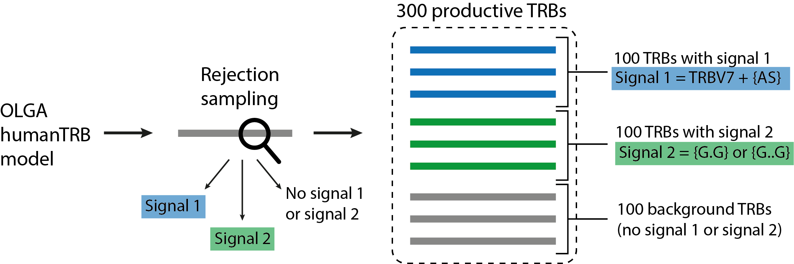

LIgO simulation quickstart
=======================

As LIgO is now a part of immuneML, it can be directly used for simulation.

How to run LIgO
---------------------------------

You can run LIgO in command line using the following command:

.. code-block:: console

  ligo specs.yaml output_folder

Where

* **specs.yaml** — simulation parameters described by the user in a yaml file. Please see :doc:`specification` for more information about LIgO parameters.
* **output_folder** — output folder name defined by the user (should not exist before the run).

How to explore LIgO results
---------------------------------

The output folder structure is the same for all LIgO runs. The output folder should include:

- **index.html**: main output file which gives an overview of the simulation: link to the full specification, the used LIgO version, some general information on the dataset and the link to the dataset exported in the standard AIRR format
- **full_specs.yaml** file: includes the specification and default parameters if any of the parameters where left unfilled
- **inst1** folder: this folder name is the same as the name given to the instruction by the user, all results are located here; the simulated dataset is located under `inst1/exported_dataset/airr/`
- **HTML_output** folder: presentation of figures and reports if specified

How to use LIgO for receptor-level simulation
-------------------------------------------------

Simulation of a TCR dataset containing two immune signals
^^^^^^^^^^^^^^^^^^^^^^^^^^^^^^^^^^^^^^^^^^^^^^^^^^^^^^^^^^^^^^^^^^

In this quickstart tutorial, we will simulate a dataset of 300 productive TRB receptors — 100 TRBs containing signal 1, 100 TRBs containing signal 2,
and 100 TRBs containing no immune signal (background receptors), see the illustration below. Signal 1 consists of a 2-mer {AS} and TRBV7, i.e., only TRBs containing both TRBV7 and 2-mer {AS} contain Signal 1. Signal 2 consists of two gapped k-mers {G.G} and {G..G}.  Signal-specific TRBs will be generated using the rejection sampling strategy and the default OLGA model (humanTRB).

LIgO reports the simulated TRBs as a triple of TRBV gene name, CDR3 AA sequence, and TRBJ gene name. If you also want to report the generation
probabilities (pgen) of the simulated receptors according to the default OLGA humanTRB model, set the *export_p_gens* parameter to true.
Please keep in mind that pgen evaluation may take time.

Step 1: YAML specification
^^^^^^^^^^^^^^^^^^^^^^^^^^^^^^^^^

We need to define the YAML file describing the simulation parameters.

- First, we define the immune signals 1 and 2 in the **definitions** section.. You can read more about the yaml file parameters in :doc:`specification`.
- Second, we define the number of TRBs per each signal in the **simulations** section. You can read more about the yaml file parameters in :doc:`specification`.
- Finally, we define technical parameters of the simulation in the **instructions** section. You can read more about the yaml file parameters in :doc:`specification`.

Here is the complete YAML specification for the simulation:

    .. collapse:: receptor_ligo_quickstart.yaml

        .. code-block:: yaml

          definitions:
            motifs:
              motif1:
                seed: AS
              motif2:
                seed: G/G
                max_gap: 2
                min_gap: 1
            signals:
              signal1:
                v_call: TRBV7
                motifs: [motif1]
              signal2:
                motifs: [motif2]
            simulations:
              sim1:
                is_repertoire: false
                paired: false
                sequence_type: amino_acid
                simulation_strategy: RejectionSampling
                remove_seqs_with_signals: true # remove signal-specific AIRs from the background
                sim_items:
                  sim_item1: # group of AIRs with the same parameters
                    generative_model:
                      chain: beta
                      default_model_name: humanTRB
                      model_path: null
                      type: OLGA
                    number_of_examples: 100
                    signals:
                      signal1: 1
                  sim_item2:
                    generative_model:
                      chain: beta
                      default_model_name: humanTRB
                      model_path: null
                      type: OLGA
                    number_of_examples: 100
                    signals:
                      signal2: 1
                  sim_item3:
                    generative_model:
                      chain: beta
                      default_model_name: humanTRB
                      model_path: null
                      type: OLGA
                    number_of_examples: 100
                    signals: {} # no signal
          instructions:
            my_sim_inst:
              export_p_gens: false
              max_iterations: 100
              number_of_processes: 4
              sequence_batch_size: 1000
              simulation: sim1
              type: LigoSim

Step 2: Running LIgO
^^^^^^^^^^^^^^^^^^^^^^^^^^^^^^^^^

After saving the yaml specification to a file (e.g., quickstart_receptor.yaml), you can proceed with the analysis by following these steps:

#. Activate the virtual environment where you have installed LIgO, for example

.. code-block:: console

  source ligo_env/bin/activate

#. Navigate to the directory where the yaml specification (quickstart_receptor.yaml) was saved.

#. Execute the following command:

.. code-block:: console

  ligo quickstart_receptor.yaml quickstart_output_receptor

All results will be located in quickstart_output_receptor. Note that the output folder (quickstart_output_receptor) should not exist prior to the run.

Step 3: Understanding the output
^^^^^^^^^^^^^^^^^^^^^^^^^^^^^^^^^
The simulated dataset is located under quickstart_output_receptor/inst1/exported_dataset/airr/batch1.tsv. In the output, each row represent one AIR.

Some of the columns are shown in the table below:

.. list-table:: Simulated receptors in AIRR format
    :header-rows: 1

    * - v_call
      - j_call
      - junction_aa
      - signal1
      - signal2
      - signal1_position
      - signal2_position

    * - TRBV10-1*01
      - TRBJ2-5*01
      - CARPDRGGGYTF
      - 0
      - 1
      - m000000000000
      - m000000100000
    * - TRBV7-2*02
      - TRBJ2-5*01
      - CASSRGHFQETQYF
      - 1
      - 0
      - m01000000000000
      - m00000000000000
    * - TRBV7-8*01
      - TRBJ2-3*01
      - CASSSPGGVRIYSTDTQYF
      - 1
      - 0
      - m0100000000000000000
      - m0000000000000000000

Next steps
^^^^^^^^^^^^^^^^^^^^^^^^^^^^^^^^^

You can find more information about yaml parameters in :doc:`specification`. Other tutorials for how to use LIgO can be found under :doc:`tutorials`.

How to use LIgO for repertoire-level simulation
-------------------------------------------------
Simulation of BCR repertoires labeled with two immune events
^^^^^^^^^^^^^^^^^^^^^^^^^^^^^^^^^^^^^^^^^^^^^^^^^^^^^^^^^^^^^^^^^^

In this quickstart tutorial, we will generate a dataset of 20 BCR repertoires, with each repertoire containing 6 BCRs. Out of these, 10 repertoires will be labeled as immune event 1 and will consist of 30% BCRs with signal 1 and 30% BCRs with signal 2. The remaining 10 repertoires will be labeled as immune event 2 and will consist of 50% BCRs with signal 1 and 50% BCRs with signal 2. Signal 1 is composed of a 2-mer {AA}, while signal 2 is composed of a 2-mer {GG}. Signal-specific ИСКыs will be generated using the signal implantation strategy, where any implanting position is allowed, and the default OLGA model (humanIGH).

Step 1: YAML specification
^^^^^^^^^^^^^^^^^^^^^^^^^^^^^^^^^

LIgO simulation starts with defining the YAML file with the simulation parameters.

- First, we define the immune signals 1 and 2 in the **definitions** section. You can read more about the yaml file parameters in :doc:`specification`.
- Second, we define the immune events and the repertoire parameters, such as the number of repertoires and the number of BCRs in therepertoire, in the **simulations** section. You can read more about the yaml file parameters in :doc:`specification`.
- Finally, we define technical parameters of the simulation in the **instructions** section. You can read more about the yaml file parameters in :doc:`specification`.

Here is the complete YAML specification for the simulation:

    .. collapse:: repertoire_ligo_quickstart.yaml

        .. code-block:: yaml

          definitions:
            motifs:
              motif1:
                seed: AA
              motif2:
                seed: GG
            signals:
              signal1:
                motifs: [motif1]
              signal2:
                motifs: [motif2]
            simulations:
              sim1:
                is_repertoire: true
                paired: false
                sequence_type: amino_acid
                simulation_strategy: Implanting
                remove_seqs_with_signals: true # remove signal-specific AIRs from the background
                sim_items:
                  sim_item: # group of AIRs with the same parameters
                    AIRR1:
                      immune_events:
                        ievent1: True
                        ievent1: False
                      signals: [signal1: 0.3, signal2: 0.3]
                      number_of_examples: 10
                      is_noise: False
                      receptors_in_repertoire_count: 6,
                      generative_model:
                        chain: heavy
                        default_model_name: humanIGH
                        model_path: null
                        type: OLGA
                    AIRR2:
                      immune_events:
                        ievent1: False
                        ievent1: True
                      signals: [signal1: 0.5, signal2: 0.5]
                      number_of_examples: 10
                      is_noise: False
                      receptors_in_repertoire_count: 6,
                      generative_model:
                        chain: heavy
                        default_model_name: humanIGH
                        model_path: null
                        type: OLGA
          instructions:
            my_sim_inst:
              export_p_gens: false
              max_iterations: 100
              number_of_processes: 4
              sequence_batch_size: 1000
              simulation: sim1
              type: LigoSim

Step 2: Running LIgO
^^^^^^^^^^^^^^^^^^^^^^^^^^^^^^^^^
After saving the yaml specification to a file (e.g., quickstart_repertoire.yaml), you can proceed with the analysis by following these steps:

#. Activate the virtual environment where you have installed LIgO, for example

.. code-block:: console

  source ligo_env/bin/activate

#. Navigate to the directory where the yaml specification (quickstart_repertoire.yaml) was saved.

#. Execute the following command:

.. code-block:: console

  ligo quickstart_repertoire.yaml quickstart_output_repertoire

All results will be located in quickstart_output_repertoire. Note that the output folder (quickstart_output_repertoire) should not exist prior to the run.

Next steps
^^^^^^^^^^^^^^^^^^^^^^^^^^^^^^^^^

You can find more information about yaml parameters in :doc:`specification`. Other tutorials for how to use LIgO can be found under :doc:`tutorials`.
