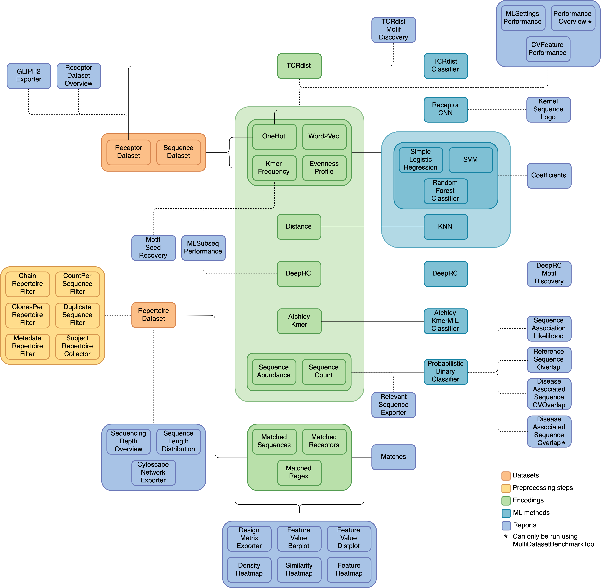

YAML specification
###################

.. meta::

   :twitter:card: summary
   :twitter:site: @immuneml
   :twitter:title: immuneML YAML specification
   :twitter:description: See all valid options for immuneML YAML specification: for importing and simulating AIRR datasets, training ML models, choosing different encodings and reports, performing exploratory analysis.
   :twitter:image: https://docs.immuneml.uio.no/_images/receptor_classification_overview.png

.. toctree::
   :maxdepth: 2

The YAML specification defines which analysis should be performed by immuneML. It is defined under three main keywords:

  - :code:`definitions` - describing the settings of :code:`datasets`, :code:`encodings`, :code:`ml_methods`, :code:`preprocessing_sequences`, :code:`reports`, :code:`simulations` and other components,
  - :code:`instructions` - describing the parameters of the analysis that will be performed and which of the analysis components (defined under :code:`definitions`) will be used for this
  - :code:`output` - describing how to format the results of the analysis (currently, only HTML output is supported).

The purpose of this page is to list all the YAML specification options. If you are not familiar with the YAML specification and get started, see
:ref:`How to specify an analysis with YAML`.

The overall structure of the YAML specification is the following:

.. indent with spaces
.. code-block:: yaml

  definitions: # mandatory keyword
    datasets: # mandatory keyword
      my_dataset_1: # user-defined name of the dataset
        ... # see below for the specification of the dataset
    encodings: # optional keyword - present if encodings are used
      my_encoding_1: # user-defined name of the encoding
        ... # see below for the specification of different encodings
    ml_methods: # optional keyword - present if ML methods are used
      my_ml_method_1: # user-defined name of the ML method
        ml_method_class_name: # see below for the specification of different ML methods
          ... # parameters of the method if any (if none are specified, default values are used)
        # the parameters model_selection_cv and model_selection_n_folds can be specified for any ML method used and define if there will be
        # an internal cross-validation for the given method (if used with TrainMLModel instruction, this will result in the third nested CV, but only over method parameters)
        model_selection_cv: False # whether to use cross-validation and random search to estimate the optimal parameters for one split to train/test (True/False)
        model_selection_n_folds: -1 # number of folds if cross-validation is used for model selection and optimal parameter estimation
    preprocessing_sequences: # optional keyword - present if preprocessing sequences are used
      my_preprocessing: # user-defined name of the preprocessing sequence
        ... # see below for the specification of different preprocessing
    reports: # optional keyword - present if reports are used
      my_report_1:
        ... # see below for the specification of different reports
  instructions: # mandatory keyword - at least one instruction has to be specified
    my_instruction_1: # user-defined name of the instruction
      ... # see below for the specification of different instructions
  output: # how to present the result after running (the only valid option now)
    format: HTML

A diagram of the different dataset types, preprocessing steps, encodings, ML methods and reports, and how they can be
combined in different analyses is shown below. The solid lines represent components that should be used together, and the
dashed lines indicate optional combinations.

Definitions
===========

Datasets
--------

.. include:: ../specs/definitions/datasets.rst

Simulation
----------

.. include:: ../specs/definitions/simulation.rst

Encodings
---------

.. include:: ../specs/definitions/encodings.rst

Reports
---------

.. include:: ../specs/definitions/reports.rst

ML methods
-----------

When choosing which ML method(s) are most suitable for your use-case, please consider the following table.
The table describes which of the ML methods can be used for binary classification (two classes per label), and which
can be used for multi-class classification. Note that all classifiers can automatically be used for multi-label classification
in immuneML.
Furthermore, it describes what type of dataset the classifier can be applied to, and whether a third level of nested cross-validation
can be used for the selection of model parameters (scikit-learn classifiers).

.. csv-table:: ML methods properties
   :file: _static/files/ml_methods_properties.csv
   :header-rows: 1

.. include:: ../specs/definitions/ml_methods.rst

Preprocessings
--------------

.. include:: ../specs/definitions/preprocessings.rst

Instructions
============

.. include:: ../specs/instructions/instructions.rst

Output
======

HTML
----

.. include:: ../specs/output/outputs.rst
