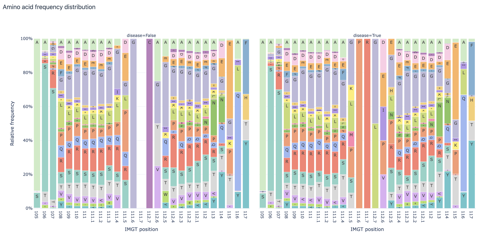
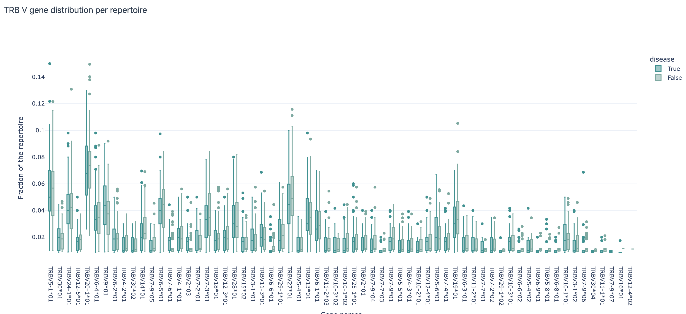
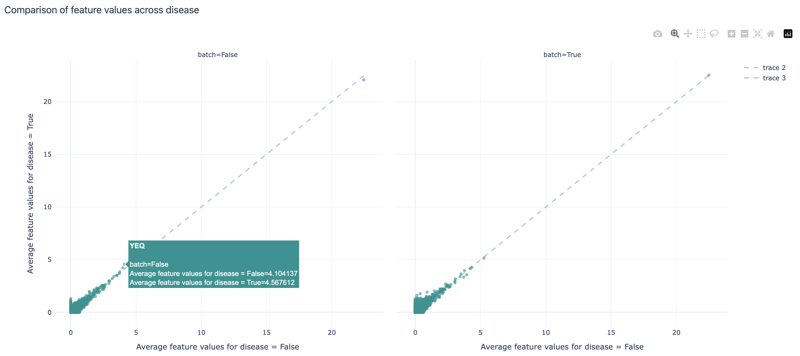
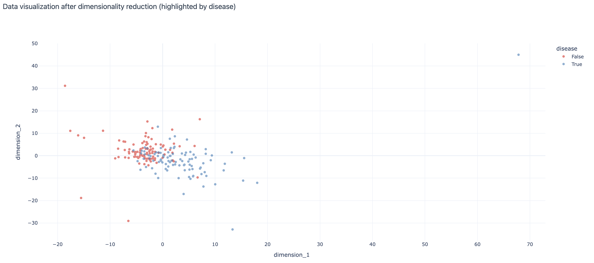
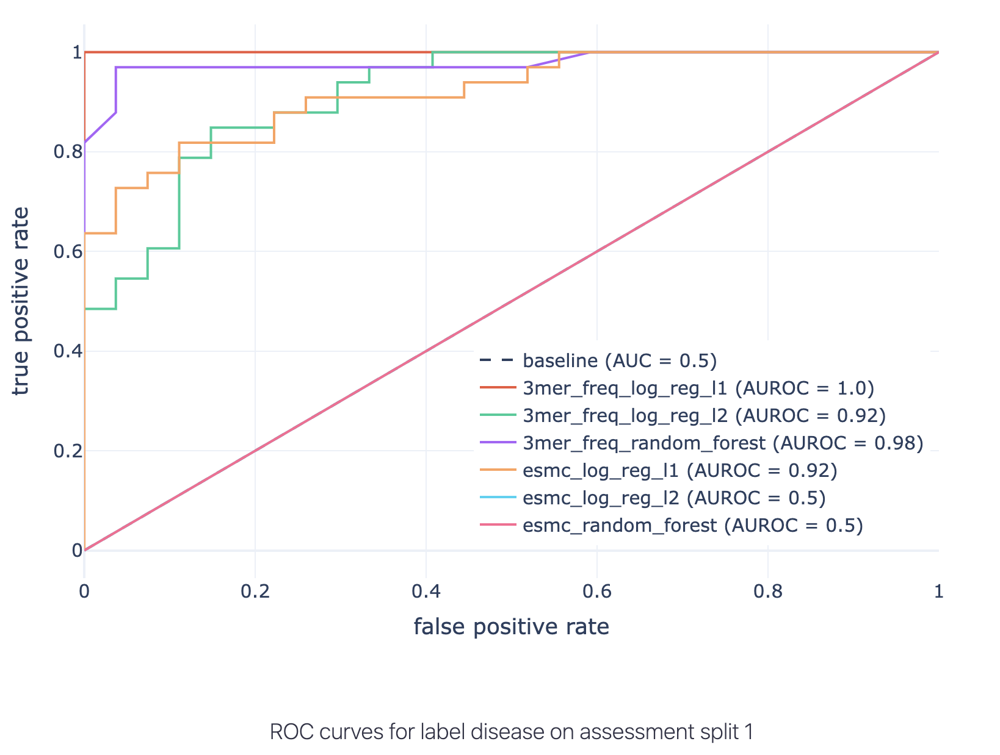
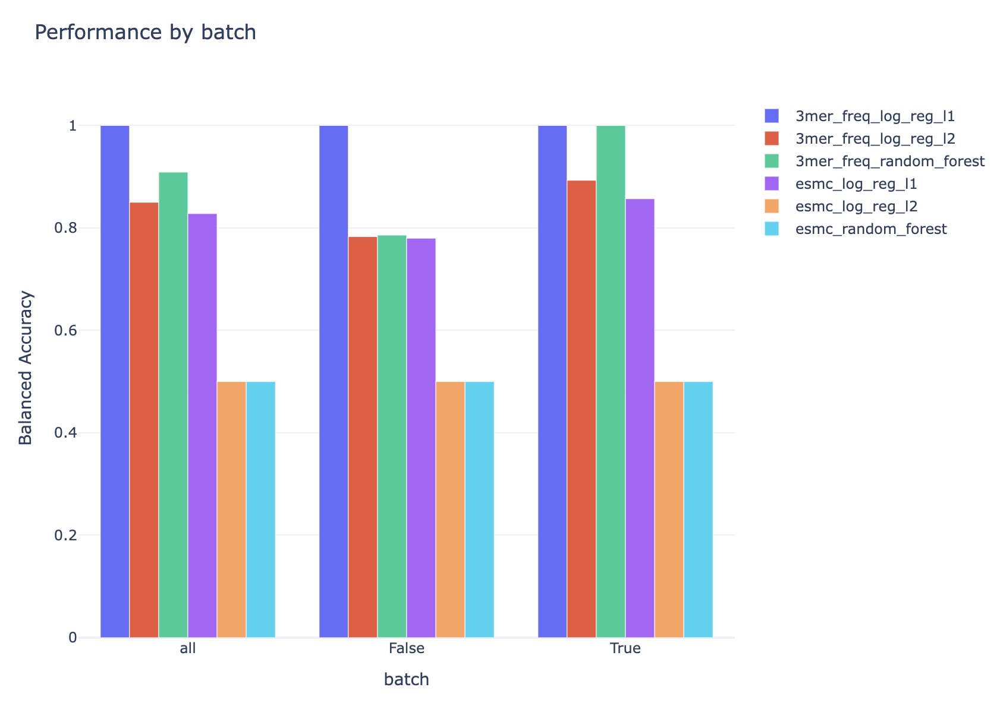

Analyzing Your Own Dataset
===================================

In this tutorial, we will show how to analyze your own dataset with some useful guidelines on which concrete steps to take,
which instructions to use, what visualizations to create. This tutorial assumes immuneML is already installed at your machine.
If that is not the case, see :ref:`Installing immuneML`.

The examples in this tutorial will use a :download:`simulated dataset <../_static/files/dataset.zip>`. It consists of 200 repertoires
with two labels: disease (True, False) and batch (True, False).

The available analysis specifications should be general enough that it can be applied to any dataset with
minimal changes (e.g., paths, label names).

Step 1: Explore the dataset
-----------------------------

Before doing any machine learning, it is important to check the dataset. For that purpose, immuneML offers some
useful reports and visualizations:

- :ref:`AminoAcidFrequencyDistribution`: shows the relative frequency of each amino acid at each position in the sequences;
  the report can also split the dataset per some predefined label (e.g., by disease status)

- :ref:`LabelOverlap`: shows the overlap of two different labels in the dataset as a heatmap; useful if in addition to the
  labels you are interested in, you have some other labels (e.g., batch information) that you want to check for overlap

- :ref:`SequenceLengthDistribution`: shows the histogram of the lengths of sequences by the dataset, optionally split by a
  label of interest; useful to see if the dataset is balanced in terms of sequence lengths

- :ref:`VJGeneDistribution`: shows how frequently each of the V and J gene occurs in the dataset; shows joint V and J gene
  distributions as well; here the report can also be split by a label of interest

- :ref:`LabelDist`: shows the distribution for a list of labels of interest (e.g., disease, batch, age, sex); useful to
  see if the dataset is balanced or if some unexpected values are present

Some useful reports specifically for repertoire datasets (with one repertoire per patient):

- :ref:`RepertoireClonotypeSummary`: shows the number of distinct clonotypes per repertoire; the clonotype counts can be
  colored by label of interest to see if there are any differences in the number of clonotypes per label.

Additional useful reports to be applied on encoded datasets:

- :ref:`FeatureComparison`: splits the data by the label of interests and plots their average values per label as a
  scatterplot, allowing us to visually inspect which features differ the most between the label values.

- :ref:`DimensionalityReduction`: uses a dimensionality reduction method (e.g., PCA, tSNE, UMAP) to visualize the encoded
  dataset and optionally colors the points (each corresponding to one example from the dataset) by the label of interest.

Encodings useful for exploratory analyses:

- :ref:`KmerFrequency` encoder: represents an example by the frequency of subsequences of the given length; see the documentation
  for additional configuration options;

The analysis specification to run these reports:

.. collapse:: step1_exploratory_analysis.yaml

        .. highlight:: yaml
        .. code-block:: yaml

          definitions:
            datasets:
              dataset:
                format: AIRR
                params: # make sure the paths to the downloaded dataset files are correct
                  dataset_file: ./dataset/dataset.yaml
                  metadata_file: ./dataset/metadata.csv

            encodings:
              3mer_freq: KmerFrequency

            reports:

              aa_dist:
                AminoAcidFrequencyDistribution:
                  relative_frequency: true
                  split_by_label: true
                  label: disease
                  alignment: IMGT
                  region_type: IMGT_CDR3

              label_overlap:
                LabelOverlap:
                  column_label: disease
                  row_label: batch

              seq_len_dist_for_disease:
                SequenceLengthDistribution:
                  sequence_type: AMINO_ACID
                  region_type: IMGT_CDR3
                  label: disease
                  split_by_label: true
                  plot_frequencies: true

              seq_len_dist_for_batch:
                SequenceLengthDistribution:
                  sequence_type: AMINO_ACID
                  region_type: IMGT_CDR3
                  label: batch
                  split_by_label: true
                  plot_frequencies: true

              gene_dist_disease:
                VJGeneDistribution:
                  split_by_label: true
                  label: disease

              gene_dist_batch:
                VJGeneDistribution:
                  split_by_label: true
                  label: batch

              clonotype_summary_disease:
                RepertoireClonotypeSummary:
                  split_by_label: true
                  label: disease

              clonotype_summary_batch:
                RepertoireClonotypeSummary:
                  split_by_label: true
                  label: batch

              feature_comparison:
                FeatureComparison:
                  comparison_label: disease
                  column_grouping_label: batch
                  opacity: 0.6
                  show_error_bar: False

              dim_red_disease:
                DimensionalityReduction:
                  label: disease
                  dim_red_method:
                    KernelPCA:
                      n_components: 2

              dim_red_batch:
                DimensionalityReduction:
                  label: batch
                  dim_red_method:
                    KernelPCA:
                      n_components: 2

          instructions:
            exploratory_analysis:
              type: ExploratoryAnalysis
              analyses:
                raw_data_analysis:
                  dataset: dataset
                  reports: [aa_dist, label_overlap, seq_len_dist_for_disease, seq_len_dist_for_batch, gene_dist_disease, gene_dist_batch, clonotype_summary_disease, clonotype_summary_batch]
                encoded_data_analysis:
                  dataset: dataset
                  encoding: 3mer_freq
                  reports: [feature_comparison, dim_red_disease, dim_red_batch]

Run the exploratory analysis from the command line:

.. code-block:: bash

    immune-ml step1_exploratory_analysis.yaml ./exploratory_analysis_results/

Some of the results on the example dataset are shown below:

Amino acid frequency distribution report per IMGT position, split by 'disease' label:

V gene distribution across repertoires split by the 'disease' label:

Comparison of feature values (average 3-mer frequencies per repertoire) across disease and batch labels:

Visualization of the dataset after 3-mer frequency encoding and dimensionality reduction with repertoires (examples)
colored by the 'disease' label:

Step 2: Make a smaller dataset to try out the ML analysis first
-------------------------------------------------------------------

It is often a good idea to make a smaller dataset to try out the analysis first. This can be done by using the
Subsampling instruction.

.. collapse:: step2_make_small_dataset.yaml

        .. highlight:: yaml
        .. code-block:: yaml

                definitions:
                  datasets:
                    dataset:
                      format: AIRR
                      params:
                        dataset_file: ./dataset/dataset.yaml
                        metadata_file: ./dataset/metadata.csv

                instructions:
                  subsampling:
                    type: Subsampling
                    dataset: dataset
                    subsampled_dataset_sizes: [75] # keep only 75 randomly selected repertoires
                    subsampled_repertoire_size: 50 # keep only 50 sequences per repertoire

Run this specification from the command line:

.. code-block:: bash

    immune-ml step2_make_small_dataset.yaml ./small_dataset/

To explore the results, see `./small_dataset/index.html`. The small dataset in AIRR format is then located
at `./small_dataset/subsampling/dataset_75_subsampled_1/exported/airr/`.

Step 3: Run the ML analysis on a smaller dataset & revise the analysis as needed
-------------------------------------------------------------------------------------

Here we define one example of immuneML analysis to build a repertoire classifier to distinguish between diseased and
healthy. We try out different ML methods and encodings and choose the "best" one using nested cross validation. For
more details on how this procedure is done in immuneML, see
:ref:`How to train and assess a receptor or repertoire-level ML classifier`.
For a detailed list of data encodings and ML methods, see :ref:`YAML specification`.

.. note::

        The results we obtain here are not so interesting per se, as we run the analysis on a subset of data. The
        aim is to make sure the analysis runs without issues and that all the parameters of interest (e.g., all
        visualizations and ML-encoding combinations) have been provided.

Here is an example of the specification:

.. collapse:: step3_small_ML_analysis.yaml

        .. highlight:: yaml
        .. code-block:: yaml

                definitions:
                  datasets:
                    dataset:
                      format: AIRR
                      params:
                        dataset_file: ./small_dataset/subsampling/dataset_75_subsampled_1/exported/airr/dataset.yaml
                        metadata_file: ./small_dataset/subsampling/dataset_75_subsampled_1/exported/airr/metadata.csv

                  encodings:
                    3mer_freq: KmerFrequency
                    esmc: ESMC

                  ml_methods:
                    log_reg_l1:
                      LogisticRegression:
                        penalty: l1
                    log_reg_l2:
                      LogisticRegression:
                        penalty: l2
                    random_forest:
                      RandomForestClassifier:
                        n_estimators: 50

                  reports:
                    coefficients: # examine the coefficients of individual models (eg betas of logistic regression)
                      Coefficients:
                        coeff_to_plot: [n_largest]
                        n_largest: [20]

                    ml_setting_comparison: MLSettingsPerformance # plot performance of different ML settings

                    performance_per_label: # performance of the model where examples are grouped by alternative label
                      PerformancePerLabel: # it can be used to see if the model is learning alternative label instead of label of interest
                        alternative_label: batch
                        metric: balanced_accuracy

                    roc_curve_summary: ROCCurveSummary

                instructions:
                  fit_and_eval_classifiers:
                    type: TrainMLModel
                    settings:
                      - encoding: 3mer_freq
                        ml_method: log_reg_l1
                      - encoding: 3mer_freq
                        ml_method: log_reg_l2
                      - encoding: 3mer_freq
                        ml_method: random_forest
                      - encoding: esmc
                        ml_method: log_reg_l1
                      - encoding: esmc
                        ml_method: log_reg_l2
                      - encoding: esmc
                        ml_method: random_forest
                    assessment: # outer loop of the nested cross validation (for model assessment)
                      split_strategy: random # randomly split to train+validation and test
                      split_count: 1
                      training_percentage: 0.7
                      reports:
                        models: [coefficients] # plot coefficients of models trained on the train+validation data
                    selection: # inner loop of the nested cross validation (for model selection)
                      split_strategy: k_fold # do 5-fold CV starting from train+validation data [70% of the original dataset as defined in assessment]
                      split_count: 5
                    labels: [disease]
                    dataset: dataset
                    metrics: [auc, precision, recall]
                    optimization_metric: balanced_accuracy
                    reports: [ml_setting_comparison, performance_per_label, roc_curve_summary]

Run this specification from the command line:

.. code-block:: bash

    immune-ml step3_small_ML_analysis.yaml ./small_ML_result/

To explore the results, see `./small_ML_result/index.html`. In case something went wrong, all details can be found at
`./small_ML_result/log.txt`.

Step 4: Run the analysis on the full dataset
--------------------------------------------------

If everything worked out well so far (or if all necessary adjustments have been made), run the analysis on the full
dataset. The specification file is the same as in step 3, except that dataset file and metadata file should point to
the full dataset instead.

Here are some of the results on the full dataset:

- ROC curves with AUC annotated for all combinations of encoding + ML method listed on the test set:

As the disease-associated signal is a 3-mer (by the simulation setup), the best performing method is a
logistic regression with L1 penalty and with data encoded by 3-mer frequencies.

- Since there is also batch information in the dataset, it is possible to check if the performance of the
  models differs for different batches (the results shown here are for the test set):

Additional information
-----------------------------

The simulated dataset used in this tutorial was created using LIgO tool from immuneML. It uses OLGA to generate
naive immune receptor sequences and simulates immune events by either implanting or filtering sequences based on
user-specified conditions. For more information on LIgO and simulations, see :ref:`Dataset simulation with LIgO`.