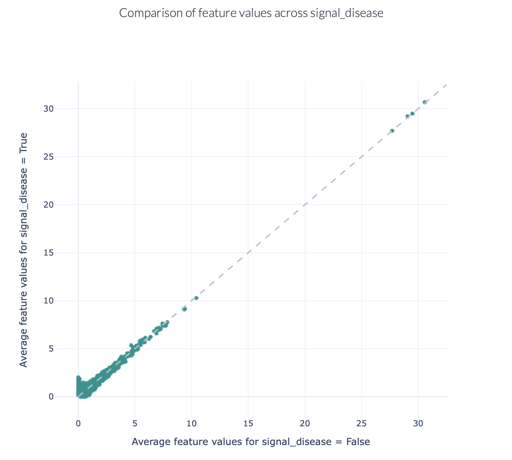
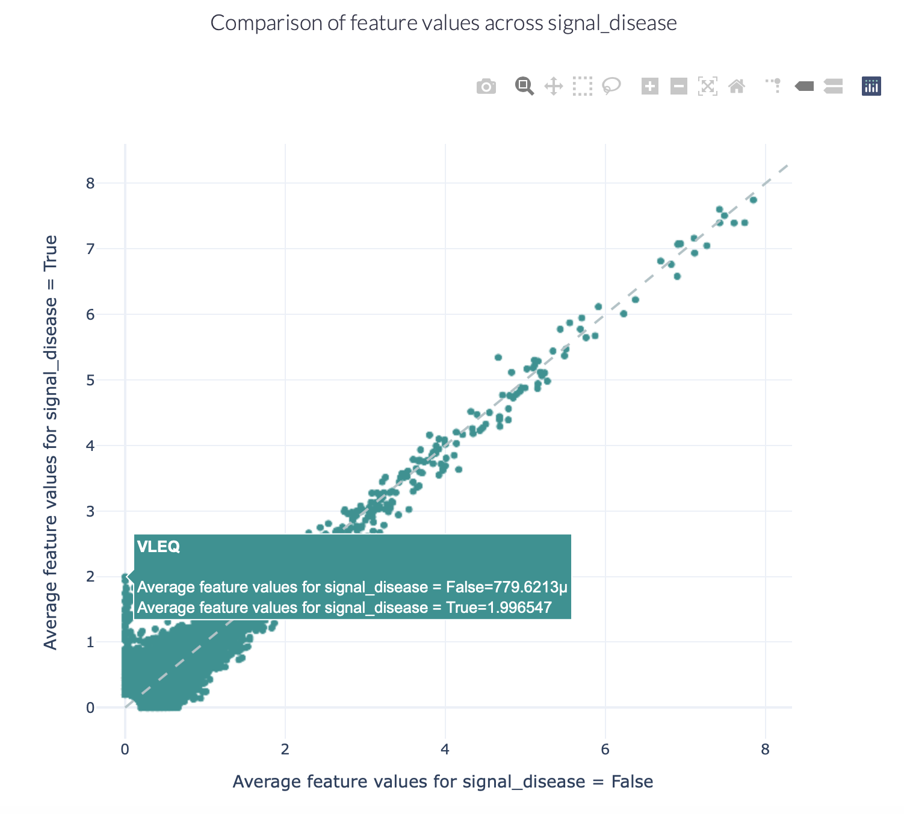

Comparing baseline motif frequencies in repertoires
-----------------------------------------------------------

Not every motif is equally likely to occur in the sequences of an immune repertoire.
The variability of immune receptors is for example restricted by which V, D and J genes are present, among other factors.
Using immuneML, we can investigate the baseline motif frequencies of immune receptor or repertoire datasets.

One method for comparing the baseline motif frequency distributions between different classes (e.g., sick versus healthy,
or antigen binding versus non-binding) is by encoding the dataset using the :ref:`KmerFrequency` encoder,
and generating a :ref:`FeatureComparison` report.
This analysis can be executed using the :ref:`ExploratoryAnalysis` instruction, see :ref:`How to perform an exploratory data analysis` for more details.

The figures below show an example of the FeatureComparison report plot executed on the Quickstart dataset when encoded with a 4-mer frequency encoding.
In this dataset, the synthetic disease signal 'VLEQ' was implanted. The figure on the left shows the complete plot, where it can be seen that
there is a subset of 4-mers which occur at a higher frequency in the repertoires where the disease signal is present.
The figure on the right shows the data from the same figure, but zoomed in on the left lower corner.
The generated figure is interactive, and it is possible to hover over the points to reveal which feature they represent.
As can be seen in the right figure, the feature 'VLEQ' appears more frequently in the repertoires where signal_disease = True.

Alternatively, when investigating the occurrence of more complex motifs in repertoire datasets, the :ref:`MatchedRegex` encoder
can be used in combination with the :ref:`Matches` report. This will produce a table summarizing how often a set of regular
expressions are matched in the sequences of the repertoire dataset.

.. meta::

   :twitter:card: summary
   :twitter:site: @immuneml
   :twitter:title: immuneML: motif recovery
   :twitter:description: See tutorials on how to perform motif recovery in immuneML.
   :twitter:image: https://docs.immuneml.uio.no/_images/receptor_classification_overview.png
