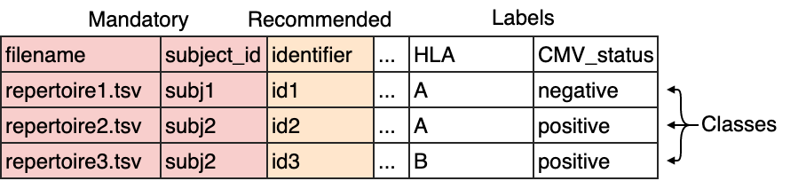

How to import data into immuneML
==================================

.. meta::

   :twitter:card: summary
   :twitter:site: @immuneml
   :twitter:title: immuneML: importing data
   :twitter:description: See tutorials on how to import the data into immuneML.
   :twitter:image: https://docs.immuneml.uio.no/_images/receptor_classification_overview.png

The first step of any immuneML analysis is to import the dataset that will be used. There exist three types of datasets in immuneML:

- **Repertoire datasets** should be used when making predictions per repertoire, such as predicting a disease state.
  When importing a repertoire dataset, you should create a :ref:`metadata file <What should the metadata file look like?>`.

- **Sequence datasets** should be used when predicting values for single immune receptor chains, such as antigen specificity.

- **Receptor datasets** are the paired variant of sequence datasets, and should be used to make a prediction for each receptor chain pair.

A broad range of different import formats can be specified, including AIRR, MiXCR, VDJdb, ImmunoSEQ (Adaptive Biotechnologies),
10xGenomics, OLGA and IGoR. For the complete list of supported data formats, and extensive documentation see :ref:`Datasets`.
If you are using a custom format, or your preferred format is not yet supported, any type of tabular file can also be imported
using :ref:`Generic` import. When possible, using format-specific importers is preferred over Generic import, as they require
less options to be set and might take care of automatic reformatting of certain fields.

Alternatively to importing data from files, it is also possible to generate datasets containing random immune receptor sequences on the fly,
see :ref:`How to generate a dataset with random sequences`.

Dataset metadata (labels)
------------------------------------------
In order to use a dataset for training ML classifiers, the metadata, which contains prediction :code:`labels`, needs to be available.
For repertoire datasets, the metadata is supplied through a metadata file. The metadata file is a .csv file which contains
one repertoire (filename) per row, and the metadata labels for that repertoire.

For sequence and receptor datasets the metadata should be available in the columns of the sequence data files. For example,
VDJdb files contain columns named 'Epitope', 'Epitope gene' and 'Epitope species'. These columns can be specified to serve
as metadata columns. immuneML attempts to import any additional columns for sequence- or receptor datasets as labels,
but the import parameter :code:`label_columns` can be used to explicitly set the column names of labels to import
(see the documentation of the respective import class for details).

What should the metadata file look like?
^^^^^^^^^^^^^^^^^^^^^^^^^^^^^^^^^^^^^^^^^^^^^^^

The metadata file is a simple .csv file describing each repertoire in the dataset, and its corresponding metadata labels.
Note that *only the repertoire files that are present in the metadata file will be imported*.

The format is as follows:

The columns :code:`filename` and :code:`subject_id` are mandatory. The column :code:`identifier` is recommended to
easily identify which results are associated with which repertoire. If no identifiers are supplied, random identifiers are generated.
Any other columns may be defined by the user and will serve as repertoire :code:`labels`, such as for example disease state, HLA type, age or sex.
These labels may be used as prediction targets of ML models, or as additional information when running specific analysis :ref:`Reports`.

For an example of a metadata file, `see here the metadata file <https://ns9999k.webs.sigma2.no/10.11582_2021.00008/cmv_metadata.csv>`_ used to
replicate the analysis by `Emerson et al. 2017 <https://doi.org/10.1038/ng.3822>`_.

YAML specification for importing data from files
-------------------------------------------------

Data import must be defined as a part of the YAML specification. The name is defined by the user. It can consist of letters, numbers and underscores.
Under the dataset name key, the :code:`format` of the data must be specified, as well as additional parameters under a key named :code:`params`.
Under :code:`format`, any of the formats listed under :ref:`Datasets` may be filled in. Under :code:`params`, the parameter :code:`path` is always
required when importing data from files. All the files must be stored in a single folder, and this folder must set through the
parameter :code:`path`.

Here is an incomplete example specification using AIRR format:

.. indent with spaces
.. code-block:: yaml

  definitions:
    datasets:
      my_dataset: # this is the name of the dataset we will use in the YAML specification
        format: AIRR
        params:
          path: path/to/data/
          ... # other import parameters will be specified here

Specifying params for repertoire dataset import
^^^^^^^^^^^^^^^^^^^^^^^^^^^^^^^^^^^^^^^^^^^^^^^
By default, it is assumed that a repertoire dataset should be imported. In this case, the path to the :code:`metadata_file`
must be specified. The metadata file is a .csv file which contains one repertoire (filename) per row, and the metadata
labels for that repertoire. These metadata labels can be used as a prediction target when training ML models.
For more details on structuring the metadata file, see :ref:`What should the metadata file look like?`.
Note that only the repertoire files that are present in the metadata file will be imported.

Other parameters that are specific to the format may be specified under :code:`params` as well, and are explained in more detail for each format
under :ref:`Datasets`.

A complete specification for importing a repertoire dataset from AIRR format with default parameters may look like this:

.. indent with spaces
.. code-block:: yaml

  definitions:
    datasets:
      my_dataset: # this is the name of the dataset we will use in the YAML specification
        format: AIRR
        params:
          # required parameters
          path: path/to/data/
          metadata_file: path/to/metadata.csv
          # is_repertoire is by default True, and may be omitted
          is_repertoire: True
          # Other parameters specific to AIRR data may be specified here

Specifying params for receptor or sequence dataset import
^^^^^^^^^^^^^^^^^^^^^^^^^^^^^^^^^^^^^^^^^^^^^^^^^^^^^^^^^

If you want to import a sequence or receptor dataset, set the parameter :code:`is_repertoire` to false, and set :code:`paired` to either false (sequence dataset)
or true (receptor dataset). For sequence and receptor dataset, metadata labels must be specified directly as columns in the input files.
These metadata labels can be used as a prediction target when training ML models. For example, a column 'binding' can be added, which may have values 'true' and 'false'.
The metadata labels are specified through parameter :code:`metadata_column_mapping`, which is a mapping from the names of the columns in
the file to the names that will be used internally in immuneML (for example: when specifying :code:`labels` in the :ref:`TrainMLModel` instruction).
It is recommended that the immuneML-internal names contain only lowercase letters, numbers and underscores.

A complete specification for importing a sequence dataset from AIRR format with default parameters may look like this:

.. indent with spaces
.. code-block:: yaml

  definitions:
    datasets:
      my_dataset: # this is the name of the dataset we will use in the YAML specification
        format: AIRR
        params:
          # required parameters
          path: path/to/data/
          is_repertoire: false
          paired: false # must be true for receptor dataset and false for sequence datasets
          metadata_column_mapping: # metadata column mapping AIRR: immuneML
            binding: binding # the names could just be the same
            Epitope.gene: epitope_gene # if the column name contains undesired characters, it may be renamed for internal use
          # Other parameters specific to AIRR data may be specified here

For receptor datasets, the additional parameter :code:`receptor_chains` needs to be set, which determines the type
of chain pair that should be imported. The resulting specification may look like this:

.. indent with spaces
.. code-block:: yaml

  definitions:
    datasets:
      my_dataset: # this is the name of the dataset we will use in the YAML specification
        format: AIRR
        params:
          # required parameters
          path: path/to/data/
          is_repertoire: false
          paired: true # must be true for receptor dataset and False for sequence datasets
          receptor_chains: TRA_TRB # choose from TRA_TRB, TRG_TRD, IGH_IGL and IGH_IGK
          metadata_column_mapping: # metadata column mapping AIRR: immuneML
            binding: binding # the names could just be the same
            Epitope.gene: epitope_gene # if the column name contains undesired characters, it may be renamed for internal use
          # Other parameters specific to AIRR data may be specified here

Importing previously generated immuneML datasets
------------------------------------------------

When you import a dataset into immuneML for the first time, it is converted to an optimized binary format,
which speeds up the analysis. The main resulting file has an `.yaml` extension, and may be accompanied
by several other `.yaml` and `.npy` files. When running immuneML locally, you can by default find these immuneML
dataset files in the folder 'datasets', which is located in the main output folder of your analysis.

Some instructions (:ref:`DatasetExport`, :ref:`SubSampling`) also explicitly export binarized immuneML
datasets when selecting 'ImmuneML' as the export format.

These `.yaml` files can later be imported easily and with few parameters, and importing from `.yaml` is
also faster than importing from other data formats. A YAML specification for ImmuneML data import is shown below.
Important note: ImmuneML files might not be compatible between different immuneML (sub)versions.

.. indent with spaces
.. code-block:: yaml

  definitions:
    datasets:
      my_dataset:
        format: ImmuneML
        params:
          path: path/to/dataset.yaml
          # specifying a metadata_file is optional, it will update the dataset using this new metadata.
          metadata_file: path/to/metadata.csv

