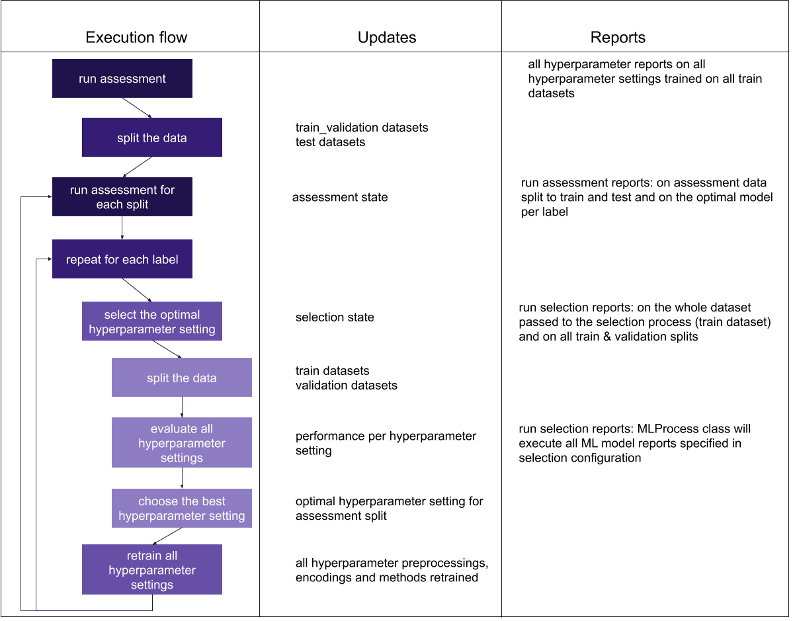

How to train and assess a receptor/repertoire classifier
========================================================

ImmuneML provides a rich set of functionality for learning and assessing machine
learning models (classifiers of receptors or repertoires). It supports both nested
cross-validation and fixed splits into training, validation and test sets for learning
parameters and hyper-parameters. Processing and filtering choices for input receptor data,
as well as encoding choice, can be set up as hyper-parameters for automatic optimization
and unbiased assessment across such choices. One can set up a single ImmuneML run to train
models, optimize hyper-parameters and get an unbiased assessment of its performance.
The resulting optimized classifier can also afterwards be applied to further datasets.
This process is shown in Figure 1.

See :ref:`How to properly train and assess an ML model` to learn more about model training, hyper-parameters and unbiased assessment.

.. figure:: ../_static/images/ml_process_overview.png
  :width: 70%

  Figure 1 - overview of the training process of an ML classifier: hyperparameter
  optimization is done on training and validation data and the model performance is
  assessed on test data

The analysis specification consists of (i) defining all elements used for analysis,
such as the dataset, encodings, preprocessing, ML methods and reports, (ii) defining
the instruction to be executed. Hyperparameter optimization instructions take as parameters:

1. A list of hyperparameter settings (preprocessing, encoding, ML method combinations) to be evaluated,

.. highlight:: yaml
.. code-block:: yaml

  settings:
    - encoding: my_kmer_enc
      ml_method: my_log_reg
    - preprocessing: filter1
      encoding: my_kmer_enc
      ml_method: my_svm

2. Assessment configuration, including:

  2.1. How to split the data in the outer cross-validation loop,

  2.2. How many combinations of training/test datasets to generate based on the given
  splitting strategy,

  2.3. What percentage of data to use for the training dataset (if splitting to training and test is random),

  2.4. Reports to execute:

    2.4.1. Hyperparameter reports: have access to the HPOptimizationState, as explained later in this document,

    2.4.2. Reports on the data splits to be performed on each training and test dataset created,

    2.4.3. Optimal model reports to be generated from optimal models per label

  .. highlight:: yaml
  .. code-block:: yaml

    assessment:
      split_strategy: random
      split_count: 5
      training_percentage: 0.7
      reports:
        hyperparameter:
          - my_hp_benchmark

3. Selection configuration, including:

  3.1. How to split the data in the inner cross-validation loop,

  3.2. How many combinations of train/test datasets to generate based on the strategy,

  3.3. What percentage of data to use for the training dataset (the remaining will be used for validation),

  3.4. Reports to execute:

    3.4.1. Data reports on the whole dataset passed to the inner CV loop,

    3.4.2. Data split reports for each train/validation dataset split,

    3.4.3. ML method reports being run on all ML methods during the selection

  .. highlight:: yaml
  .. code-block:: yaml

    selection:
      split_strategy: random
      split_count: 1
      reports: {}
      training_percentage: 0.7

4. A list of labels to use for prediction,

5. A list of metrics for evaluation (e.g., accuracy, balanced accuracy, f1_weighted…),

6. A metric which will be used for evaluation (given under optimization_metric field)

An example is shown below:

.. highlight:: yaml
.. code-block:: yaml

  definitions:
    datasets:
      simulated_d1:
        format: AdaptiveBiotech
        params:
          result_path: /data_volume/immuneml_parsed/
          metadata_file: /data_volume/metadata.csv
          columns_to_load: [amino_acid]
    encodings:
      my_kmer_enc:
        KmerFrequency:
          k: 4
          sequence_encoding: CONTINUOUS_KMER
          normalization_type: RELATIVE_FREQUENCY
      my_kmer_enc2:
        KmerFrequency:
          k: 3
          sequence_encoding: CONTINUOUS_KMER
          normalization_type: RELATIVE_FREQUENCY
    ml_methods:
      my_svm: SVM
      my_log_reg:
      SimpleLogisticRegression:
        penalty: l1
        C:
          - 1000
          - 100
          - 0.01
          - 0.001
      model_selection_cv: True
      model_selection_n_folds: 5
    reports:
      my_hp_benchmark: BenchmarkHPSettings

  instructions:
    hpoptim_instr:
      type: HPOptimization
      settings:
        - encoding: my_kmer_enc
          ml_method: my_log_reg
        - encoding: my_kmer_enc2
          ml_method: my_svm
      assessment:
        split_strategy: random
        split_count: 5
        training_percentage: 0.7
        reports:
          hyperparameter:
            - my_hp_benchmark
      selection:
        split_strategy: random
        split_count: 1
        training_percentage: 0.7
      labels:
        - label
      dataset: simulated_d1
      metrics: [accuracy, auc] # metrics to be computed for all settings
      strategy: GridSearch
      batch_size: 4
      optimization_metric: balanced_accuracy # the metric used for optimization
      reports: []

The flow of the hyperparameter optimization is shown in the Figure 2, along with the
output that is generated and reports executed during the particular step:

  Figure 2 - execution flow of the HPOptimizationInstruction along with the information on data and reports generated at each step

For implementation detals, see :ref:`Hyperparameter Optimization Details`.