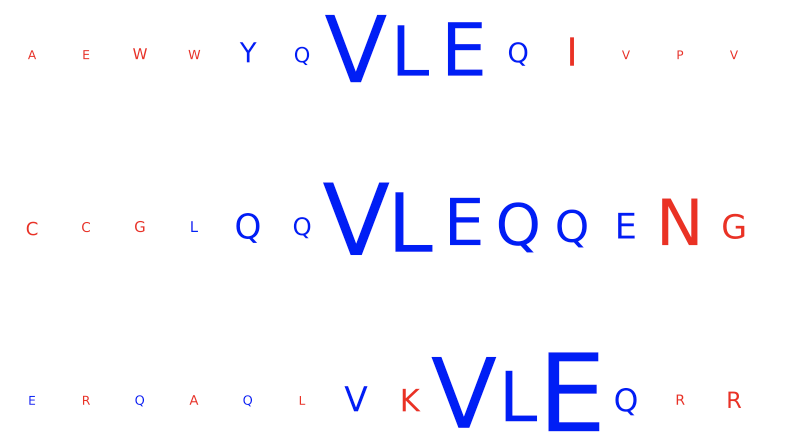
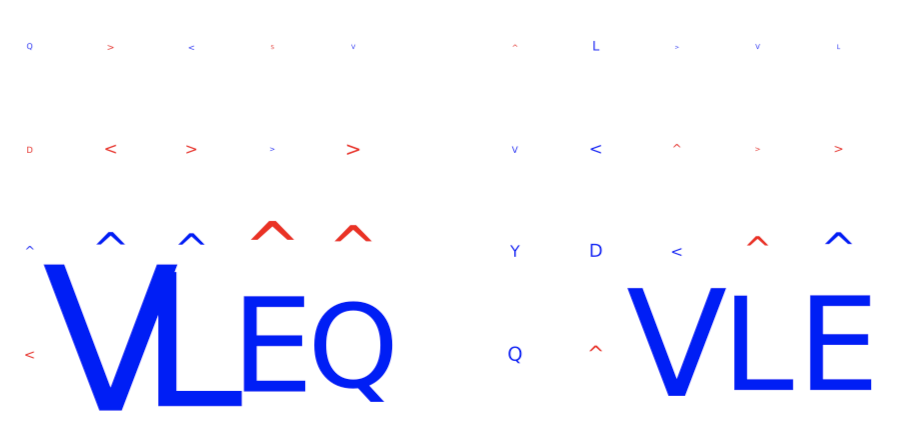
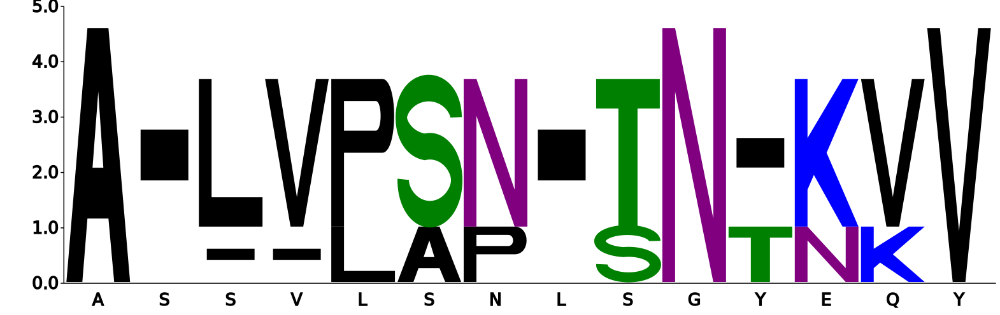
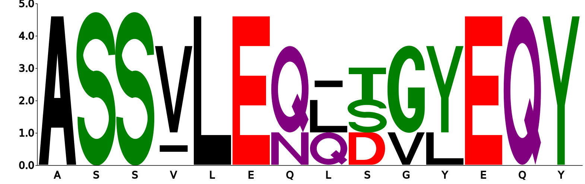

How to discover disease- or antigen specificity-associated motifs
==================================================================================

immuneML provides several different options for recovering motifs associated with antigen specificity or immune states.
Depending on the context, immuneML provides several different reports which can be used for this purpose.

Discovering motifs learned by classifiers
-----------------------------------------

KmerFrequency coefficients
^^^^^^^^^^^^^^^^^^^^^^^^^^^

When using the :ref:`KmerFrequency` encoder in combination with
:ref:`LogisticRegression`, :ref:`SVM` or :ref:`RandomForestClassifier`, a straightforward way to investigate which
k-mer subsequences were learned to be important is by running the :ref:`Coefficients` report.
This can be applied to repertoire, receptor and sequence classification problems.

Strongly positive coefficients might indicate (partial) disease or antigen specificity-associated motifs.
Consider the following example, where the groundtruth implanted disease signal was 'VLEQ', the largest 3-mer encoding coefficients
are associated with the subsequences 'VLE' and 'LEQ' which are contained inside 'VLEQ'.
Furthermore, subsequences that partially overlap with the disease signal, such as 'EQD', 'EQV' and 'YVL'
are also associated with relatively large coefficients.
Note that the coefficient size is not only determined by how important a subsequence is for determining an immune state
or antigen specificity, but also other factors, such as the baseline frequency of subsequences in a dataset.

.. image:: ../_static/images/reports/coefficients_logistic_regression.png
   :alt: Coefficients report
   :width: 600

DeepRCMotifDiscovery for repertoire classification
^^^^^^^^^^^^^^^^^^^^^^^^^^^^^^^^^^^^^^^^^^^^^^^^^^^^^

When using the classifier :ref:`DeepRC` for a repertoire classification task, the report :ref:`DeepRCMotifDiscovery` can
be used to investigate the learned patterns in the data.
This report plots the contributions of input sequences and kernels to trained DeepRC model.
These contributions are computed using integrated gradients (IG).
The following two figures show examples of the DeepRCMotifDiscovery report outputs when training a DeepRC model
on a dataset containing the artificial disease signal 'VLEQ'.

The left figure shows the contributions of the characters within the input sequences of the test dataset
for the immune status prediction of the repertoire. Blue indicates positive contribution, while red indicates
negative contribution.
Similarly, the right figure shows the 1D CNN kernels with the highest contribution over all positions and amino acids.

In this example, one kernel shows a strong signal for the subsequence 'VLEQ' while another shows a strong signal for
'VLE', which results in a strong positive contribution for the subsequence 'VLE' in the input sequences,
with a relatively smaller (but still posxitive) contribution from the remaining 'Q'.

TCRdistMotifDiscovery for receptor classification
^^^^^^^^^^^^^^^^^^^^^^^^^^^^^^^^^^^^^^^^^^^^^^^^^^

For paired receptor datasets, the ML method :ref:`TCRdistClassifier` can be used in combination with the :ref:`TCRdistMotifDiscovery` report.
This report hierarchically clusters paired immune receptor sequences based on the TCRdist3 distance metric, and
for each of the clusters logo plots are created to uncover the motifs within the clustered receptors.
The figures below show examples of the logo plots of the TCRα (left) and TCRβ (right) chains. In this example, the
subsequence 'VLEQ' has been implanted in the TCRβ chains, which can be seen in positions 4-7 in the logo plot on the right.

.. meta::

   :twitter:card: summary
   :twitter:site: @immuneml
   :twitter:title: immuneML: motif recovery
   :twitter:description: See tutorials on how to perform motif recovery in immuneML.
   :twitter:image: https://docs.immuneml.uio.no/_images/receptor_classification_overview.png

coming soon!