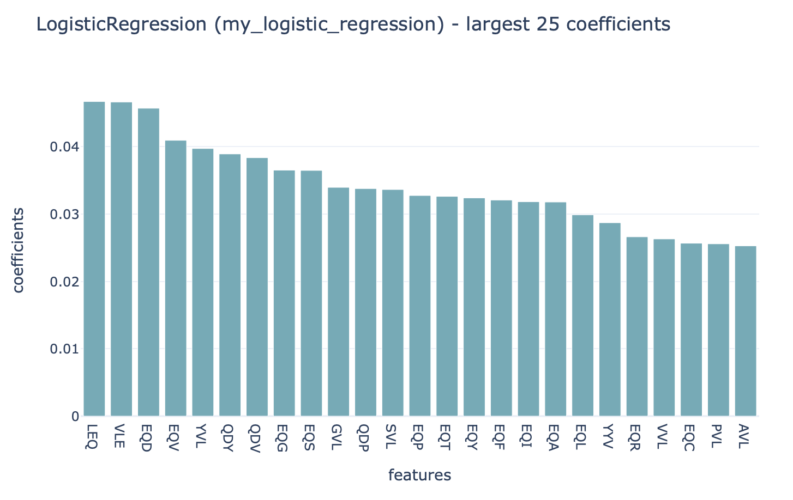

How to discover disease or antigen specificity associated motifs using immuneML
==================================================================================

immuneML provides several different options for recovering or inspecting motifs associated with immune states or antigen specificity.
Depending on the context, immuneML provides several different reports which can be used for this purpose.

Discovering motifs learned by classifiers
-----------------------------------------

KmerFrequency coefficients
^^^^^^^^^^^^^^^^^^^^^^^^^^^

When using the :ref:`KmerFrequency` encoder in combination with
:ref:`LogisticRegression`, :ref:`SVM` or :ref:`RandomForest`, a straightforward way to investigate which
k-mer subsequences were learned to be important is by running the :ref:`Coefficients` report.
This can be applied to repertoire, receptor and sequence classification problems.

Strongly positive coefficients might indicate (partial) disease or antigen specificity-associated motifs.
Consider the following example, where the groundtruth implanted disease signal was 'VLEQ', the largest coefficients
are associated with the subsequences 'VLE' and 'LEQ' which are contained inside 'VLEQ'.
Furthermore, subsequences that partially overlap with the disease signal, such as 'EQD', 'EQV' and 'YVL'
are also associated with relatively large coefficients.
Note that the coefficient size is not only determined by how important a subsequence is for determining an immune state
or antigen specificity, but also other factors, such as
:ref:`the baseline frequency of subsequences in a dataset <Comparing baseline motif frequencies subsets of the dataset>`.

DeepRCMotifDiscovery for repertoire classification
^^^^^^^^^^^^^^^^^^^^^^^^^^^^^^^^^^^^^^^^^^^^^^^^^^^^^

When using the classifier :ref:`DeepRC` for a repertoire classification task, the report :ref:`DeepRCMotifDiscovery` can
be used to investigate the learned patterns in the data.
This report plots the contributions of input sequences and kernels to trained DeepRC model.
These contributions are computed using integrated gradients (IG).
The following two figures show examples of the DeepRCMotifDiscovery report outputs when training a DeepRC model
on a dataset containing the artificial disease signal 'VLEQ'.

The left figure shows the contributions of the characters within the input sequences of the test dataset
for the immune status prediction of the repertoire. Blue indicates positive contribution, while red indicates
negative contribution.
Similarly, the right figure shows the 1D CNN kernels with the highest contribution over all positions and amino acids.

.. image:: ../_static/images/reports/deeprc_ig_inputs.png
   :alt: DeepRC IG over inputs
   :height: 150px

.. image:: ../_static/images/reports/deeprc_ig_kernels.png
   :alt: DeepRC IG over kernels
   :height: 150px

In this example, one kernel shows a strong signal for the subsequence 'VLEQ' while another shows a strong signal for
'VLE', which results in a strong positive contribution for the subsequence 'VLE' in the input sequences,
with a relatively smaller contribution from the remaining 'Q'.

TCRdistMotifDiscovery for receptor classification
^^^^^^^^^^^^^^^^^^^^^^^^^^^^^^^^^^^^^^^^^^^^^^^^^^

For paired receptor datasets, the ML method :ref:`TCRdistClassifier` and :ref:`TCRdistMotifDiscovery` report can be used.
This report hierarchically clusters paired immune receptor sequences based on the TCRdist3 distance metric, and
for each of the clusters logo plots are created to uncover the motifs within the clusters.
The figures below show examples of the logo plots of the TCRα and TCRβ chains respectively. In this example, the
subsequence 'VLEQ' has been implanted in the TCRβ chains, which can be seen in the logo plot.

.. image:: ../_static/images/reports/tcrdist_motif_b.svg
   :alt: TCRdist beta chain logo plot
   :width: 300px

Recovering simulated immune signals
-----------------------------------
The :ref:`Simulation instruction<How to simulate antigen or disease-associated signals in AIRR datasets>` can be used to implant
synthetic immune signals into AIRR datasets. Such immune signals can range from simple k-mers to collections of different
k-mers with possible gap positions or stochastic hamming distance modifications.

The advantage of implanted immune signals is that the ground truth is known, meaning that the motifs learned
by a classifier can be compared with the motifs that were originally implanted.
When using  the :ref:`KmerFrequency` encoder in combination with :ref:`LogisticRegression`, :ref:`SVM` or :ref:`RandomForest`,
this comparison can be made using the :ref:`MotifSeedRecovery` report.

First, a maximum overlap score is calculated between each :ref:`KmerFrequency` feature (AAA, AAC, ...) and the implanted motif seeds.
This score represents how well a given feature represents at least one of the motif seeds that comprise the ground truth signal.
When calculating this overlap score, possible gap positions and hamming distance modifications are considered (see :ref:`MotifSeedRecovery` for details).
The maximum overlap score between each feature and the motif seeds is determined using a sliding window approach.
Therefore, the feature and motif seed do not have to have an equal length.
The resulting overlap scores will be highest for features that completely match the motif seed, lower for features
that partially match (for example A**AC** and **AC**C have at most 2 positions overlap), and lowest for features that
do not represent any of the motif seeds.

Next, the features are grouped based on their maximum overlap scores. For each overlap score, a boxplot is made
representing the coefficient value (LogisticRegression, SVM) or feature importance (RandomForest) for those features.
If the classifier succeeded in learning the signal, the coefficient value or feature importance is highest
for those motifs with a high overlap score.

An example of what the output of the :ref:`MotifSeedRecovery` report looks like for a successful classifier is given here:

.. image:: ../_static/images/reports/motif_seed_recovery.png
   :alt: Motif seed recovery report
   :width: 600

Comparing baseline motif frequencies subsets of the dataset
-----------------------------------------------------------
baseline frequencies of motifs:
- kmerencoder + featurevaluebarplot / featurevaluedistplot

more complex motifs:
- matches reports

 When using kmer encoder, FeatureValueBarplot or FeatureValueDistplot could be used to visualize this.
 Otherwise MatchedRegexEncoder + Matches report for investigating more complex motifs (regexes)

- when motifs are unknown

- when motifs are known

in relation to discussions with Chakri: it can be useful to investigate the baseline occurrence of motifs.
When using kmer encoder, FeatureValueBarplot or FeatureValueDistplot could be used to visualize this.
Otherwise MatchedRegexEncoder + Matches report for investigating more complex motifs (regexes)

I guess this could be a tutorial if we have the time for it? We'll have a
feature value report in a week or so (Create a report showing the distribution of feature values across classes),
so we can combine matched encoders and reports, tcrdist report and feature value report with e.g. k-mers as possible scenario? :)

sounds like a good idea! I'd be interested in contributing to this.
I think an important part is that there are several different ways to do motif recovery.
What you describe is one scenario, and then for deeprc/tcrdist they have their own reports,
and when implanted signals are known there is the MotifSeedRecovery when working with known implanted signals.

I agree - it could still be one tutorial, but with different subsections: what if we don't know the motifs
or if we do know them, etc. :) You could then take the lead here if you
want and I can help if things are unclear with tcrdist :)

RelevantSequenceExporter?

