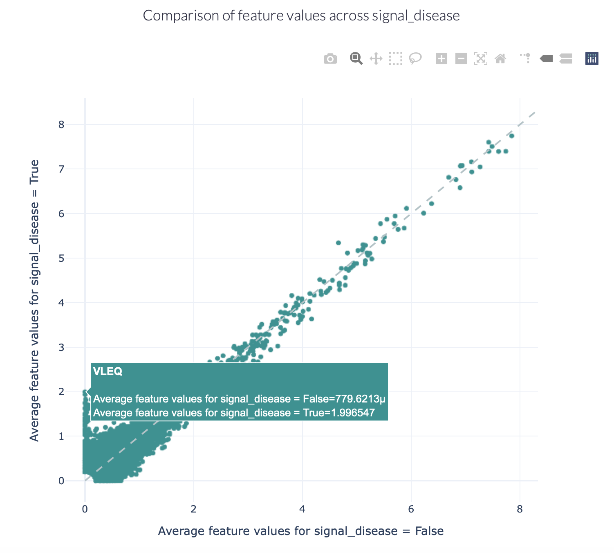

How to discover disease- or antigen specificity-associated motifs
==================================================================================

immuneML provides several different options for recovering motifs associated with antigen specificity or immune states.
Depending on the context, immuneML provides several different reports which can be used for this purpose.

Discovering positional motifs using precision and recall thresholds
----------------------------------------------------------------------

It is often assumed that the antigen binding status of an immune receptor (antibody/TCR) may be determined by the *presence*
of a short motif in the CDR3.
We developed a method (manuscript in preparation) for the discovery of antigen binding associated motifs with the following properties:

- Short position-specific motifs with possible gaps
- High precision for predicting antigen binding
- High generalisability to unseen data, i.e., retaining a relatively high precision on test data

Method description
^^^^^^^^^^^^^^^^^^^^^^^^^^^

A motif with a high precision for predicting antigen binding implies that when the motif is present,
the probability that the sequence is a binder is high. One can thus iterate through every possible motif and filter
them by applying a precision threshold. However, the more 'rare' a motif is, the more likely that the motif just had
a high precision by chance (for example: a motif that occurs in only 1 binder and 0 non-binders has a perfect precision,
but may not retain high precision on unseen data). Thus, an additional recall threshold is applied to remove
rare motifs.
Our method allows the user to define a precision threshold and learn the optimal recall threshold using a training + validation set.

The method consists the following steps:

1. Splitting the data into training, validation and test sets.

2. Using the training set, find all motifs with a high training-precision.

3. Using the validation set, determine the recall threshold for which the validation-precision is still high (separate recall thresholds may be learned for motifs with different sizes).

4. Using the combined training + validation set, find all motifs exceeding the user-defined precision threshold and learned recall threshold(s).

5. Using the test set, report the precision and recall of these learned motifs.

6. Optional: use the set of learned motifs as input features for ML classifiers (e.g., :ref:`BinaryFeatureClassifier` or :ref:`LogisticRegression`) for antigen binding prediction.

Steps 2+3 are done by the report :ref:`MotifGeneralizationAnalysis`. This report exports the learned recall cutoff(s).
It is recommended to run this report using the :ref:`ExploratoryAnalysis` instruction.
Steps 4+5 are done by the :ref:`Motif` encoder. The learned recall cutoff(s) are used as input parameters. This encoder
can be used either in :ref:`ExploratoryAnalysis` or :ref:`TrainMLModel` instructions.

Discovering motifs learned by classifiers
-----------------------------------------

KmerFrequency coefficients
^^^^^^^^^^^^^^^^^^^^^^^^^^^

When using the :ref:`KmerFrequency` encoder in combination with
:ref:`LogisticRegression`, :ref:`SVM` or :ref:`RandomForestClassifier`, a straightforward way to investigate which
k-mer subsequences were learned to be important is by running the :ref:`Coefficients` report. To specify this type of analysis, see
:ref:`How to train and assess a receptor or repertoire-level ML classifier`, where the Coefficients reports can be provided under :ref:`TrainMLModel`
instruction, under selection:reports:models or assessment:reports:models.
This can be applied to repertoire, receptor and sequence classification problems.

Strongly positive coefficients might indicate (partial) disease or antigen specificity-associated motifs.
Consider the following example, where the ground truth implanted disease signal was 'VLEQ', the largest 3-mer encoding coefficients
are associated with the subsequences 'VLE' and 'LEQ' which are contained inside 'VLEQ'.
Furthermore, subsequences that partially overlap with the disease signal, such as 'EQD', 'EQV' and 'YVL'
are also associated with relatively large coefficients.
Note that the coefficient size is not only determined by how important a subsequence is for determining an immune state
or antigen specificity, but also other factors, such as the baseline frequency of subsequences in a dataset.

.. image:: ../_static/images/reports/coefficients_logistic_regression.png
   :alt: Coefficients report
   :width: 600

DeepRCMotifDiscovery for repertoire classification
^^^^^^^^^^^^^^^^^^^^^^^^^^^^^^^^^^^^^^^^^^^^^^^^^^^^^

When using the classifier :ref:`DeepRC` for a repertoire classification task, the report :ref:`DeepRCMotifDiscovery` can
be used to investigate the learned patterns in the data.
This report plots the contributions of input sequences and kernels to trained DeepRC model.
These contributions are computed using integrated gradients (IG).
The following two figures show examples of the DeepRCMotifDiscovery report outputs when training a DeepRC model
on a dataset containing the artificial disease signal 'VLEQ'. See :ref:`How to train and assess a receptor or repertoire-level ML classifier` for tutorial
on how to write an instruction to perform this type of analysis (using :ref:`TrainMLModel` instruction and specifying the report under
selection:reports:models or assessment:reports:models) and :ref:`DeepRCMotifDiscovery` for more information on the specific report.

The left figure shows the contributions of the characters within the input sequences of the test dataset
for the immune status prediction of the repertoire. Blue indicates positive contribution, while red indicates
negative contribution.
Similarly, the right figure shows the 1D CNN kernels with the highest contribution over all positions and amino acids.

.. image:: ../_static/images/reports/deeprc_ig_inputs.png
   :alt: DeepRC IG over inputs
   :height: 150px

In this example, one kernel shows a strong signal for the subsequence 'VLEQ' while another shows a strong signal for
'VLE', which results in a strong positive contribution for the subsequence 'VLE' in the input sequences,
with a relatively smaller (but still posxitive) contribution from the remaining 'Q'.

TCRdistMotifDiscovery for receptor classification
^^^^^^^^^^^^^^^^^^^^^^^^^^^^^^^^^^^^^^^^^^^^^^^^^^

For paired receptor datasets, the ML method :ref:`TCRdistClassifier` can be used in combination with the :ref:`TCRdistMotifDiscovery` report.
This report hierarchically clusters paired immune receptor sequences based on the TCRdist3 distance metric, and
for each of the clusters logo plots are created to uncover the motifs within the clustered receptors. See :ref:`How to train and assess a receptor or repertoire-level ML classifier` for
running the :ref:`TrainMLModel` instruction (where :ref:`TCRdistMotifDiscovery` report can be provided under assessment:reports:models or selection:reports:models),
and :ref:`TCRdistMotifDiscovery` report for more details on the report.

The figures below show examples of the logo plots of the TCRα (left) and TCRβ (right) chains. In this example, the
subsequence 'VLEQ' has been implanted in the TCRβ chains, which can be seen in positions 4-7 in the logo plot on the right.

.. image:: ../_static/images/reports/tcrdist_motif_a.svg
   :alt: TCRdist alpha chain logo plot
   :width: 300px

Recovering simulated immune signals
-----------------------------------
The :ref:`Simulation instruction<How to simulate antigen or disease-associated signals in AIRR datasets>` can be used to implant
synthetic immune signals into AIRR datasets. Such immune signals can range from simple k-mers to collections of different
k-mers with possible gap positions or stochastic hamming distance modifications.

The advantage of implanted immune signals is that the ground truth is known, meaning that the motifs learned
by a classifier can be compared with the motifs that were originally implanted.
When using  the :ref:`KmerFrequency` encoder in combination with :ref:`LogisticRegression`, :ref:`SVM` or :ref:`RandomForestClassifier`,
this comparison can be made using the :ref:`MotifSeedRecovery` report.

First, a maximum overlap score is calculated between each :ref:`KmerFrequency` feature ('AAA', 'AAC', ...) and the implanted motif seeds.
This score represents how well a given feature represents at least one of the motif seeds that comprise the ground truth signal.
When calculating this overlap score, possible gap positions and hamming distance modifications are considered (see :ref:`MotifSeedRecovery` for details).
The maximum overlap score between each feature and the motif seeds is determined using a sliding window approach.
Therefore, the feature and motif seed do not have to have an equal length.
The resulting overlap scores will be highest for features that completely match the motif seed, lower for features
that partially match (for example 'A\ **AC**' and '**AC**\ C' have at most 2 positions overlap), and lowest for features that
do not represent any of the motif seeds.

Next, the features are grouped based on their maximum overlap scores. For each overlap score, a boxplot is made
representing the coefficient value (LogisticRegression, SVM) or feature importance (RandomForestClassifier) for those features.
If the classifier succeeded in learning the signal, the coefficient value or feature importance is highest
for those motifs with a high overlap score.

For running this type of analysis, see :ref:`How to train and assess a receptor or repertoire-level ML classifier` for details on :ref:`TrainMLModel`
instruction where the :ref:`MotifSeedRecovery` report should be provided directly under reports keyword in the instruction.

An example of what the output of the :ref:`MotifSeedRecovery` report looks like for a successful classifier is given here:

.. image:: ../_static/images/reports/motif_seed_recovery.png
   :alt: Motif seed recovery report
   :width: 600

Comparing baseline motif frequencies in repertoires
-----------------------------------------------------------

Not every motif is equally likely to occur in the sequences of an immune repertoire.
The variability of immune receptors is for example restricted by which V, D and J genes are present, among other factors.
Using immuneML, we can investigate the baseline motif frequencies of immune receptor or repertoire datasets.

One method for comparing the baseline motif frequency distributions between different classes (e.g., sick versus healthy,
or antigen binding versus non-binding) is by encoding the dataset using the :ref:`KmerFrequency` encoder,
and generating a :ref:`FeatureComparison` report.
This analysis can be executed using the :ref:`ExploratoryAnalysis` instruction, see :ref:`How to perform an exploratory data analysis` for more details.

The figures below show an example of the FeatureComparison report plot executed on the Quickstart dataset when encoded with a 4-mer frequency encoding.
In this dataset, the synthetic disease signal 'VLEQ' was implanted. The figure on the left shows the complete plot, where it can be seen that
there is a subset of 4-mers which occur at a higher frequency in the repertoires where the disease signal is present.
The figure on the right shows the data from the same figure, but zoomed in on the left lower corner.
The generated figure is interactive, and it is possible to hover over the points to reveal which feature they represent.
As can be seen in the right figure, the feature 'VLEQ' appears more frequently in the repertoires where signal_disease = True.

.. image:: ../_static/images/reports/feature_comparison_full.png
   :alt: Feature comparison full plot
   :width: 500

Alternatively, when investigating the occurrence of more complex motifs in repertoire datasets, the :ref:`MatchedRegex` encoder
can be used in combination with the :ref:`Matches` report. This will produce a table summarizing how often a set of regular
expressions are matched in the sequences of the repertoire dataset.

.. meta::

   :twitter:card: summary
   :twitter:site: @immuneml
   :twitter:title: immuneML: motif recovery
   :twitter:description: See tutorials on how to perform motif recovery in immuneML.
   :twitter:image: https://docs.immuneml.uio.no/_images/receptor_classification_overview.png
