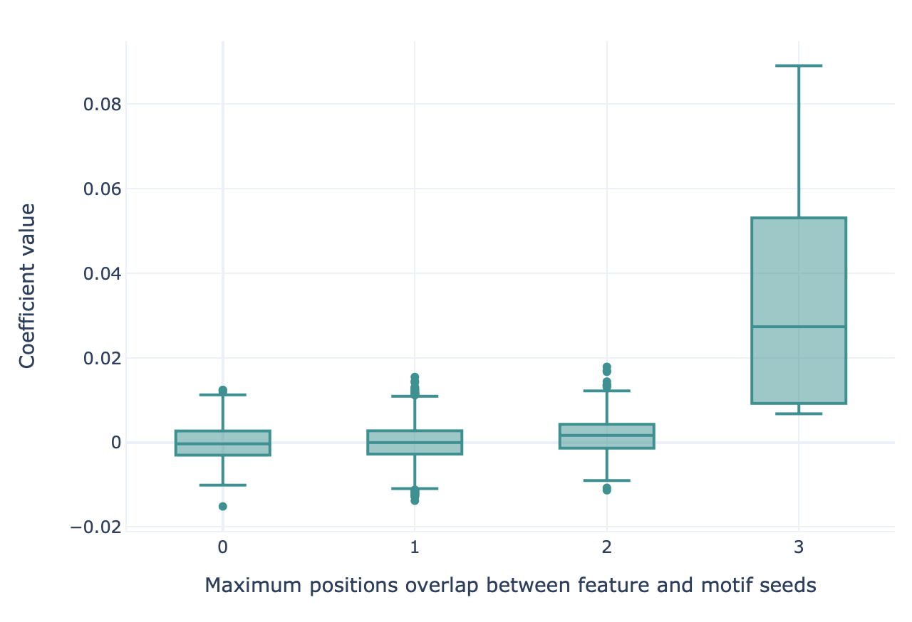

Recovering simulated immune signals
-----------------------------------
The :ref:`LigoSim instruction<Dataset simulation with LIgO>` can be used to implant
synthetic immune signals into AIRR datasets. Such immune signals can range from simple k-mers to collections of different
k-mers with possible gap positions or stochastic hamming distance modifications.

The advantage of implanted immune signals is that the ground truth is known, meaning that the motifs learned
by a classifier can be compared with the motifs that were originally implanted.
When using  the :ref:`KmerFrequency` encoder in combination with :ref:`LogisticRegression`, :ref:`SVM` or :ref:`RandomForestClassifier`,
this comparison can be made using the :ref:`MotifSeedRecovery` report.

First, a maximum overlap score is calculated between each :ref:`KmerFrequency` feature ('AAA', 'AAC', ...) and the implanted motif seeds.
This score represents how well a given feature represents at least one of the motif seeds that comprise the ground truth signal.
When calculating this overlap score, possible gap positions and hamming distance modifications are considered (see :ref:`MotifSeedRecovery` for details).
The maximum overlap score between each feature and the motif seeds is determined using a sliding window approach.
Therefore, the feature and motif seed do not have to have an equal length.
The resulting overlap scores will be highest for features that completely match the motif seed, lower for features
that partially match (for example 'A\ **AC**' and '**AC**\ C' have at most 2 positions overlap), and lowest for features that
do not represent any of the motif seeds.

Next, the features are grouped based on their maximum overlap scores. For each overlap score, a boxplot is made
representing the coefficient value (LogisticRegression, SVM) or feature importance (RandomForestClassifier) for those features.
If the classifier succeeded in learning the signal, the coefficient value or feature importance is highest
for those motifs with a high overlap score.

For running this type of analysis, see :ref:`How to train and assess a receptor or repertoire-level ML classifier` for details on :ref:`TrainMLModel`
instruction where the :ref:`MotifSeedRecovery` report should be provided directly under reports keyword in the instruction.

An example of what the output of the :ref:`MotifSeedRecovery` report looks like for a successful classifier is given here:

