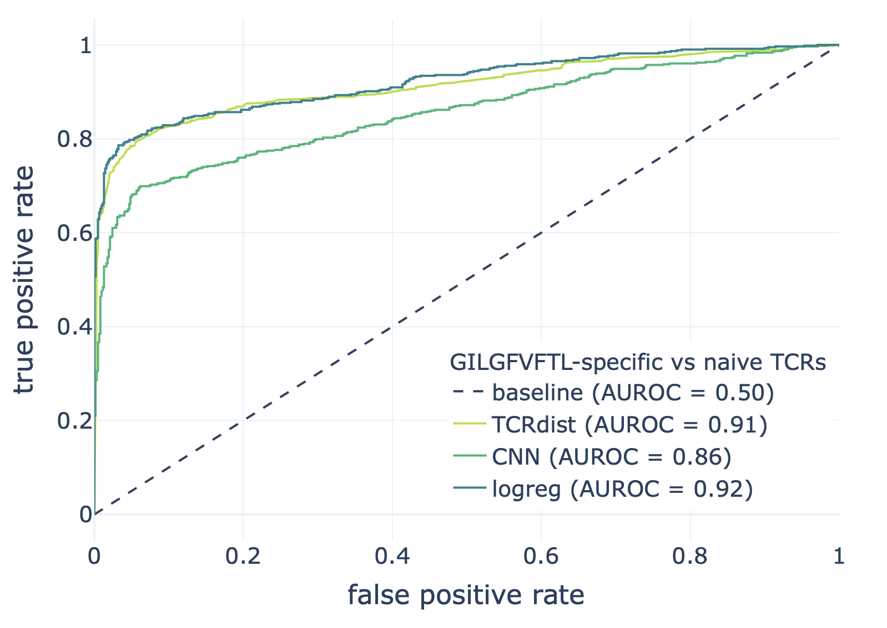
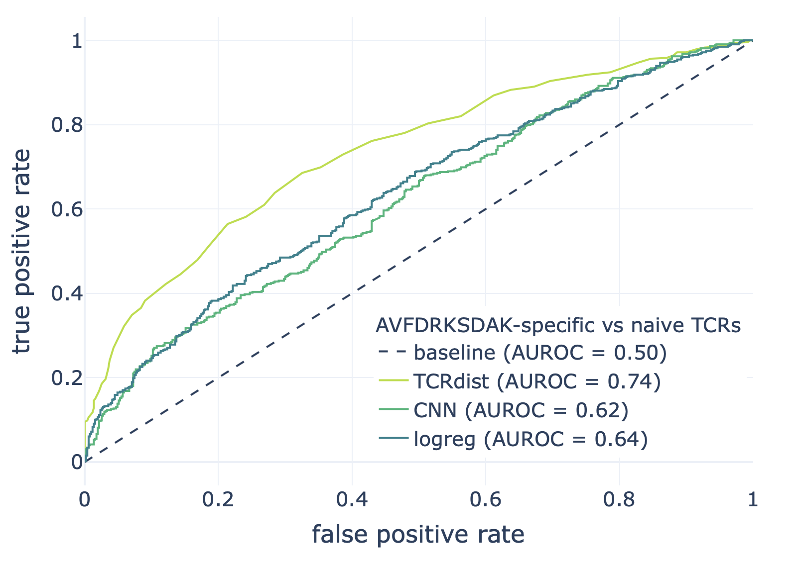
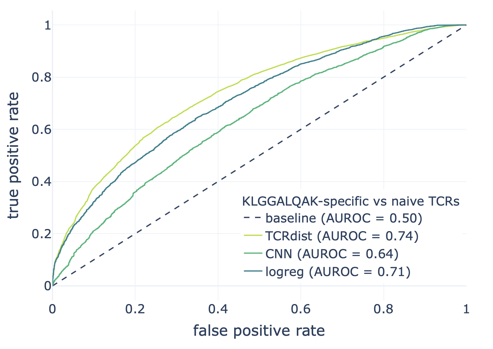

Manuscript use case 2: Extending immuneML with a deep learning component for predicting antigen specificity of paired receptor data
====================================================================================================================================

To demonstrate how immuneML can be extended, we added a convolutional neural network (CNN) for predicting receptor specificity. To show how it can be
using alongside existing components, we compared the CNN with k-nearest neighbour classifier based on TCRdist distance and a
logistic regression model on 3-mer frequencies. We also show the motifs extracted by CNN, TCRdist and GLIPH for the datasets we examine.

This use-case description includes the description of the datasets, how to add a CNN model, how to compare CNN with other models and finally, how to
extract motifs from models.

The complete collection of original files used in this use case can be found in the NIRD research data archive (DOI: `10.11582/2021.00009 <https://doi.org/10.11582/2021.00009>`_).
Note that the YAML specifications in the original dataset were compatible with immuneML version 1.1.1.
This documentation page contains the YAML specifications for equivalent analyses with the latest immuneML version (last tested with version 1.1.4).

Preparing the datasets
-----------------------

We used three epitope-specific datasets to compare the performance of CNN, TCRdist classifier and logistic regression. The epitope-specific paired chain
receptors were downloaded from VDJdb for epitopes:

- AVFDRKSDAK (Epstein-Barr virus): the original file is available here: :download:`AVFDRKSDAK.tsv <../_static/files/AVFDRKSDAK-EBV-Human-TCRAB_paired-2020-12-23 15_07_08.331.tsv>`
- GILGFVFTL (Influenza A): the original file is available here: :download:`GILGFVFTL.tsv <../_static/files/GILGFVFTL-InfluenzaA-Human-TCRAB_paired-2020-12-23 15_06_16.244.tsv>`
- KLGGALQAK (Cytomegalovirus): the original file is available here: :download:`KLGGALQAK.tsv <../_static/files/KLGGALQAK-CMV-epitope-Human-TCRAB_paired-2020-12-23 15_04_46.165.tsv>`

Naive unpaired T-cell receptor data was downloaded from the immuneACCESS database from the study by `Heikkilä et al. 2020 <http://www.sciencedirect.com/science/article/pii/S016158902030479X>`_. It consisted of naive PBMC
TCRAB data from 4 healthy donors that where then randomly paired if coming from the same donor, as described also by Dash et al. 2017 for generation of
background receptors. The receptors missing the V- or J-gene information (even though in some cases gene subgroup might have been know),
receptors shorter than 6 amino acids and receptors containing V- or J-gene information for which the mapping was not available in TCRdist3 were
removed. The removed genes due to TCRdist3 availablility were: TCRAV37-01\*01, TCRBV07-05\*02, TCRAV28-01, TCRAV31-01\*01, TCRBV07-05, TCRAV33-01\*01,
TCRAV32-01\*01, TCRBVA-or09_02, TCRBV22-01.

The original data file as downloaded from immuneACCESS is available here: :download:`naiveTCRAB.tsv <../_static/files/Heikkila et al 2020 naive PBMC TCRAB immuneACCESS 20201223.tsv>`

Using this data, three datasets were created by combining epitope-specific paired receptor data with naive randomly paired data. These data along with
the results of testing are available in `NIRD research data archive <http://doi.org/10.11582/2021.00009>`_.

Adding a new ML method
-----------------------

We proposed a CNN model adapted to the receptor specificity prediction problem. Briefly, an adaptive immune receptor consists of two chains, two receptor
(amino acid) sequences forming a 3D structure. This receptor can either bind an antigen (e.g., part of a virus) and trigger an immune response or not.
The ability to predict if receptor binds an antigen would provide useful knowledge for diagnostics and therapeutics development.

The CNN we proposed for this task would consist of one set of kernels of multiple kernel sizes for each receptor chain. The kernels are followed by
ReLU activation and max-pooling to obtain one representation vector per receptor chain. These two vectors are then concatenated and form a unique
receptor representation. This receptor representation is then provided as input for a single linear layer with a single output predicting if a
receptor will bind an antigen or not.

To add a new ML method, we added two classes to the :code:`ml_methods` package:

1. ReceptorCNN class implementing MLMethod interface and
2. PyTorchReceptorCNN class inheriting PyTorch's nn.Module and implementing the forward pass through the network.

The :code:`ReceptorCNN` class is the main class given in the YAML specification when this method is used, while the :code:`PyTorchReceptorCNN` class is PyTorch-specific
implementation. :code:`ReceptorCNN` creates an object of the :code:`PyTorchReceptorCNN` class and takes care of training and predicting class assignment for
training instances. See the documentation and the code for ReceptorCNN at :py:obj:`immuneML.ml_methods.ReceptorCNN.ReceptorCNN` and for PyTorchReceptorCNN at
:py:obj:`immuneML.ml_methods.pytorch_implementations.PyTorchReceptorCNN.PyTorchReceptorCNN`. We also provide a tutorial :ref:`How to add a new machine learning method`.

Comparing the ML models and recovered motifs from TCRdist3, GLIPH2 and CNN
------------------------------------------------------------------------------

We compared three ML methods to predict if a paired receptor will bind an antigen or not:

1. ReceptorCNN method added in the previous step,
2. k-nearest neighbors classifier based on TCRdist distance between paired receptors, and
3. logistic regression model based on 3-mer frequencies in each chain.

We compared the performance on three datasets described previously. The YAML specification for one of these analysis (for Influenza A, epitope GILGFVFTL)
is available below. In addition to training and comparing the models, we also recovered motifs from each of them to show how we could get some
insight into the inner workings of each method. We used immuneML to extract the motifs from the trained TCRdist-based classifier, logistic regression
model and CNN. Additionally, we exported the data in a format compatible with GLIPH2 from immuneML and used the same data to extract the motifs with
GLIPH2 as for the other models.

To recover the motifs from the ReceptorCNN model, we added a :ref:`KernelSequenceLogo` report to visualize the kernels of the network as information
gain matrices, similar to the work of `Ploenzke and Irizarry 2018 <https://www.biorxiv.org/content/10.1101/411934v1>`_. Adding a report to explore machine learning
models is described in the tutorial :ref:`How to add a new report`. Briefly, adding a report to explore the motifs in the CNN was done by implementing and adding
a class that implements the given report, without modifying any other part of the code.

The input data, YAML specifications and results of these comparisons are available in `NIRD research data archive <http://doi.org/10.11582/2021.00009>`_.

YAML specification for training machine learning models and recovering motifs in the GILGFVFTL dataset (note that the ROCCurveSummary was not present in the original
specification and the plots were obtained outside immuneML; it has since been added to immuneML and can be used directly from YAML specification):

.. code-block:: yaml

  definitions: # definition of the components: datasets, encodings, ML models, reports
    datasets:
      dataset_GILGFVFTL: # the dataset specific for the epitope GILGFVFTL of EBV virus combined with naive receptors
        format: AIRR
        params:
          is_repertoire: False
          path: data/GILGFVFTL.tsv
          paired: True
          import_illegal_characters: False
          import_empty_nt_sequences: True
          import_empty_aa_sequences: False
          receptor_chains: TRA_TRB
          metadata_column_mapping:
            GILGFVFTL: GILGFVFTL
          organism: human
    encodings: # how to represent the data
      one_hot: # encoding for the neural network includes one-hot encoding of receptors and additional three positional channels
        OneHot:
          use_positional_info: True
          distance_to_seq_middle: 3
          flatten: False
      tcrdist_enc: # represents the the receptors by tcrdist distances between them
        TCRdist:
          cores: 32
      kmer_frequency: # represents receptors by the frequency of k-mers per chain
        KmerFrequency:
          k: 3
          sequence_encoding: continuous_kmer  # split sequence into overlapping k-mers
          scale_to_unit_variance: True # scale the normalized examples to have unit variance
          scale_to_zero_mean: False # scale the normalized examples to have zero mean -> setting this to True might destroy sparsity
    ml_methods: # which machine learning methods to use
      cnn: # a convolutiional network
        ReceptorCNN:
          number_of_threads: 32
          batch_size: 20000
          evaluate_at: 1000
          iteration_count: 20000
          kernel_count: 50
          kernel_size: [3, 4, 5, 6]
          positional_channels: 3
          learning_rate: 0.01
          l1_weight_decay: 0.01
          l2_weight_decay: 0.01
      tcrdist_cls: # kNN classifier based on tcrdist distances [computed in the encoding phase]
        TCRdistClassifier:
          percentage: 0.1 # the percentage of receptors relevant for determining the class assignment (binding vs. not binding), based on the paper by Dash $
      logistic_regression:
        LogisticRegression:
          penalty: [l1, l2] # try lasso and ridge
          C: [1000, 100, 10, 1, 0.1, 0.01, 0.001] # regularization constants
        model_selection_cv: True # do a third level of cross-validation where only the logistic regression hyperparameters listed here will be optimized by $
        model_selection_n_folds: 5 # for this third level of CV, use 5-fold CV
    reports: # additional output: analysis reports
      cnn_kernel_logo: KernelSequenceLogo # this report will visualize kernels from the CNN as sequences logos since the kernels are conditioned to represen$
      tcrdist_logo: # uses tcrdist3 library to discover the motifs in the hierarchically clustered receptors based on tcrdist distance
        TCRdistMotifDiscovery:
          positive_class_name: True # will only cluster the positive class (receptors binding to GILGFVFTL)
          min_cluster_size: 100 # minimum cluster size to extract the motif from
      coefficients:
        Coefficients: # plot top 100 largest coefficients for logistic regression
          coefs_to_plot: [n_largest]
          n_largest: [100]
      gliph_exporter: # will export the receptor data in format compatible with GLIPH2 (Huang et al. 2020) so that it can be directly used on the data as sp$
        GLIPH2Exporter:
          condition: GILGFVFTL # what is the condition, as defined by GLIPH2
      roc_summary: ROCCurveSummary # plot the ROC curves on the performance for each split in the outer cross-validation loop to compare different methods defined here
  instructions:
    tcrdist_cnn_comparison: # definition of the analysis
      type: TrainMLModel # analysis for training ML models
      settings: # which combinations of previously defined encodings and ML models to consider
        - encoding: one_hot
          ml_method: cnn
        - encoding: tcrdist_enc
          ml_method: tcrdist_cls
        - encoding: kmer_frequency
          ml_method: logistic_regression
      assessment: # how to perform the outer loop of nested cross-validation to obtain performance estimate
        split_strategy: random # randomly split to train and test
        split_count: 1 # make only one such split
        training_percentage: 0.7 # use 70% of data for testing
        reports: # which reports to generate of the data and the models obtained in this way
          models: # reports to generate from the models, here: motif discovery
            - cnn_kernel_logo
            - tcrdist_logo
            - coefficients
          data_splits: # reports to generate from the data, here: output the data in GLIPH2-compatible format
            - gliph_exporter
      selection: # how to perform the inner loop of nested cross-validation to choose the optimal model
        split_strategy: k_fold # do 5-fold cross-validation
        split_count: 5
        reports: # again, which reports to generate, same as under assessment
          models:
            - cnn_kernel_logo
            - tcrdist_logo
            - coefficients
          data_splits:
            - gliph_exporter
      labels: # which labels to use to train the ML models
        - GILGFVFTL
      dataset: dataset_GILGFVFTL # which dataset to use
      metrics: [balanced_accuracy, precision, recall] # metrics to be computed for all settings
      strategy: GridSearch # how to evaluate different combinations of encodings and ML models listed under settings, here: just compare them all with each other
      number_of_processes: 32 # in the parallelized parts of the code, how many processes to use
      optimization_metric: auc # the metric used for optimization
      reports: [roc_summary] # additional reports made on the full results -> here produce the ROC curves for each method as shown in the results
      store_encoded_data: False # whether to store the encoded data, if set to True, it could increase the disk space usage
      refit_optimal_model: False # whether to refit the optimal model before exporting it (not in this use-case as the models will be used for comparison, not for classifying some new data)

Results
-------------------------------------------------

We compared the CNN method with the TCRdist-based k-nearest neighbor classifier and logistic regression on a dataset
consisting of epitope-specific and naive TCRαβ sequences (assumed to be non-epitope-specific).

The resulting ROC curves for the three epitopes (GILGFVFTL, Influenza A; AVFDRKSDAK, Epstein-Barr virus; KLGGALQAK, Cytomegalovirus) are shown below.
Note that these figures were not included in the results deposited in the NIRD research data archive, but the YAML specification above
has been updated to produce these plots.

