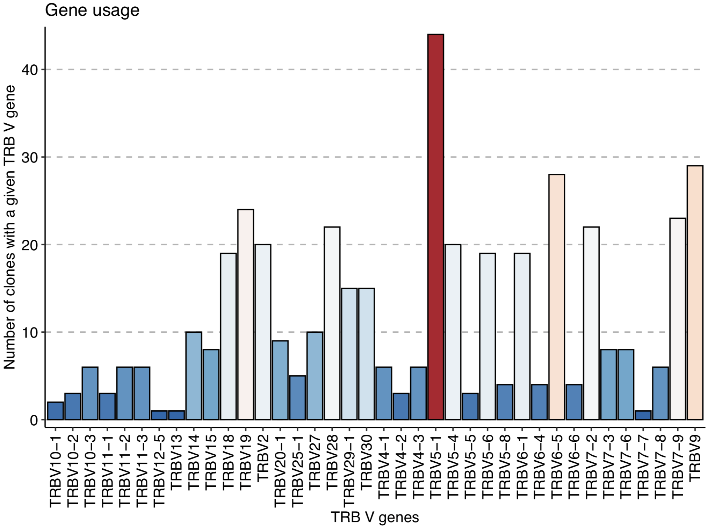

Integration use case: post-analysis of sequences with immunarch
==========================================================================================

This use case will show how to perform a post-analysis of CMV associated TCRβ sequences using `immunarch <https://immunarch.com/>`_/
These sequences were identified through the method
`published by Emerson et al. <https://www.nature.com/articles/ng.3822>`_, which was reproduced inside immuneML.
The analysis used to obtain these sequences is described in :ref:`Manuscript use case 1: Reproduction of a published study inside immuneML`,
where the sequences were exported using the :ref:`RelevantSequenceExporter`.

Download the sequence file here: :download:`relevant_sequences.csv <../_static/files/relevant_sequences.csv>`

This analysis requires the R package `immunarch <https://immunarch.com>`_ version 0.6.5 or higher to be installed.

.. indent with spaces
.. code-block:: R

    library(immunarch)

    # Read in of CMV-associated sequences
    relevant_sequences <- read.csv("relevant_sequences.csv") # Column names are AIRR-compliant
    relevant_sequences = relevant_sequences[!(relevant_sequences$v_call==""), ] # Remove sequences with missing V gene annotation
    colnames(relevant_sequences) <- c("CDR3.aa", "V.name", "J.name") # Renaming of columns in order for geneUsage function to work properly
    relevant_sequences$Clones <- 1 # Addition of clones columns in order for geneUsage function to work properly

    # V gene analysis using immunarch:
    geneUsage(relevant_sequences) %>% vis() +  labs (x = "TRB V genes", y = "Number of clones with a given TRB V gene")

The immunarch :code:`geneUsage()` plot shows that TRBV5-1 is the most used V gene among the CMV-associated TCRβ sequences:

