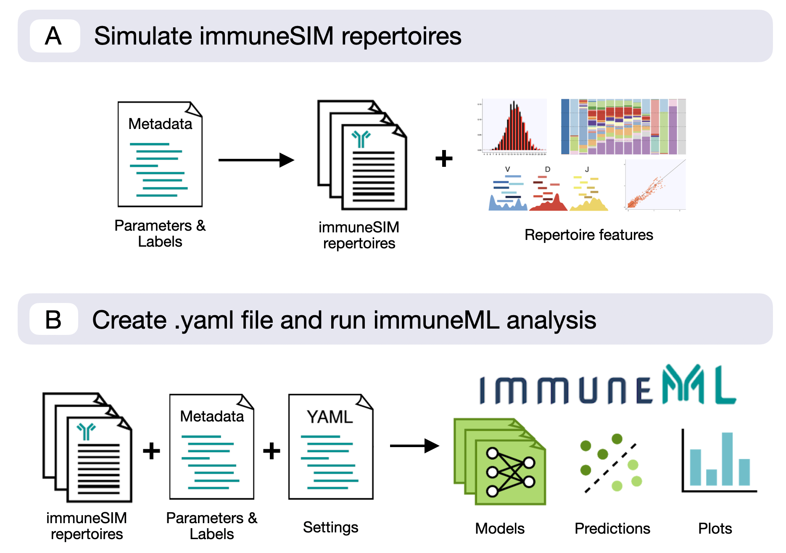
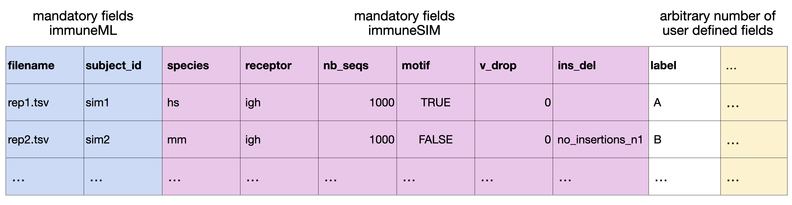

Integration use case: Performing analysis on immuneSIM-generated repertoires
==============================================================================

This use case will show you how to use immuneML in conjunction with immuneSIM
(`Weber et al. 2020 <https://academic.oup.com/bioinformatics/article/36/11/3594/5802461>`_), tunable multi-feature simulation tool of B- and T-cell
receptor repertoires for immunoinformatics benchmarking.

The combined use of these tools enables the user to generate datasets with know signals as a baseline for ML classification. The user
can either input already existing immuneSIM repertoires into the workflow or use a cross-platform metadata file to both simulate datasets and provide
the label information for immuneML input.

For reference, a detailed documentation of immuneSIM including an installation guide `can be found here <https://immunesim.readthedocs.io/en/latest/quickstart.html>`_.
Additionally, example files for this particular workflow are available on the `immuneSIM GitHub <https://github.com/GreiffLab/immuneSIM/tree/master/use_cases/immuneML>`_.
Note: This use case is based on immuneSIM v0.9.0.

Combined workflow with an immuneSIM and immuneML compatible metadata file
----------------------------------------------------------------------------

The most efficient way to combine immuneSIM and immuneML is by using a single metadata
file for both the simulation in immuneSIM and training the model in immmuneML. Below an example of a metadata table,
containing parameters for the simulation of immuneSIM repertoires, which can also be used
as metadata in an immuneML workflow.

This metadata file (:download:`metadata_full_sim.csv <../_static/files/metadata_full_sim.csv>`) is used by the following immuneSIM script to generate a set of repertoires.
The metadata file can then be fed into immuneML together with the resulting simulated repertoires
as described in the :ref:`How to import data into immuneML` section.

The following R script generates the simulated repertoires using immuneSIM. The script can also be downloaded here: :download:`immuneSIM_for_ML.R <../_static/files/immuneSIM_for_ML.R>`.

.. highlight:: r
.. code-block:: r

  ## ImmuneML use case (https://immuneml.uio.no/)
  # This script simulates immuneSIM repertoires based on an immuneML compatible metadata file.
  # requires immuneSIM 0.9.0 (github: https://github.com/GreiffLab/immuneSIM)

  library(immuneSIM)

  PATH <- "./immuneML_Sim"

  #load metadata file
  metadata <- read.delim(file.path(PATH,"metadata_full_sim.csv"),sep=",")

  #Define motif for cases where motif==TRUE. Here two motifs are inserted with a probability of 0.5 at a fixed position.
  motif <- data.frame(aa=c("AA","FF"),nt=c("gccgcc","tttttt"),freq=c(0.5,0.5))
  fixed_pos <- 4

  #for each line in metadata simulate a repertoire and write out.
  for(i in 1:nrow(metadata)){

    #simulate repertoire
    curr_df <- immuneSIM(number_of_seqs = metadata$nb_seqs[i],
                         vdj_list = list_germline_genes_allele_01,
                         species = metadata$species[i],
                         receptor = substr(metadata$receptor[i],1,2),
                         chain = substr(metadata$receptor[i],3,3),
                         insertions_and_deletion_lengths = insertions_and_deletion_lengths_df,
                         user_defined_alpha = 2,
                         name_repertoire = metadata$filename[i],
                         length_distribution_rand = length_dist_simulation,
                         random = FALSE,
                         shm.mode = 'none',
                         shm.prob = 15/350,
                         vdj_noise = 0,
                         vdj_dropout = c(V=metadata$v_drop[i],D=0,J=0),
                         ins_del_dropout = metadata$ins_del[i],
                         equal_cc = FALSE,
                         freq_update_time = round(0.5*metadata$nb_seqs[i]),
                         max_cdr3_length = 100,
                         min_cdr3_length = 6,
                         verbose = TRUE,
                         airr_compliant = TRUE)

    #after simulation implant motifs
    if(metadata$motif[i]==TRUE){
      curr_df <- motif_implantation(curr_df, motif,fixed_pos)
    }

    #write repertoire to file
    write.table(curr_df,file=file.path(PATH, "data", metadata$filename[i]),sep="\t",quote=FALSE,row.names=FALSE)
  }

Using existing immuneSIM repertoires with immuneML
-----------------------------------------------------

As immuneSIM repertoires use AIRR-compliant column naming, they can be directly fed into
any immuneML workflow using :ref:`AIRR` importer. For this, a metadata file indexing the existing immuneSIM repertoires
and indicating classification relevant labels has to be created.

If the user chooses to write their own using .yaml file, the declaration of :code:`format: AIRR`
in the definition section is sufficient to ensure compatibility with immuneSIM datasets.

Here we show an example of the analysis using immuneSIM-generated repertoires to train a logistic regression and examine the coefficients of the
model.

.. highlight:: yaml
.. code-block:: yaml

  definitions:
    datasets:
      immuneSIM_dataset: # user-defined dataset name: here described the immuneSIM dataset
        format: AIRR
        params:
          path: ./immuneML_Sim/data/         # path to the folder containing the repertoire files generated by immuneSIM
          metadata_file: ./immuneML_Sim/metadata_full_sim.csv

    encodings:
      my_kmer_frequency: # user-defined encoding name
        KmerFrequency:   # encoding type
          k: 3           # encoding parameters

    ml_methods:
      my_logistic_regression: LogisticRegression # user-defined ML model name: ML model type (no user-specified parameters)

    reports:
      my_coefficients: Coefficients # user-defined report name: report type (no user-specified parameters)

  instructions:
    my_training_instruction: # user-defined instruction name
      type: TrainMLModel

      dataset: immuneSIM_dataset # use the same dataset name as in definitions
      labels:
      - label    # use a label available in the metadata file

      settings: # which combinations of ML settings to run
      - encoding: my_kmer_frequency
        ml_method: my_logistic_regression

      assessment: # parameters in the assessment (outer) cross-validation loop
        reports:  # plot the coefficients for the trained model
          models:
          - my_coefficients
        split_strategy: random   # how to split the data - here: split randomly
        split_count: 1           # how many times (here once - just to train and test)
        training_percentage: 0.7 # use 70% of the data for training

      selection: # parameters in the selection (inner) cross-validation loop
        split_strategy: random
        split_count: 1
        training_percentage: 1 # use all data for training

      optimization_metric: balanced_accuracy # the metric to optimize during nested cross-validation when comparing multiple models
      metrics: # other metrics to compute for reference
      - auc # area under the ROC curve
      - precision
      - recall
