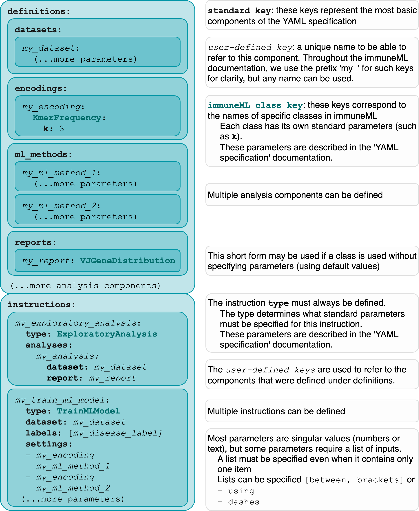
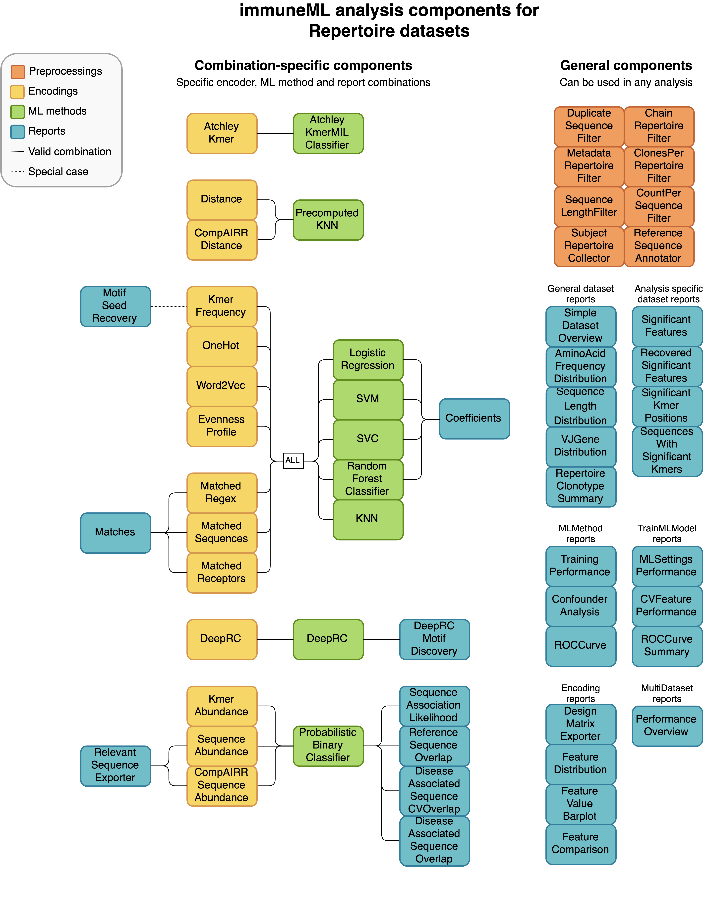
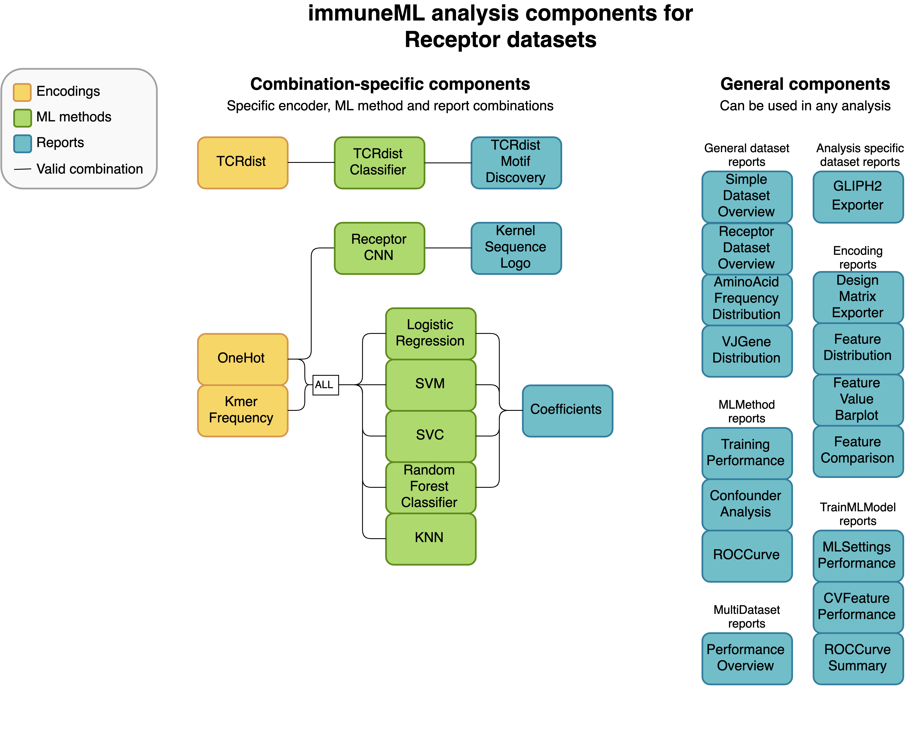
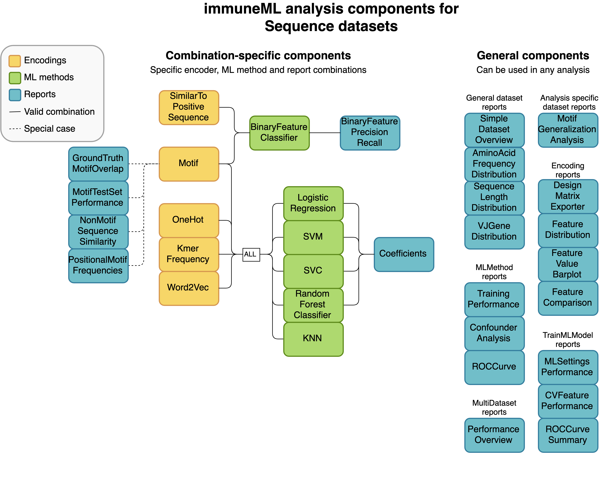

How to specify an analysis with YAML
====================================

.. meta::

   :twitter:card: summary
   :twitter:site: @immuneml
   :twitter:title: immuneML: specify an analysis with YAML
   :twitter:description: See tutorials on how to specify analysis in immuneML through YAML specification file.
   :twitter:image: https://docs.immuneml.uio.no/_images/receptor_classification_overview.png

Analyses in immuneML are specified through a YAML specification file. This is a text file with nested keys and values.
Since immuneML can be used for a variety of different tasks, different parameters need to be set depending on the use case.
The keys are essentially the input parameters to immuneML, except the values to these parameters can consist of more key-value pairs.
Throughout the documentation, the names of keys (which have a specific meaning) will be formatted like :code:`this`.

.. note::

        If you have not used YAML before, we recommend reading the official docs for an overview (https://yaml.org/spec/1.2.2/#chapter-2-language-overview) or any tutorial online.
        We also recommend using a YAML-friendly editor (Sublime Text, PyCharm or others) or an online YAML validator (https://jsonformatter.org/yaml-validator) to make sure
        your YAML file is correctly formatted.

The immuneML YAML specification reflects two main sets of keys:

- Under :code:`definitions` the different analysis components are defined, such as a specific ML method, or the import parameters for a dataset.

- The :code:`instructions` describe what kind of workflow is executed using the components defined under definitions. For example, whether to train ML models, or simulate a dataset for benchmarking.

This page gives a general overview of the YAML specification structure, and the keys that should be present.
For an exhaustive list of all the options that can be specified, see :ref:`YAML specification`.

Structure of the analysis specification
---------------------------------------

The following figure outlines the general structure of the YAML specification file. Note that depending on the specific analysis,
the components and parameters that need to be specified may not be the same.
On the highest level, the analysis specification always consists of :code:`definitions` and :code:`instructions`.

Specifying Definitions
^^^^^^^^^^^^^^^^^^^^^^

Under :code:`definitions`, the following analysis components may be defined:

- :code:`datasets`: specifying where data is located, what format the data is in, and how it should be imported (see :ref:`How to import data into immuneML` for more details),

- :code:`preprocessing_sequences`: defining one or more preprocessing steps to be taken on the dataset (this is optional),

- :code:`encodings`: different data representations,

- :code:`ml_methods`: different machine learning methods (e.g., SVM or KNN),

- :code:`reports`: specific plots or statistics to apply to the raw or encoded data, ML methods or results.

Simulation-specific components (only relevant when running the :ref:`Dataset simulation with LIgO`) are:

- :code:`motifs`: parts of the simulation definition defined by a seed and a way to create specific motif instances from the seed,

- :code:`signals`: parts of the simulation which can include multiple motifs and correspond to a single label for subsequent classification tasks,

- :code:`simulations`: define how to combine different signals and how to implant them in the dataset.

Under definitions, each analysis sub-component is defined using a user-defined key.
Throughout the documentation, we use the prefix 'my\_' to identify these keys, but any kind of name may be used here.
These keys are unique names that identify the settings for a component, and they are
later referenced in the :ref:`instructions <Specifying Instructions>`.

An example of a full :code:`definitions` section which may be used for a machine learning task is given below.
Note that in order to run this yaml file, instructions still need to be added

    .. collapse:: definitions.yaml

        .. highlight:: yaml
        .. code-block:: yaml

          definitions:
            datasets: # every instruction uses a dataset
              my_dataset:
                format: AIRR
                params:
                  path: path/to/data/
                  metadata_file: path/to/metadata.csv
            preprocessing_sequences:
              my_preprocessing:
                - my_beta_chain_filter:
                    ChainRepertoireFilter:
                      keep_chain: TRB
            ml_methods:
              my_log_reg: LogisticRegression
              my_svm: SVM
            encodings:
              my_kmer_freq_encoding_1: KmerFrequency # KmerFrequency with default parameters
              my_kmer_freq_encoding_2: # KmerFrequency with user-defined parameters
                KmerFrequency:
                  k: 5
            reports:
              my_seq_length_distribution: SequenceLengthDistribution
          instructions:
            # to be added...

The :code:`definitions` section used for Simulation contains different components (:code:`motifs`, :code:`signals`, :code:`simulations`).
These are discussed in more detail in the following tutorial: :ref:`Dataset simulation with LIgO`.

Specifying Instructions
^^^^^^^^^^^^^^^^^^^^^^^

Similarly to analysis components, :code:`instructions` are defined under a user-defined key.
Under this key, you should define the instruction :code:`type`, which defines the type
of analysis that will be done. All other settings are instruction-specific.

The following instruction types may be used:

- :ref:`TrainMLModel`

- :ref:`ExploratoryAnalysis`

- :ref:`LIgO Simulation <LigoSim>`

- :ref:`MLApplication`

- and few others; :ref:`Instructions <Instruction parameters>` for the complete list.

The components defined under definitions can be referenced inside the instruction, but any result from the
instructions is not available to other instructions. If the output of one instruction needs to be used in another
other instruction, two separate immuneML runs need to be made (e.g, running immuneML once with the Simulation
instruction to generate a dataset, and subsequently using that dataset as an input to a second immuneML
run to train a ML model).

An example of the YAML specification for the TrainMLModel instruction is shown below.
See the tutorial :ref:`How to train and assess a receptor or repertoire-level ML classifier` for more explanation behind all settings.

    .. collapse:: instructions.yaml

        .. highlight:: yaml
        .. code-block:: yaml

          definitions:
            # to be added...
          instructions:
            my_instruction: # user-defined instruction key
              type: TrainMLModel
              dataset: my_dataset # reference dataset from definitions
              labels: [disease]
              settings: # settings are made up of preprocessing (optional), ml_method and encoding
              - encoding: my_kmer_freq_encoding_1
                ml_method: my_log_reg
              - preprocessing: my_preprocessing
                encoding: my_kmer_freq_encoding_2
                ml_method: my_svm
              assessment:
                split_strategy: random
                split_count: 1
                training_percentage: 70
                reports:
                  data_splits: [my_seq_length_distribution]
              selection:
                split_strategy: k_fold
                split_count: 5
              strategy: GridSearch
              metrics: [accuracy]
              optimization_metric: accuracy
              reports: null # no reports
              refit_optimal_model: False
              number_of_processes: 4

Specifying output
^^^^^^^^^^^^^^^^^

Optionally, the key :code:`output` may be specified on the base level (next to :code:`definitions` and :code:`instructions`). However,
the only supported output format is currently HTML. The :code:`output` section may be omitted from the YAML, but if included, it should look like this:

.. highlight:: yaml
.. code-block:: yaml

  output:
    format: HTML

Putting all parts together
---------------------------------------
Not every analysis component can be combined with every component.
Some analysis components are specific to a particular dataset type (receptor, sequence or repertoire dataset),
and some components need to be used in a specific combination (such as encoder-ML method compatibility).
The diagrams below show for each dataset type how the components can be combined.

An example of a complete YAML specification for training an ML model through nested cross-validation is given here:

    .. collapse:: complete_definitions_instructions.yaml

        .. highlight:: yaml
        .. code-block:: yaml

          definitions:
            datasets:
              d1:
                format: AIRR
                params:
                  metadata_file: path/to/metadata.csv
                  path: path/to/data/
            preprocessing_sequences:
              my_preprocessing:
                - my_beta_chain_filter:
                    ChainRepertoireFilter:
                      keep_chain: TRB
            ml_methods:
              my_log_reg: LogisticRegression
              my_svm: SVM
            encodings:
              my_kmer_freq_encoding_1: KmerFrequency # KmerFrequency with default parameters
              my_kmer_freq_encoding_2: # KmerFrequency with user-defined parameters
                KmerFrequency:
                  k: 5
            reports:
              my_seq_length_distribution: SequenceLengthDistribution
          instructions:
            my_instruction: # user-defined instruction key
              type: TrainMLModel
              dataset: my_dataset # reference dataset from definitions
              labels: [disease]
              settings: # settings are made up of preprocessing (optional), ml_method and encoding
              - encoding: my_kmer_freq_encoding_1
                ml_method: my_log_reg
              - preprocessing: my_preprocessing
                encoding: my_kmer_freq_encoding_2
                ml_method: my_svm
              assessment:
                split_strategy: random
                split_count: 1
                training_percentage: 70
                reports:
                  data_splits: [my_seq_length_distribution]
              selection:
                split_strategy: k_fold
                split_count: 5
              strategy: GridSearch
              metrics: [accuracy]
              optimization_metric: accuracy
              reports: null # no reports
              refit_optimal_model: False
              number_of_processes: 4
          output:
            format: HTML

Running the specified analysis
------------------------------

To run an instruction via command line with the given YAML specification file:

.. code-block:: console

  immune-ml path/to/specification.yaml result/folder/path/

Alternatively, create an ImmuneMLApp object in a Python script and pass it the path parameter to the constructor before calling its :code:`run()` method as follows:

.. highlight:: python
.. code-block:: python

  from immuneml.app.ImmuneMLApp import ImmuneMLApp

  app = ImmuneMLApp(specification_path="path/to/specification.yaml", result_path="result/folder/path/")
  app.run()
